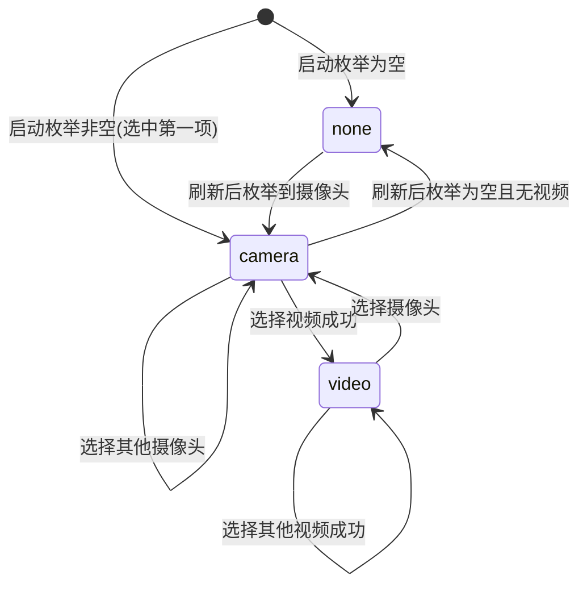
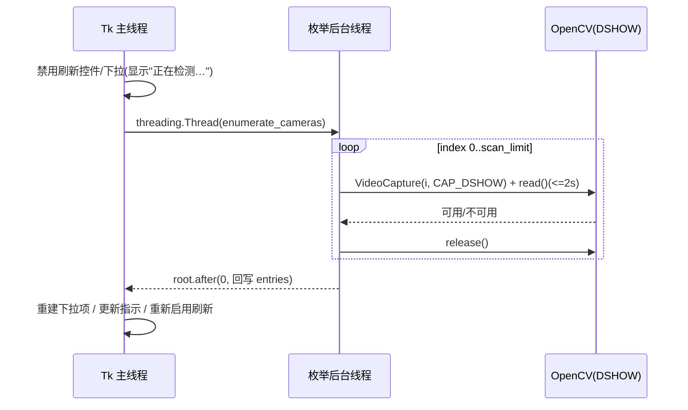

# Design Document

## Overview

本设计将 `apps/app_ui.py` 中 `App` 类的输入区由“单一自由文本框 + 选择视频按钮”改造为“摄像头下拉菜单 + 选择视频按钮 + 刷新控件 + 当前输入源指示标签”的组合交互。核心目标是让用户从系统自动枚举出的可用摄像头列表中直观选择摄像头，同时保留对本地视频文件的选择，并保证任一时刻仅存在一个生效的输入源。

设计遵循三条主线：

1. **新增一个可独立单测的摄像头枚举器**（`enumerate_cameras`，建议置于 `apps/camera_enum.py`），通过 OpenCV DSHOW 后端从编号 0 扫描到扫描上限，以“能打开 + 能读到非空帧 + 单编号探测超时保护 + 完成后释放资源”作为健壮性判据，返回 `[(显示文本, 整数编号)]` 列表。该模块不依赖 Tk，便于注入 mock 探测函数做属性测试（满足需求 1）。
2. **引入一个明确的输入源状态模型**（camera / video / none 三态互斥），在 UI 内统一维护，将 `self.source_var` 的字符串语义复用为最终输入标识（摄像头存数字字符串、视频存路径），使 `_collect_state` / `_worker_loop` 的改动最小（满足需求 2、3、4）。
3. **沿用现有线程模型**（`threading.Thread` 后台执行 + `root.after` 回写 UI），将摄像头枚举（启动枚举与刷新枚举）放到后台线程，避免阻塞 Tk 主循环（满足需求 1、5）。

本特性不触碰推理链路（`vision_pipeline.py`）、模型默认行为或 YOLO 迁移相关路径，改动严格局限于 UI 输入区与新增枚举器模块。

## Architecture

### 模块边界

```
apps/
├── camera_enum.py   # 新增：纯枚举逻辑 + Camera_Entry 数据结构（不依赖 tkinter）
└── app_ui.py        # 改造：App 输入区控件 + 输入源状态模型 + 后台枚举调度
```

将枚举逻辑从 UI 中剥离到 `camera_enum.py`，符合 AGENTS.md 中“UI 代码留在 app_ui.py，逻辑可独立测试”的模块边界约定，也使枚举器可在注入 mock 探测函数的情况下做属性测试。

### 输入源状态模型

UI 内部维护一个单一生效输入源，三态互斥：

| 状态 | 含义 | `source_var` 取值 | 指示标签文本 |
| --- | --- | --- | --- |
| `camera` | 当前生效输入源为摄像头编号 | 数字字符串，如 `"0"` | `当前输入源：摄像头 0` |
| `video` | 当前生效输入源为视频文件路径 | 文件路径字符串 | `当前输入源：视频文件 <路径>` |
| `none` | 无生效输入源（枚举为空且未选视频） | 空字符串 `""` | `当前输入源：未选择` |

互斥规则（需求 3.3、3.4）：

- 选择摄像头条目 → 设 `source_kind = camera`，`source_var = str(index)`，清除已记录的视频路径。
- 选择视频文件成功 → 设 `source_kind = video`，`source_var = <path>`，清空下拉选中项（视觉上不再高亮某摄像头）。

`source_var` 复用为“最终输入标识”：摄像头存数字字符串、视频存路径。`_collect_state` / `_worker_loop` 沿用既有的 `source.isdigit()` 分支即可正确路由（数字 → `cv2.CAP_DSHOW` 摄像头；否则 → 文件路径），因此采集逻辑改动最小。



### 线程与枚举流程

枚举可能阻塞数秒（逐编号探测 + 单编号超时），必须在后台线程执行，结果经 `root.after` 回写 UI，沿用现有 `_post_*` 模式。



并发与状态门控（需求 5.3、5.7）：

- 枚举进行中：禁用刷新控件，避免重复触发。
- 采集运行中（`self._worker` 存活）：禁用刷新控件，避免采集期间重新枚举摄像头。
- 用 `self._enum_busy: threading.Event` 标记枚举进行中，回调中据此与采集运行态共同决定是否重新启用刷新。

启动时（`__init__` / `_build_ui` 完成后）触发一次后台枚举，初始下拉显示“正在检测摄像头…”，枚举完成后回填。

## Components and Interfaces

### 1. 摄像头枚举器（`apps/camera_enum.py`）

```python
from __future__ import annotations
from dataclasses import dataclass
from typing import Callable

DEFAULT_SCAN_LIMIT = 5          # 需求 1.7
SCAN_LIMIT_MIN = 1
SCAN_LIMIT_MAX = 32             # 需求 1.7
PROBE_TIMEOUT_S = 2.0           # 需求 1.5

@dataclass(frozen=True)
class CameraEntry:
    """下拉菜单中的单个摄像头条目。"""
    label: str   # 面向用户的显示文本，如 "摄像头 0"
    index: int   # 传给 cv2.VideoCapture 的非负整数编号


def make_label(index: int) -> str:
    """由编号生成显示文本；编号与文本一一对应。需求 2.2。"""
    return f"摄像头 {index}"


def probe_camera(index: int, timeout_s: float = PROBE_TIMEOUT_S) -> bool:
    """探测单个编号是否可用：isOpened() 且能 read() 到非空帧，带超时与资源释放。
    需求 1.2、1.3、1.5、1.6。该函数封装真实 cv2 I/O，单测时可被替换。"""
    ...


def enumerate_cameras(
    scan_limit: int = DEFAULT_SCAN_LIMIT,
    probe: Callable[[int], bool] = probe_camera,
) -> list[CameraEntry]:
    """从 0 起按编号递增探测至 scan_limit（含），返回升序可用条目列表。
    需求 1.1、1.4、1.7、1.8。
    - scan_limit 被钳制到 [SCAN_LIMIT_MIN, SCAN_LIMIT_MAX]。
    - probe 可注入，便于在不接触真实硬件的情况下做属性测试。
    - 返回列表按 index 升序，每个可用 index 至多出现一次。
    """
    ...
```

设计要点：

- `probe` 作为参数注入，使 `enumerate_cameras` 成为可确定性测试的纯协调逻辑（给定 `probe` 的判定，输出完全确定）。真实 `probe_camera` 负责 OpenCV I/O 与超时。
- 超时实现：在子线程内执行 `VideoCapture` 打开 + `read()`，主探测线程 `join(timeout_s)`；超时则判定不可用并继续（需求 1.5）。无论成功失败，`finally` 中 `cap.release()`（需求 1.6）。
- `read()` 返回 `(ok, frame)`，要求 `ok is True 且 frame is not None 且 frame.size > 0` 方判可用（需求 1.3）。

### 2. UI 控件改动（`App._build_ui`）

将原 `输入` Labelframe 内容替换为：

```
输入
├── ttk.Label  "选择摄像头："
├── 行(src_row)
│   ├── ttk.Combobox(camera_combo, state="readonly", textvariable=camera_choice_var)  # 替代原 Entry
│   └── ttk.Button "刷新" (refresh_btn, command=self._refresh_cameras)
├── ttk.Button "选择视频…" (command=self._browse_video)   # 保留
└── ttk.Label  当前输入源指示 (textvariable=source_hint_var)
```

- `camera_combo`：`state="readonly"`（需求 2.4，禁止自由文本输入）。其 `values` 为各 `CameraEntry.label`。绑定 `<<ComboboxSelected>>` → `_on_camera_selected`。
- 原 `self.source_entry`（自由文本框）被移除，界面不再保留（需求 2.1）。
- `refresh_btn`：刷新控件（需求 5.1）。
- `source_hint_var: StringVar`：当前输入源指示标签（需求 3.5）。

新增实例状态变量（`__init__`）：

```python
self.camera_choice_var = StringVar(value="")     # 下拉当前显示文本
self.source_hint_var = StringVar(value="当前输入源：未选择")
self.source_kind = "none"                        # "camera" | "video" | "none"
self._camera_entries: list[CameraEntry] = []     # 当前枚举结果
self._enum_busy = threading.Event()              # 枚举进行中标记
# self.source_var 复用为最终输入标识（数字字符串 或 路径）
```

### 3. 回调与方法

| 方法 | 触发 | 职责 | 关联需求 |
| --- | --- | --- | --- |
| `_start_enumeration()` | 启动时 / 刷新时 | 置 `_enum_busy`，禁用刷新与下拉，起后台线程跑 `enumerate_cameras`，结果经 `root.after` 交给 `_apply_camera_entries` | 1.1, 5.2, 5.3 |
| `_apply_camera_entries(entries, ok)` | 枚举回调（主线程） | 更新 `_camera_entries`、重建下拉项；非空则保留/设定选中并更新输入源；空则禁用下拉并提示“未检测到可用摄像头”；清 `_enum_busy`，按采集态恢复刷新 | 1.8, 2.2, 2.5, 2.6, 5.4, 5.5, 5.6 |
| `_on_camera_selected(event)` | `<<ComboboxSelected>>` | 由选中 label 反查 `CameraEntry.index` → `source_kind="camera"`，`source_var=str(index)`，清视频路径，更新指示 | 2.3, 3.3 |
| `_browse_video()` | “选择视频…”按钮 | 弹文件框；取消则不改变；选中则校验可打开，成功 → `source_kind="video"`，`source_var=path`，清下拉选中，更新指示；失败 → 报错且保持原状 | 3.1-3.4, 3.6, 3.7 |
| `_refresh_cameras()` | 刷新控件 | 采集运行中或枚举进行中则忽略；否则调用 `_start_enumeration()` | 5.1, 5.3, 5.7 |
| `_collect_state()` | 点击“开始” | `source_kind=="none"` → 抛错“未选择输入源”；否则用 `source_var` 构造 `UiState` | 4.3 |
| `_set_refresh_enabled()` | 枚举/采集态变化 | 仅当“非枚举中且采集未运行”时启用刷新控件 | 5.3, 5.7 |

`_start` / `_stop` 需在采集启停时调用 `_set_refresh_enabled()`，保证采集运行中刷新禁用、停止后恢复（需求 5.7）。

### 4. `_worker_loop` 兼容性

`_worker_loop` 维持现有逻辑：`source = state.source`，`is_file = not source.isdigit()`，数字走 `cv2.VideoCapture(int(source), cv2.CAP_DSHOW)`，否则走路径打开（需求 4.1、4.2）。打开失败的错误提示已包含 `source` 标识（需求 4.4）；对视频路径，`_browse_video` 阶段已校验文件存在与可打开（需求 4.5、3.7），双重保障。

## Data Models

### CameraEntry（摄像头条目）

| 字段 | 类型 | 说明 |
| --- | --- | --- |
| `label` | `str` | 面向用户显示文本，非空，由 `make_label(index)` 生成，如 `"摄像头 0"` |
| `index` | `int` | 非负整数摄像头编号，传给 `cv2.VideoCapture(index, cv2.CAP_DSHOW)` |

不变式：`label` 与 `index` 一一对应（`make_label` 为单射）；同一枚举结果列表中 `index` 唯一且升序。

### 输入源表示（复用 `source_var` + `source_kind`）

| `source_kind` | `source_var` 内容 | 约束 |
| --- | --- | --- |
| `"camera"` | `str(index)`，纯数字 | `source_var.isdigit()` 为真 |
| `"video"` | 文件路径 | 非纯数字 |
| `"none"` | `""` | 空字符串 |

不变式（需求 3.3、3.4）：任一时刻 `source_kind` 仅取一值，且 `source_var` 的形态与 `source_kind` 一致——任意时刻至多一个生效输入源。

### UiState（沿用现有，不改字段）

`source: str` 字段语义不变（数字字符串或路径），由 `_collect_state` 从 `source_var` 填充。

## Correctness Properties

*A property is a characteristic or behavior that should hold true across all valid executions of a system-essentially, a formal statement about what the system should do. Properties serve as the bridge between human-readable specifications and machine-verifiable correctness guarantees.*

本特性的可属性化部分集中在两处纯逻辑：摄像头枚举器（`enumerate_cameras` / `make_label`，注入 `probe` 后完全确定）与输入源状态模型（摄像头/视频互斥切换的不变式）。OpenCV 真实 I/O、超时、资源释放、UI 控件状态等由示例测试、集成测试与手动验证覆盖（见 Testing Strategy），不纳入属性测试。

### Property 1: 枚举结果等于可用编号与扫描范围的交集（升序、去重）

*For any* 可用编号集合 A（`set[int]`，元素 ≥ 0）与任意扫描上限 n，使用一个满足 `probe(i) == (i in A)` 的注入式探测函数调用 `enumerate_cameras(n, probe)`，其返回的编号序列 SHALL 等于 `sorted(A ∩ [0, clamp(n,1,32)])`，即结果按升序排列、每个可用编号至多出现一次、且任何不可用编号都不出现在结果中。

**Validates: Requirements 1.1, 1.4, 1.8**

### Property 2: 扫描上限被钳制到 [1, 32]

*For any* 整数 n（包含负数与超过 32 的值），`enumerate_cameras(n, probe)` 实际探测到的最大编号 SHALL 不超过 `clamp(n, 1, 32)`，且不小于 1 对应的探测范围；即有效扫描上限恒等于 `max(1, min(n, 32))`。

**Validates: Requirements 1.7**

### Property 3: 显示文本与编号一一对应且非空

*For any* 非负整数编号集合，`make_label(index)` SHALL 对每个编号产生一个非空字符串，且为单射——不同编号产生不同显示文本，从而可由显示文本唯一反查其整数编号。

**Validates: Requirements 2.2**

### Property 4: 输入源切换保持「至多一个生效源」不变式

*For any* 由「选择摄像头(index)」与「选择有效视频(path)」组成的任意操作序列，将其逐步应用到输入源状态模型后，在每一步之后 SHALL 恰好存在一个与 `source_kind` 一致的生效输入源：当 `source_kind == "camera"` 时 `source_var` 为该编号的数字字符串且无视频路径残留；当 `source_kind == "video"` 时 `source_var` 为该路径且下拉无摄像头选中；二者不可同时生效。

**Validates: Requirements 3.3, 3.4**

## Error Handling

| 场景 | 处理方式 | 关联需求 |
| --- | --- | --- |
| 单编号探测超时（>2s） | 探测子线程 `join(timeout)` 超时 → 判该编号不可用，`finally` 释放资源，继续下一编号 | 1.5, 1.6 |
| 探测过程抛异常（驱动错误等） | `probe_camera` 内 `try/except` 捕获，视为不可用并确保 `release()` | 1.3, 1.6 |
| 启动/刷新枚举整体异常或超时 | 后台线程将异常经 `root.after` 回传，`_apply_camera_entries(ok=False)` 保留刷新前的 `_camera_entries` 与下拉项不变，状态栏提示“刷新摄像头失败”；恢复刷新控件 | 5.6 |
| 枚举结果为空 | 下拉禁用，显示“未检测到可用摄像头”，`source_kind="none"`，不记录输入源 | 1.8, 2.6, 5.5 |
| 选择视频对话框取消 | `filedialog` 返回空串 → 直接 return，状态与指示不变 | 3.6 |
| 选择的视频无法打开/不存在 | `_browse_video` 用 `Path.exists()` + 临时 `cv2.VideoCapture(path)`/`isOpened()` 校验；失败则 `messagebox.showerror` 含路径，保持原输入源不变，不更新指示 | 3.7, 4.5 |
| 点击“开始”但 `source_kind=="none"` | `_collect_state` 抛 `ValueError("未选择输入源…")`，`_start` 捕获后弹错且不启动，开始按钮保持可用 | 4.3 |
| 采集层 `isOpened()` 为 False | `_worker_loop` 走现有分支：`_post_status` 提示含 `source` 标识，`_post_done` 恢复开始按钮，不进入采集循环 | 4.4 |
| 采集运行中触发刷新 | `_refresh_cameras` 检测 `self._worker` 存活则直接忽略；刷新控件本就处于禁用态 | 5.7 |

线程安全：所有对 Tk 控件与状态变量的写操作均通过 `root.after(0, ...)` 回到主线程执行；枚举后台线程仅产出 `list[CameraEntry]` 这一不可变结果，不直接触碰 UI。`_enum_busy`（`threading.Event`）用于跨线程标记枚举进行中。

## Testing Strategy

采用单元测试 + 属性测试 + 集成/手动验证的分层策略。新增枚举器纯逻辑可独立单测，UI 交互与真实 OpenCV I/O 走示例与手动验证。

### 测试库与组织

- 语言/框架：Python，使用项目可用的 `pytest`（仓库已存在 `.pytest_cache`）。
- 属性测试库：使用 **Hypothesis**（成熟的 Python PBT 库，不自行实现）。如运行环境未安装，按 AGENTS.md 代理约定安装：`.\.venv\Scripts\python.exe -m pip install hypothesis --proxy http://127.0.0.1:7890`。
- 测试文件：`tests/test_camera_enum.py`（枚举器属性 + 示例）、`tests/test_input_source_state.py`（输入源状态机属性 + 示例）。
- 枚举器测试通过注入 `probe` 回调，**不接触真实摄像头硬件**，保证确定性与可在 CI/无设备环境运行。

### 属性测试（Property-Based Tests）

每个属性以**单个**属性测试实现，**最少运行 100 次迭代**（Hypothesis 默认满足，必要时 `@settings(max_examples=100)`），并以注释标注其对应设计属性。

标签格式：`# Feature: camera-dropdown-selection, Property {number}: {property_text}`

- **Property 1**：`st.sets(st.integers(min_value=0, max_value=40))` 生成可用集合 A，`st.integers()` 生成 scan_limit；注入 `probe = lambda i: i in A`；断言 `[e.index for e in enumerate_cameras(n, probe)] == sorted(i for i in A if 0 <= i <= clamp(n,1,32))`。
- **Property 2**：`st.integers()` 生成任意 n（含负数/超大值）；用记录被探测编号的 spy `probe` 断言被探测的最大编号 == `clamp(n,1,32)`，最小为 0。
- **Property 3**：`st.lists(st.integers(min_value=0, max_value=1000), unique=True)`；断言每个 `make_label(i)` 非空，且 `{make_label(i) for i in idxs}` 的大小等于 `len(idxs)`（单射）。
- **Property 4**：将输入源状态模型抽取为可独立测试的小型纯结构（如 `InputSourceState` 持有 `kind`/`value`，提供 `select_camera(i)`、`select_video(p)`）；`st.lists` 生成由两类操作组成的随机序列；逐步应用后在每步断言不变式：`kind=="camera"` ⇒ `value.isdigit()`；`kind=="video"` ⇒ `not value.isdigit()`；二者互斥。

### 单元/示例测试（Example-Based）

- `probe_camera` 判定逻辑：mock cap，覆盖 (未打开)、(打开+空帧)、(打开+非空帧) 样例（需求 1.3）。
- 超时：注入阻塞 `probe`，验证超时判不可用且继续后续编号（需求 1.5）。
- 资源释放：mock cap，断言每次探测后 `release()` 被调用（需求 1.6）。
- 输入源状态：空 entries → 下拉禁用 + 提示 + `kind=none`（2.6, 5.5）；非空 → 选中首项且 `source_var=str(index)`（2.5）；选视频成功/取消/打不开（3.2, 3.6, 3.7）；`_collect_state` 在 `none` 时抛错（4.3）。
- 刷新门控：对 `(enum_busy, capture_running)` 四组合断言刷新启用态（5.3, 5.7）。

### 集成与手动验证（Integration / Smoke）

- 真实硬件枚举、`cv2.CAP_DSHOW` 后端、采集打开摄像头/视频（需求 1.2, 4.1, 4.2, 4.4, 5.2）依赖真实 OpenCV，做手动运行验证：`.\.venv\Scripts\python.exe apps/app_ui.py`，插拔摄像头后点刷新观察列表更新。
- UI 结构 smoke（需求 2.1, 2.4, 3.1, 5.1）：通过代码审查与运行确认下拉为 readonly、无自由文本输入框、刷新与“选择视频…”按钮存在可用。

### 兼容性验收（AGENTS.md 强制最低检查）

```powershell
.\.venv\Scripts\python.exe -m py_compile .\apps\app_ui.py .\apps\camera_enum.py
```

须在改动后通过编译检查（参考 AGENTS.md 的最低 PR 检查项）。
