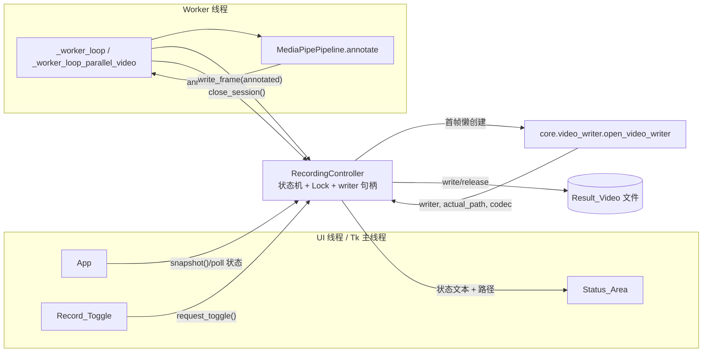
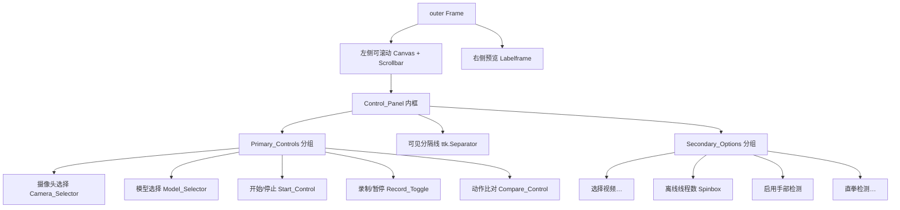
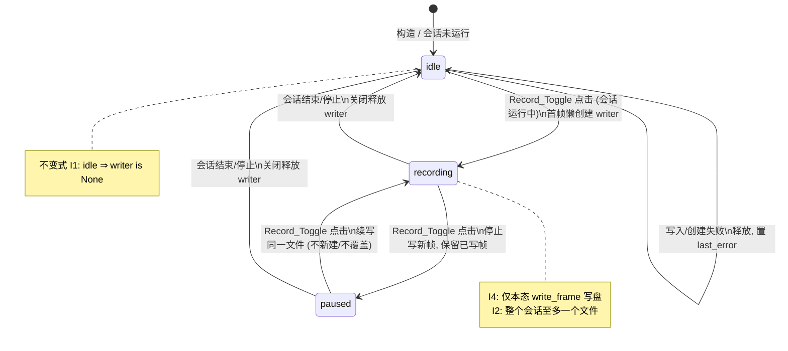

# 设计文档：UI 布局重组与录制/暂停运行时控制

## Overview

（概述）

本设计针对 `apps/app_ui.py` 中 `App` 类管理的 Tkinter 桌面界面，目标有二：

1. **布局重组**：把当前分散在「输入 / 选项 / 运行 / 状态」四张 `Labelframe` 卡片里的控件，按主次重新组织为左侧控制区中的两个分组——**Primary_Controls**（核心五项：摄像头选择、模型选择、开始、录制/暂停、动作比对）与 **Secondary_Options**（视频文件选择、离线线程数、手部检测开关、直拳检测入口），两组之间用明确可见的分隔线隔开。引入最小窗口尺寸（800×600）与可滚动画布，保证小尺寸下五项核心控件仍可完整访问。

2. **录制/暂停运行时控制（新增能力）**：把录制从「启动前预先勾选导出」改造为「会话运行期间随时开始/暂停」。核心是引入一个**与 Tkinter 解耦、可独立单元/属性测试**的录制状态机控制器 `RecordingController`，由 UI 线程在 `Record_Toggle` 点击时变更状态，工作线程（`_worker_loop` / `_worker_loop_parallel_video`）每帧读取状态以决定是否写盘。`VideoWriter` 在首次「空闲→录制中」时延迟创建（复用 `core/video_writer.open_video_writer` 的编码回退能力），在「已暂停⇄录制中」之间保持同一 writer，在会话结束/停止时无论当前状态都关闭释放。

设计约束：不改变底层视觉推理逻辑（`core/vision_pipeline.py`）、模板匹配与技术评估算法；不改变摄像头枚举模块（`apps/camera_enum.py`）的对外行为。

> 需求覆盖：本节对应 Requirement 1（布局）、Requirement 5（录制/暂停）整体目标。

### 设计决策与理由

| 决策 | 理由 |
| --- | --- |
| 将录制状态机抽取为独立模块 `core/recording_controller.py`，不依赖 tkinter | 与 `apps/camera_enum.py` 同样的可测试性策略：状态转换是纯逻辑，可用 Hypothesis 做属性测试，无需启动 GUI 或真实 I/O。 |
| 复用 `open_video_writer` 而非内联 `cv2.VideoWriter_fourcc("mp4v")` | 现有内联写法在多数播放器上兼容性差；`open_video_writer` 已实现 avc1/H264/MJPG/mp4v 编码回退并返回实际落盘路径。 |
| `RecordingController` 内部以 `threading.Lock` 保护状态与 writer 句柄 | UI 线程改状态、worker 线程读状态并写帧，存在跨线程共享；锁保证转换原子、避免「暂停瞬间仍写入一帧」之类竞态。 |
| 录制写盘动作放在 worker 线程内，由 worker 调用 controller 的 `write_frame()` | 写盘是阻塞 I/O，不能放 UI 线程；controller 内部根据状态自行决定写或不写，UI 只发「请求状态变更」信号。 |
| 默认保存路径由 `outputs_dir()` + 时间戳派生 | 去除「启动前必须选路径」的耦合，录制随时可开始；时间戳保证每次会话文件名唯一。 |
| 控制区使用可滚动 Canvas 承载 | 满足需求 1.6：窗口小于 800×600 时通过滚动访问全部核心控件，而非永久裁剪。 |

## Architecture

（架构）

### 线程与职责划分

- **UI 线程（Tk 主线程）**：构建并刷新控件；处理 `Record_Toggle` 点击，调用 `RecordingController.request_toggle()`；通过 `_tick()` 消费帧队列刷新预览；根据 controller 状态刷新 `Status_Area` 文本与路径。
- **Worker 线程**：读取帧 → `pipe.annotate()` → 将标注帧投递预览队列；**每帧调用 `RecordingController.write_frame(annotated)`**，由 controller 依据当前状态决定写或跳过；会话结束时调用 `RecordingController.close_session()`。
- **RecordingController**：跨线程共享的录制状态机，持有 `Recording_State`、`VideoWriter` 句柄与目标路径；以锁保证状态转换与写盘判定的原子性。

UI 线程只「请求」状态变更，真正的 writer 创建/写入/释放都发生在 worker 线程对 controller 的调用中，避免在 UI 线程做阻塞 I/O，同时把竞态收敛到 controller 内部一把锁。

### 组件关系图



### 控制区布局结构



> 需求覆盖：组件关系图对应 Requirement 5；布局结构图对应 Requirement 1.1–1.4、Requirement 7。

## Components and Interfaces

（组件与接口）

### 1. `RecordingController`（新增，`core/recording_controller.py`）

与 tkinter 完全解耦的录制状态机。所有真实 I/O（writer 工厂）通过依赖注入，便于属性测试用假对象替换。

```python
RecordingState = Literal["idle", "recording", "paused"]  # 空闲 / 录制中 / 已暂停

# writer 工厂签名，默认绑定到 open_video_writer
WriterFactory = Callable[[Path, float, tuple[int, int]], tuple["VideoWriterLike", Path, str]]

class RecordingController:
    def __init__(
        self,
        writer_factory: WriterFactory,
        path_provider: Callable[[], Path],   # 默认：outputs_dir()/record_<timestamp>.mp4
    ) -> None: ...

    @property
    def state(self) -> RecordingState: ...

    def begin_session(self, *, fps: float, size: tuple[int, int]) -> None:
        """会话启动：登记本次会话写入参数，状态保持 idle，不创建 writer（懒创建）。"""

    def request_toggle(self) -> RecordingState:
        """UI 线程调用：idle→recording / recording→paused / paused→recording 循环切换。
        在 idle→recording 时若尚无 writer 则记下"需懒创建"标记，真正创建延迟到首个 write_frame。
        返回切换后的状态。会话未运行时为 no-op 并保持 idle。"""

    def write_frame(self, frame) -> None:
        """Worker 线程每帧调用：仅当状态为 recording 时写盘。
        首次写盘时懒创建 writer（recording 状态下）。paused/idle 直接跳过。
        写入或创建失败时进入错误处理：释放资源、置 error 原因、复位 idle。"""

    def close_session(self) -> Path | None:
        """会话结束/停止：无论 recording 还是 paused 都释放 writer、复位 idle。
        返回已写入的 Result_Video 实际路径（若本会话曾录制过）否则 None。"""

    def snapshot(self) -> "RecordingSnapshot":
        """返回不可变快照（state、result_path、frames_written、last_error），供 UI 线程刷新状态显示。"""
```

线程安全：`request_toggle` / `write_frame` / `close_session` / `snapshot` 内部统一用一把 `threading.Lock` 串行化，保证「读状态→写帧」是原子的，杜绝暂停瞬间多写一帧的竞态。

### 2. `App._build_ui()`（重构）

- 左侧改为「可滚动容器」：`Canvas` + 垂直 `Scrollbar` + 内嵌 `inner` Frame；`inner` 通过 `<Configure>` 事件更新 `scrollregion`；鼠标滚轮绑定。
- `inner` 内自上而下放置：
  1. **Primary_Controls** 分组（`ttk.Labelframe` 或带标题的 Frame），顺序固定：Camera_Selector → Model_Selector → Start_Control → Record_Toggle → Compare_Control。
  2. **`ttk.Separator(orient="horizontal")`** 作为明确可见分隔。
  3. **Secondary_Options** 分组：选择视频、离线线程数 Spinbox、手部检测 Checkbutton、直拳检测按钮。
- `Status_Area` 保留在控制区底部（状态文本、识别结果、进度条），录制状态文本与路径并入其中。
- 主窗口 `self.root.minsize(800, 600)`，保持 `geometry("1100x720")` 初始尺寸。

### 3. `App` 录制相关新增/改动方法

- `self._rec = RecordingController(writer_factory=..., path_provider=...)`：构造期创建。
- `_on_record_toggle()`：UI 回调，调用 `self._rec.request_toggle()`，据返回状态刷新按钮文本（开始录制/暂停录制/继续录制）与 Status_Area。
- `_refresh_recording_status()`：由 `_tick()` 周期调用，读取 `self._rec.snapshot()` 刷新状态文本与路径；空闲时清除录制文本（需求 5.10）；error 时弹出错误提示并复位（需求 5.11）。
- `_set_running_controls(running: bool)`：集中管理运行态控件 enable/disable（见状态转换表）。

### 4. Worker 循环改动

- 移除「启动前 `state.out_path` 决定是否建 writer」「内联 `cv2.VideoWriter_fourcc("mp4v")`」逻辑。
- 进入循环前调用 `self._rec.begin_session(fps=fps_for_ts, size=(w, h))`。
- 每帧由 `if writer is not None: writer.write(annotated)` 改为 `self._rec.write_frame(annotated)`。
- 循环结束（含正常结束、停止、异常）在 `finally` 中调用 `self._rec.close_session()`。
- `_worker_loop_parallel_video` 同步改造：写盘点 `writer.write(annotated)` 改为 `self._rec.write_frame(annotated)`，结束时 `close_session()`。

### 5. 不变更组件

`CompareWindow` / `TechEvalWindow` 的单例打开模式（`is_open()`/`focus()`）、`enumerate_cameras` / `InputSourceState`、`MediaPipePipeline` 保持不变。`Compare_Control` 在运行与未运行时均保持 enabled（需求 6.4、6.5）。

## Data Models

（数据模型）

### `RecordingController` 内部字段

| 字段 | 类型 | 说明 |
| --- | --- | --- |
| `_state` | `RecordingState` | `"idle"` / `"recording"` / `"paused"`，初始 `"idle"`。 |
| `_lock` | `threading.Lock` | 串行化所有状态/写盘操作。 |
| `_writer` | `VideoWriterLike \| None` | 当前会话的 writer 句柄；`idle` 时**必须**为 `None`（不变式）。 |
| `_result_path` | `Path \| None` | writer 实际落盘路径（由工厂返回的 `actual_path`，可能因编码回退改后缀）。 |
| `_session_active` | `bool` | 会话是否运行中；`begin_session` 置 True，`close_session` 置 False。 |
| `_fps` | `float` | 本会话写入帧率（来自源/默认 30）。 |
| `_size` | `tuple[int, int]` | 本会话写入帧尺寸 `(w, h)`。 |
| `_frames_written` | `int` | 本会话已写入帧数（用于属性断言与状态显示）。 |
| `_last_error` | `str \| None` | 最近一次写盘/创建失败原因。 |
| `_writer_factory` | `WriterFactory` | 注入的 writer 工厂，默认绑定 `open_video_writer`。 |
| `_path_provider` | `Callable[[], Path]` | 注入的路径生成器，默认 `outputs_dir()/record_<timestamp>.mp4`。 |

**核心不变式（供属性测试断言）**：

- I1：`_state == "idle"` ⇒ `_writer is None`（空闲态绝不持有打开的 writer）。
- I2：单次会话（`begin_session`→`close_session`）内最多创建一个 writer，即 `_result_path` 一旦设定不再变更为不同文件。
- I3：状态仅在 {idle→recording, recording→paused, paused→recording, *→idle(close)} 集合内转换。
- I4：`write_frame` 写盘当且仅当调用时状态为 `recording`。

### `RecordingSnapshot`（不可变快照，UI 读取用）

```python
@dataclass(frozen=True)
class RecordingSnapshot:
    state: RecordingState
    result_path: Path | None
    frames_written: int
    last_error: str | None
```

### `UiState` 更新

录制不再由启动前配置决定，移除 `save_output` / `out_path` 字段对录制流程的控制作用（保留与否取决于其他遗留调用；本设计将其从录制路径决策中解除，worker 不再据此建 writer）：

```python
@dataclass
class UiState:
    source: str
    pose_variant: str
    workers: int
    enable_hands: bool
    # save_output / out_path 不再参与运行时录制；录制完全由 RecordingController 管理
```

> 需求覆盖：数据模型对应 Requirement 5.3、5.5、5.7、5.8、5.11；不变式 I1–I4 支撑下文 Correctness Properties。


## Recording_State 状态机



## Correctness Properties

（正确性属性）

*属性（property）是指在系统所有合法执行中都应当成立的特征或行为——本质上是关于系统应做什么的形式化陈述。属性充当人类可读规约与机器可验证正确性保证之间的桥梁。*

下列属性针对从 Tkinter 中抽取出来的纯状态机 `RecordingController`。由于状态转换与写盘判定是纯逻辑（writer 通过注入的工厂以假对象替换），它们适合用 Hypothesis 做属性测试：生成随机的「UI 动作序列」（toggle / begin_session / write_frame / close_session 的任意交织）与随机帧序列，断言不变式恒成立。

### Property 1: 状态转换合法性

*For any*（对任意）由 `begin_session`、`request_toggle`、`close_session` 组成的动作序列，`RecordingController` 的状态在任意时刻都只取 `idle`/`recording`/`paused` 之一，且每一步转换都属于合法转换集合 {idle→recording, recording→paused, paused→recording, recording→idle, paused→idle}；当会话未运行（未 `begin_session` 或已 `close_session`）时，`request_toggle` 为 no-op 且状态保持 `idle`。

**Validates: Requirements 4.1, 5.1**

### Property 2: 仅录制中写盘

*For any*（对任意）动作序列与穿插其间的帧序列，注入 writer 收到的写入帧数恰好等于「调用 `write_frame` 时控制器处于 `recording` 状态」的次数；处于 `paused` 或 `idle` 时调用 `write_frame` 不产生任何写入，且不丢弃此前已写入的帧。

**Validates: Requirements 5.3, 5.5**

### Property 3: 单会话单文件

*For any*（对任意）单次会话（一次 `begin_session` 到对应 `close_session`）内的任意 toggle/写帧交织序列，本会话产生的 `result_path` 至多为一个确定路径；`paused→recording` 恢复录制时复用同一 writer 与同一路径，不新建文件、不覆盖既有内容。

**Validates: Requirements 5.7**

### Property 4: 结束必复位

*For any*（对任意）会话结束前所处的状态（`idle`、`recording` 或 `paused`），调用 `close_session` 后控制器状态恒为 `idle`，且本会话的 writer 已被释放（`release` 恰被调用且其后 writer 句柄为 `None`）。

**Validates: Requirements 4.4, 5.8**

### Property 5: writer 与路径生命周期

*For any*（对任意）动作序列，当状态为 `idle` 时控制器持有的 writer 句柄必为 `None`（空闲态绝不持有打开的 writer）；当状态为 `recording` 或 `paused` 且本会话已至少写入过一帧时，`snapshot().result_path` 非空。

**Validates: Requirements 5.9, 5.10**

### Property 6: 错误条件复位

*For any*（对任意）使 writer 工厂在创建时抛错、或使 `writer.write` 在写入时抛错的注入场景，相应的 `write_frame` 调用返回后控制器状态恒为 `idle`，writer 句柄被释放并置为 `None`，且 `snapshot().last_error` 为非空错误原因。

**Validates: Requirements 5.11**

### Property 7: 离线线程数钳制

*For any*（对任意）整数输入，离线线程数规范化函数的输出落在闭区间 `[1, os.cpu_count()]` 内（小于 1 钳到 1，大于核数钳到核数）。

**Validates: Requirements 7.2**

## Error Handling

（错误处理）

| 场景 | 处理 | 需求 |
| --- | --- | --- |
| 输入源未选择即点击开始 | `_collect_state` 抛 `ValueError`，弹出「请先选择摄像头或视频」，不启动会话，Recording_State 保持 idle | 4.2 |
| 选中摄像头无法打开/被占用 | worker 中 `cap.isOpened()` 为假 → `_post_status` 提示不可用，保持原输入源不变 | 2.6 |
| `open_video_writer` 创建失败（抛 `RuntimeError`） | `write_frame` 捕获 → 释放任何半开资源、`_last_error` 记原因、状态复位 idle；UI 经 snapshot 检测到 error 弹框提示 | 5.11 |
| 录制过程中 `writer.write` 抛异常 | 同上：关闭释放、置 error、复位 idle | 5.11 |
| 动作比对窗口创建失败 | `_open_compare` try/except → 弹框提示失败原因，主窗口状态不变 | 6.3 |
| 选择的视频文件不存在/格式不支持 | 校验失败 → 拒绝并保留先前选择，弹框提示文件无效 | 7.5 |
| 编码器全部回退失败 | `open_video_writer` 抛 `RuntimeError`，按「创建失败」路径处理 | 5.11 |

错误处理原则：`RecordingController` 内部任何写盘异常都不得逃逸到 worker 主循环导致会话崩溃；controller 自行收敛为 idle + last_error，由 UI 线程异步取 snapshot 提示用户。

## Testing Strategy

（测试策略）

### 双重测试方法

- **属性测试（Hypothesis，已在本仓库使用，见 `.hypothesis/`）**：覆盖 `RecordingController` 的 7 条正确性属性。状态机是纯逻辑，writer 通过注入的「假 writer」（记录 write/release 调用、可配置在第 N 次 write 抛错）替换，无需真实 cv2 I/O 或 GUI。
- **单元/示例测试**：覆盖按钮文本映射（开始录制/暂停录制/继续录制）、运行态控件 enable/disable 联动、布局结构断言（Primary_Controls 五项与顺序、Separator 存在、Secondary_Options 位于其后）、错误提示场景（无输入源、无效视频、比对窗口创建失败）。
- **冒烟测试**：最小尺寸 800×600 下控件可见性、可滚动 Canvas 行为、端到端启动 2 秒内出预览等依赖真实窗口几何的项，作人工/冒烟验证。

### 属性测试要求（仅适用于 `RecordingController`）

- 选用 **Hypothesis**，不自行实现属性测试框架。
- 每条属性测试最少运行 **100** 次迭代（Hypothesis 默认 `max_examples>=100`）。
- 每条测试以注释标注对应设计属性，格式：
  `# Feature: ui-layout-redesign, Property {number}: {property_text}`
- 每条正确性属性用**单个**属性测试实现。
- 推荐用 Hypothesis 的 `stateful`（`RuleBasedStateMachine`）或自定义「动作序列」生成器来生成 begin_session/toggle/write_frame/close_session 的随机交织，对照一个简单的引用模型（reference model）断言状态与写入计数（model-based testing）。

### 测试边界说明

- 摄像头枚举（需求 2.x）由既有 `apps/camera_enum.py` 测试覆盖，本特性不重复；UI 侧仅冒烟确认列表填充与运行态禁用。
- UI 渲染/几何（1.5、1.6）不做属性测试，使用冒烟测试。

### 设计到需求映射汇总

| 设计章节 | 覆盖需求 |
| --- | --- |
| 布局重组（Architecture 布局结构图、Components 2） | 1.1–1.6, 7.1–7.4 |
| RecordingController（Components 1、Data Models、状态机图） | 5.1–5.11, 4.1, 4.4 |
| Worker 循环改动（Components 4） | 5.3, 5.5, 5.7, 5.8 |
| 运行态控件联动（Components 3） | 2.5, 3.5, 3.6, 4.3, 6.4, 6.5 |
| Status_Area（Components 2、Error Handling） | 4.5, 5.9, 5.10, 7.6–7.8 |
| Error Handling | 2.6, 4.2, 5.11, 6.3, 7.5 |
| Correctness Properties P1–P7 | 4.1, 4.4, 5.1, 5.3, 5.5, 5.7, 5.8, 5.9, 5.10, 5.11, 7.2 |
