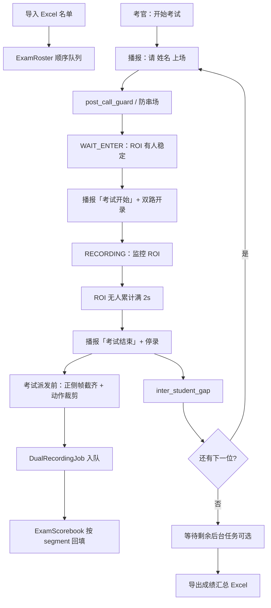
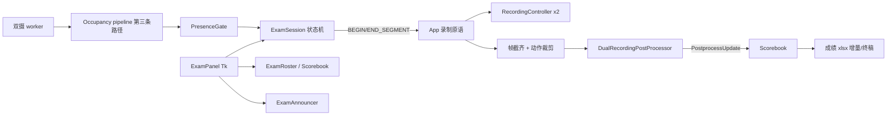

# 考试系统设计文档（Tkinter 双摄自动考场）

> **状态**：待审查（本文件仅设计，未实现）  
> **版本**：v0.2  
> **日期**：2026-07-11  
> **范围**：Python / Tkinter；不涉及 Vue/Tauri  
> **关联能力**：双摄录制后自动比对（`apps/recording_postprocess.py`、`docs/specs/20260709-233221-tkinter-dual-record-auto-compare/`）  
> **v0.2 依据**：审查优化清单 A（进实现前必改）/ B（产品必答）/ C（工程健壮性）/ D（v2 延后）

---

## 1. 背景与目标

### 1.1 业务背景

现场考试需要把现有「双摄录制 + 后台动作比对」串成可重复的考务流程：

1. 导入固定格式 Excel 考生名单，生成**考试顺序列表**  
2. 考官点击开始后，系统**按序播报姓名**  
3. 学生听到名字后进入考试区域  
4. 摄像头判定人已在**标定 ROI** 内 → 播报「考试开始」并**自动双路开录**  
5. 学生做完动作后自行离场  
6. 摄像头判定 ROI **连续无人满 2 秒** → 播报「考试结束」，**自动停录**，转入后台比对（模板考前备好）  
7. 比对结果写入成绩表；重复 2–7，直至名单走完  
8. 导出本场全部考生成绩 Excel 到指定位置  

**v1 评分含义（必须对考官说清）**：成绩仅为现有黑盒 **动作相似度综合分**（正/侧 DTW 加权后的百分制），**不含**规则扣分、技术评估细项、裁判主观分。老师若需要「规范扣分」，不在 v1 交付范围。

### 1.2 成功标准

| # | 标准 |
|:---:|:---|
| S1 | 固定表头 Excel 可导入；非法表拒绝并给出明确错误（含学号文本化、拒绝合并单元格，见 §7.2） |
| S2 | 见下方 **可测门闩**（禁止「演示 2 人成功即过」） |
| S3 | 成绩与考生、片段目录、`result.json` 可追溯关联；内部分数口径 0..1，导出 ×100（§7.5） |
| S4 | 下一位叫号**不必等待**上一位后台比对完成 |
| S5 | 名单走完后可导出完整成绩表；运行中崩溃 **已完成行** 不丢（增量落盘）；**不要求**崩溃后续考到中断考生（见 §18） |
| S6 | 不破坏现有手动双摄录制/一条龙比对路径（非考试会话零推理快路径不变） |
| S7 | 本场仅为**单一全局模板**对应的动作；现场须事先备好正/侧 heavy 模板（见 §6.5、§13） |

#### S2 可测门闩（建议默认，现场验收前可改数字）

| 门闩 | 建议默认 | 说明 |
|:---|:---|:---|
| 目标规模 | **≥10 人**连续跑完名单 | 含 skip/force 各至少 1 次的附加场景可另测 |
| 人均墙钟（叫号→停录） | **P95 ≤ 90s**（不含后台比对等待） | 不含学生故意拖延 |
| 误开录 / 误结束 | **0 次**（受控 10 人演练） | 区外站立、路过不触发；动作中不因单帧丢检结束 |
| 比对失败率 | **≤10%** 且失败均有可读 `error_code` | 含帧对齐截齐后仍失败的真实坏段 |
| 无人干预闭环 | **连续 N=5 人**无需考官点开停录 | 允许考官仅监控；skip/force 不计「无人干预」批次 |
| 半自动降级 | Presence 异常时可用人工确认到场/离场完成同场 | 不阻塞整场（实现期 UI 开关） |

> 数字标为「建议默认」：若现场动作时长/场地与假设差较大，验收纪要可改门闩，但**必须仍是量化门**，不得退回纯文字 S2。

### 1.3 本文件定位

供产品 / 研发 / 现场审查。**审查通过前不实现业务代码**。实现以本文件及审查修订为准。

---

## 2. 已确认产品决策

| 项 | 决策 | 说明 |
|:---|:---|:---|
| UI | **Tkinter 旧桌面** | 复用已成熟双摄 + 后处理；默认不改 `frontend/` |
| 摄像头 | **双摄正 + 侧** | `primary=_rec` 为 front，`secondary=_rec2` 为 side |
| 模板 | **全局同一套**正/侧 heavy `pose33_v3` | `templates/standard_front_heavy.npz` + `standard_side_heavy.npz` |
| 到场 / 离场 | **固定 ROI + 姿态**（primary + 旋转后坐标） | 无人持续 **2.0s** 结束；另见防串场参数 §8.3 |
| 评分链路 | 现有黑盒自动比对 | `auto_compare=True`，`record_skeleton=False` |
| 分数口径 | 内部 **0..1**，导出 ×100 | 综合列用 `combined_percent`（0–100 整数） |
| 补考 | 同学号可重考；**导出以最后一次成功为准** | 见 §7.6 |
| 开停录 API | **专用** `_begin/_end_recording_segment` | 禁止考试路径直接调三态 toggle |

---

## 3. 非目标（本设计明确不做）

### 3.1 v1 不做

- Vue / Tauri / `ui_backend` bridge 考试 API  
- 每考生不同模板、Excel 内动作→模板映射  
- 将正式评分切到 YOLO；考试不授权新评分后端  
- 人脸识别 / 身份核验（仅按名单顺序叫号；**错归风险见 §13**）  
- 规则扣分、error analysis（与现黑盒一致，默认关）  
- 把 DTW / 特征提取逻辑搬进考试模块  
- 多考场并行、联网集中服务器  
- 崩溃后 resume 到中断考生（仅保证已完成行不丢）  

### 3.2 延后 v2（已知局限，见 §18）

- 名单中途插入 / 请假标记  
- 大屏叫号队列 + 回放  
- 崩溃后续考  
- 每考生不同模板 / Excel 动作名  
- 嘈杂环境 TTS 增强（v1：失败降级大字文案即可）  

---

## 4. 现有能力复用

| 能力 | 位置 | 考试中的用法 |
|:---|:---|:---|
| 双摄采集与预览 | `apps/app_ui.py` `_worker_loop_dual_camera` | 考试依赖已 Start 的双摄会话 |
| 录制状态机 | `core/recording_controller.py` | 经专用 begin/end 片段 API；结束片段不关会话 |
| 片段终结与入队 | `App._finalize_and_dispatch_recording_pair` | 停录后提交 `DualRecordingJob`（可先考试侧截齐帧） |
| 后台 FIFO 转码+比对 | `apps/recording_postprocess.py` | 单消费者；**非考试**仍硬校验帧数相等 |
| 双流评分 | `core.action_compare.compare_dual_streams` | 全长打分；考试在派发前做头尾/动作段裁剪 |
| 默认模板路径 | `default_template_paths()` | 全局模板；**仓库 templates 可能为空，须现场预置** |
| 结果落盘 | 片段目录 `result.json` | 审计 + 分数来源 + 考生元数据 |
| 占用推理 | **独立** occupancy pipeline（§5.3 / §8.5） | 非 `record_skeleton` 路径；不写骨架录像 |
| 偏好持久化 | `core/paths.py` / `user_prefs.json` | ROI、防串场参数、考试目录 |

黑盒比对固定调用（与现后处理一致；考试可先裁剪源视频或传等价区间）：

```python
compare_dual_streams(
    front_template, side_template, front_video, side_video,
    pose_variant="heavy",
    workers=1,
    w_front=0.4, w_side=0.6,
    baseline=2.0,
    enable_rules=False,
    enable_error_analysis=False,
    stop_evt=...,
)
```

**硬约束**：

- 不得改变 MediaPipe `pose33_v3` 正式默认路径行为（以 golden 测试为准）  
- 考试模式强制：`auto_compare=True`、`record_skeleton=False`  
- 占用检测可以跑 pose，**录制帧必须仍为裸帧**  
- **非考试会话**：`record_skeleton=False` 时保持现有**零推理快路径**（`frame.copy()`），不得被 occupancy 代码拖慢  

---

## 5. 总体架构

### 5.1 流程



### 5.2 组件拓扑



### 5.3 职责划分

| 组件 | 职责 | 禁止 |
|:---|:---|:---|
| `ExamSession` | 纯状态机：事件→阶段→命令（§6.6 转换表为契约） | 不碰 Tk、OpenCV、ffmpeg |
| `PresenceGate` | ROI 占用布尔序列 → 稳定进场 / 空场 2s 事件 | 不直接开停录 |
| **Occupancy pipeline** | worker 内**第三条路径**：lite + `enable_hands=False` + VIDEO + **自有** `next_timestamp_ms`；隔 N 帧；**仅** `wait_enter` / `recording`（含内部空场计时）阶段运行 | 不画进录制帧；不替代 `record_skeleton` 双 pipeline；非考试不创建 |
| `ExamRoster` / Scorebook | 名单、行状态、Excel I/O、补考行策略 | 不跑比对算法 |
| `ExamAnnouncer` | 异步播报队列 | 不在 worker 热路径同步阻塞 |
| `ExamPanel` | 名单 UI、ROI 标定（旋转后 primary 预览）、按钮、状态展示 | 不写录制锁逻辑 |
| `App` | 接线：occupancy 启停、专用 begin/end 片段、派发前截齐/裁剪、job 元数据 | 考试路径禁止直接 `_on_record_toggle` |
| `DualRecordingPostProcessor` | 转码+比对；透传考生元数据 | **不**为考试放宽现网帧数硬校验（截齐在派发前完成） |

#### 5.3.1 Occupancy 第三条路径（A1，阻塞 v1）

现状：`record_skeleton=False` 时 worker 对帧直接 `copy`，**零推理**（`app_ui.py` 双摄 runtime）。  
考试需要：**裸帧录制 + 同时 pose 占用**——这是独立分支，不是打开骨架开关。

| 项 | 规格 |
|:---|:---|
| 模型 | Pose **lite**，`enable_hands=False`，`running_mode=video` |
| 时间戳 | **独立** `next_timestamp_ms`，不与骨架 pipeline 共用 |
| 输入 | **仅 primary** 路、**`_apply_rotation` 之后**的帧（与预览/ROI 同系） |
| 频率 | 每隔 `occupancy_stride` 帧推一次（默认 **3**） |
| 生命周期 | 考试 `start_exam` 后按阶段启停；会话 Stop/关窗必须 `close` |
| 活跃阶段 | 仅 `wait_enter`、`recording`（含空场累计）；`calling` / `finishing` / `paused` 等不跑 |
| 输出 | `present: bool` → `PresenceGate` → 主线程事件队列 |
| 录制 | `_write_recording_pair` 仍写裸帧；预览可叠 ROI/状态 |

非考试会话：**不得**创建 occupancy pipeline，快路径零回归。

---

## 6. 状态机

### 6.1 阶段（`ExamPhase`）

| 阶段 | 含义 |
|:---|:---|
| `idle` | 未导入或已复位 |
| `ready` | 名单就绪，可点「开始考试」 |
| `calling` | 叫号播报已发出；尚未到可进场检测时刻 |
| `wait_enter` | 已过 `post_call_guard_s`，等待 ROI 有人稳定 |
| `recording` | 录制中（空场累计为子状态，UI 可显示倒计时） |
| `finishing` | 已发 END_SEGMENT，等待 `record_stopped` / 派发完成 |
| `completed` | 名单指针耗尽（后台任务可能仍在跑） |
| `paused` | 考官暂停（冻结进场开录与自动 advance） |
| `aborted` | 整场中止；已写成绩保留 |

> v0.2 去掉易碎的瞬时相 `exam_start` / `advance` / `wait_empty` 作为**独立对外阶段**：开录/advance 为命令副作用；空场为 `recording` 内计时。

### 6.2 主要事件

| 事件 | 来源 | 备注 |
|:---|:---|:---|
| `roster_loaded` | 导入成功 | |
| `start_exam` | 考官 | 校验 §6.5 |
| `call_guard_elapsed` | 定时器 | 叫号后 `post_call_guard_s` 到 |
| `occupancy(present, t)` | PresenceGate | 仅 wait_enter/recording 有意义 |
| `enter_stable` | PresenceGate | 有人稳定 |
| `empty_stable` | PresenceGate | 无人满 `empty_hold_s` 且已过 `min_record_s`（自动路径） |
| `record_started` / `record_stopped` | App | 专用 API 回调 |
| `postprocess_update` | 后处理 | 不推进名单指针 |
| `skip_current` | 考官 | 见 §6.3 分支 |
| `force_finish_current` | 考官 | **绕过** `min_record_s` |
| `pause` / `resume` | 考官 | |
| `abort_exam` | 考官 | |
| `export_request` | 考官或完成后自动 | |
| `retest_request(student_id)` | 考官 | 补考插入 §7.6 |

### 6.3 主要命令（状态机输出）

| 命令 | 动作 |
|:---|:---|
| `ANNOUNCE(text)` | 入播报队列 + UI 文案 |
| `ARM_OCCUPANCY` / `DISARM_OCCUPANCY` | worker 启停占用采样 |
| `BEGIN_SEGMENT` | 调用 `_begin_recording_segment()` |
| `END_SEGMENT` | 调用 `_end_recording_segment()` → 截齐 → 裁剪 → dispatch |
| `DISCARD_SEGMENT` | 录制中放弃：停录且**不**入比对队列（或入队后标 skip 不比对，实现二选一，推荐不入队） |
| `BIND_SEGMENT` / `UPDATE_ROW` | 台账 |
| `SCHEDULE_CALL_GUARD` | 启动 `post_call_guard_s` |
| `SCHEDULE_INTER_GAP` | 停录确认后 `inter_student_gap_s` 再允许下一位 `calling` |
| `ADVANCE_POINTER` | 指针 +1 |
| `EXPORT` | 写/刷新 xlsx |
| `UI_LOCK_MANUAL_RECORD` | 禁用手动录制与骨架开关 |

#### 6.3.1 跳过 vs 强制结束（B4）

| 操作 | 条件 | 行为 |
|:---|:---|:---|
| **skip（未开录）** | `calling` / `wait_enter` | 当前行 → `skipped`；不录；`ADVANCE`（经 inter-gap 可选缩短为 0） |
| **skip（录制中）** | `recording` | **先** `DISCARD_SEGMENT`（停录、丢弃本段、不比对）；行 → `skipped`；再 advance |
| **force_finish** | `recording` | **绕过** `min_record_s`，立即 `END_SEGMENT`（正常派发比对）；行 → `processing` |
| **force_finish** | 非 recording | 忽略或 no-op |

### 6.4 并行策略

- **叫号与比对解耦**：考生 A 进入 `finishing`/派发后，经 `inter_student_gap_s` 可叫 B，不必等 A 比对 `completed`。  
- 后处理仍是**单消费者 FIFO**。  
- Scorebook 用 `segment_id → 行` 异步回填。  
- v1 **不做**自动背压限流；若 processing 堆积，UI 展示队列深度即可（v2 可加「落后 N 人暂停叫号」）。

### 6.5 开场前置条件（`start_exam` 校验）

全部满足才进入首位 `calling`，否则 Panel 提示：

1. 双摄会话已 running（非单摄）  
2. 正/侧模板文件存在且 `validate_template_pair` 通过（**当前仓库 `templates/` 可能为空——现场必须先生成 heavy 正/侧模板**）  
3. `pose_landmarker_heavy.task` 可用（比对）；`pose_landmarker_lite.task` 可用（占用）  
4. 名单非空  
5. ROI 已标定且合法（归一化、最小面积）  
6. 考试输出目录可写  
7. **primary=front、secondary=side** 角色已在 UI 确认（开考检查单勾选，防止正侧接反导致系统性低分）

### 6.6 状态 × 事件转换表（B5，单测契约）

图例：`—` = 忽略；命令为主要输出（可多项）。

| 当前\事件 | `start_exam` | `call_guard_elapsed` | `enter_stable` | `empty_stable` | `record_started` | `record_stopped` | `skip_current` | `force_finish` | `pause` | `resume` | `abort_exam` |
|:---|:---|:---|:---|:---|:---|:---|:---|:---|:---|:---|:---|
| `idle` | — | — | — | — | — | — | — | — | — | — | — |
| `ready` | →`calling` + ANNOUNCE + SCHEDULE_CALL_GUARD + LOCK | — | — | — | — | — | — | — | — | — | →`aborted` |
| `calling` | — | →`wait_enter` + ARM_OCC | — | — | — | — | skip 未开录 → 下一位 | — | →`paused` | — | →`aborted` |
| `wait_enter` | — | — | →`recording` + ANNOUNCE开始 + BEGIN_SEGMENT | — | （确认） | — | skip 未开录 | — | →`paused` + DISARM | — | →`aborted` |
| `recording` | — | — | 重置空场计时 | →`finishing` + ANNOUNCE结束 + END_SEGMENT | — | — | DISCARD + skipped + 下一位 | →`finishing` + END_SEGMENT（bypass min） | →`paused`（可选：同时 END 或保持录，**v1：暂停则 force 逻辑不自动停录，需考官 force/skip**） | — | DISCARD 或 END? **v1：abort→DISCARD 当前 + aborted** |
| `finishing` | — | — | — | — | — | 派发后 SCHEDULE_INTER_GAP → 有下一位则 `calling` 否则 `completed` | — | — | — | — | 取消未决? 标 cancelled |
| `paused` | — | — | — | — | — | — | 按进入 pause 前阶段语义 | 若底层仍 recording 则 force | — | 回到 pause 前阶段 | →`aborted` |
| `completed` | — | — | — | — | — | — | — | — | — | — | — |
| `aborted` | — | — | — | — | — | — | — | — | — | — | — |

补充规则：

- `postprocess_update`：**任意**阶段只 `UPDATE_ROW`，不改 `ExamPhase`。  
- `retest_request`：仅 `ready`/`completed`/`paused` 或名单间隙插入，见 §7.6。  
- `BEGIN_SEGMENT` 若失败：行 `failed`，可 skip/重试，不静默 advance。  

实现须把上表落成 `tests/test_exam_session.py` 参数化用例。

---

## 7. Excel 契约

### 7.1 依赖

实现阶段在 `requirements.txt` 增加 **`openpyxl`**。不引入 pandas。

### 7.2 导入表（固定格式）

- 仅读**第一个 sheet**  
- **第 1 行为表头**，列名精确匹配（允许列顺序变化；多余列忽略）  

| 列名 | 必填 | 说明 |
|:---|:---:|:---|
| 序号 | 是 | 正整数；考试顺序按升序 |
| 学号 | 是 | **强制按文本读**（C2） |
| 姓名 | 是 | 显示与播报 |
| 班级 | 否 | 导出原样带回 |
| 备注 | 否 | 导出原样带回 |

**校验失败则整表拒绝**：

- 缺必填列  
- 序号非正整数或重复  
- 学号或姓名空  
- 无有效数据行  
- **存在合并单元格**（C2：拒绝并提示拆分）  
- 学号若被 Excel 读成 float（如 `2.026001e6`）：导入层须从 cell 的 **格式化文本 / 文本类型** 取值；无法安全还原则整表拒绝并指出行号  

空白尾行：忽略全空行，不以空白行计有效考生。

提供「下载导入模板」：表头 + 示例行；学号列预先设为文本格式。

### 7.3 成绩导出列

| 列名 | 说明 |
|:---|:---|
| 序号 | 来自导入（补考可重复学号，序号可用原序号或 `原序号-重考k`，实现选定一种并固定） |
| 学号 / 姓名 / 班级 | |
| 综合分 | `combined_percent`，0–100 整数；未完成空 |
| 正面分 | `front_score * 100`，**一位小数** |
| 侧面分 | `side_score * 100`，**一位小数** |
| 状态 | 见下表 |
| 错误信息 | failed/skipped 的 code+message |
| 片段ID / 录制目录 | |
| 叫号 / 开录 / 结束时间 | ISO 本地 |
| 备注 | 导入备注 |
| 是否计分行 | 可选：补考历史行标 `历史` / 计分行标 `计分`（§7.6） |

**状态枚举**：

| 状态 | 含义 |
|:---|:---|
| `pending` | 未轮到或已叫号未开录 |
| `recording` | 录制中 |
| `processing` | 已停录，后台转码/比对中 |
| `completed` | 比对成功有分 |
| `failed` | 录制或比对失败（含截齐后仍无效） |
| `skipped` | 考官跳过（含录制中放弃） |
| `superseded` | 已被同学报后续成功/计分行替代的历史段（导出可隐藏或附录） |

帧截齐、动作裁剪产生的 warning 写入 `result.json` / 可选「警告」列，**不**单独占用失败态，除非裁后无有效帧。

### 7.4 落盘策略

- **考试 run 目录**：`{record_dir}/exam_{run_id}/`  
  - `run_id`：`YYYYMMDD_HHMMSS`  
  - `成绩汇总.xlsx`：增量更新  
  - 可选：`roster_snapshot.json`  
- 视频片段目录与现有双摄结构一致，成绩表用片段ID 关联。  
- **最终导出**：自动写 run 目录；完成后弹窗可选另存副本（Q1 默认）。  

**工程约束（C1 / C3）**：

| 问题 | 策略 |
|:---|:---|
| Windows 下目标被 Excel 打开导致 `os.replace` → `PermissionError` | 捕获后结构化错误：`scorebook_locked`，提示关闭文件；有限次重试（如 3×200ms）；UI 可读中文 |
| 跨盘 `replace` 失败 | 同卷临时文件再 replace；跨卷则 copy+replace 回退 |
| 全表重写卡住 Tk | **写盘在后台线程**；主线程只投递「dirty」；节流（如最多 1 次/2s，终态立即刷） |

### 7.5 数据模型（分数口径钉死，B1）

```python
@dataclass(frozen=True)
class ExamCandidate:
    order: int
    student_id: str
    name: str
    class_name: str = ""
    note: str = ""

@dataclass
class ExamResultRow:
    candidate: ExamCandidate
    status: str  # pending|recording|processing|completed|failed|skipped|superseded
    segment_id: str | None = None
    segment_dir: str | None = None
    # 内部统一 0..1；导出时 front/side * 100，综合用 combined_percent
    front_score: float | None = None
    side_score: float | None = None
    combined_score: float | None = None   # 0..1
    combined_percent: int | None = None   # 0..100，与黑盒一致
    error_code: str | None = None
    error_message: str | None = None
    warnings: list[str] = field(default_factory=list)
    called_at: str | None = None
    record_started_at: str | None = None
    record_ended_at: str | None = None
    attempt_index: int = 1              # 同学号第几次作答
    is_scoring_row: bool = True         # 导出「计分」用最后一次成功
```

### 7.6 补考 / 重录（B2，v1 最小集）

| 规则 | 定义 |
|:---|:---|
| 触发 | 行 `failed` / `skipped` / 考官对已 `completed` 不满意时点「重考」 |
| 队列 | 在**当前指针之后**插入一条同 `ExamCandidate`、`attempt_index+1` 的新行（或追加到队尾，**v1 固定：插入队尾**，实现简单） |
| 录制 | 新 `segment_id`，与历史段并存于磁盘 |
| 计分 | **导出「正式成绩」取该学号最后一次 `completed` 成功**；更早 completed 标 `superseded` 或附录「历史尝试」 |
| 全失败 | 若无任何 `completed`，导出该学号最后一次尝试状态（failed/skipped） |
| 不自动重录 | 比对失败不自动再跑；必须考官点重考或现场 retest |

---

## 8. 有人 / 无人闸门（Presence）

### 8.1 ROI 定义（A4）

- **占用判定固定使用 primary 源**（`_rec` / front），**不使用** secondary。  
- 坐标系：**旋转之后**（与 `_apply_rotation(..., state.rotate)` 后预览一致）。  
- ROI 必须在「primary + 旋转后」预览上标定；存归一化 `roi = (x0, y0, x1, y1)∈[0,1]`。  
- `user_prefs` 建议同时存：`exam_roi_norm`、`exam_roi_rotate`（标定时代的 rotate，启动时若 rotate 变更则提示重新标定）。  
- secondary / side **不参与**占用。

### 8.2 占用定义

1. Occupancy pipeline 对 primary 旋转后帧 `infer`  
2. 无 pose → `present=False`  
3. 左右髋（BlazePose **23/24**）中点落入 ROI 且 visibility ≥ `presence_vis_thr` → `present=True`  
4. 单人模型以检测到的主体为准  

### 8.3 时间参数（含防串场 B3）

| 参数 | 默认 | 含义 |
|:---|:---:|:---|
| `enter_stable_s` | **0.8** | 连续有人 → 可开录 |
| `empty_hold_s` | **2.0** | 连续无人 → 可结束（自动路径） |
| `min_record_s` | **3.0** | 自动空场结束前的最短录制；**force_finish 绕过** |
| `presence_vis_thr` | **0.3** | 髋点可见度 |
| `occupancy_stride` | **3** | 每隔 N 帧跑一次占用 |
| `post_call_guard_s` | **1.5** | 叫号后 **最早** 进入 `wait_enter` 的延迟，抑制叫号瞬间噪声 |
| `inter_student_gap_s` | **2.0** | 上一人 `record_stopped` 确认后，到下一人 `calling` 的最小间隔，抑制离场/进场交叠 |

### 8.4 `PresenceGate` 行为

```text
update(present: bool, now: float) -> list[PresenceEvent]

# wait_enter:
#   present 连续 >= enter_stable_s → EnterStable
# recording:
#   自动结束：elapsed_record >= min_record_s 且 empty 累计 >= empty_hold_s → EmptyStable
#   present==True 时清空空场计时
# force_finish：不经 Gate，由 Session 直接 END_SEGMENT
```

### 8.5 与录制帧隔离 + 第三条路径（A1 落点）

- Occupancy 与 `record_skeleton` 双 pipeline **分离**；考试 `record_skeleton` 必须为 False。  
- 录制只写裸帧。  
- 预览可叠加 ROI 与 present 灯、空场倒计时（现场调参刚需）。  
- 阶段外 DISARM，避免 CPU 常驻。

### 8.6 走位帧与 DTW（A3，阻塞 v1）

`compare_dual_streams` **按全长打分、不做视角内动作拆分**，进场/离场走路会污染分数。  
`min_record_s` + `empty_hold_s` 还会在头尾引入走动。

**v1 策略（派发前，考试专用）**：

1. **正侧帧截齐（A2）**：派发前将两路对齐到 `n = min(front_frames, side_frames)`（推荐：截断较长一路的**尾部**冗余帧，或按时间对齐后物理裁剪视频）。**不修改** postprocess 对非考试任务的 `frame_count_mismatch` 硬失败语义。  
2. **动作段裁剪**：在截齐后的序列上，用现有 `motion_energy` + 活跃区间启发式（与 `make_template` / 模板周期逻辑同族工具）估计主动作 `[start, end]`，去掉头尾走位；若能量过平则 fallback：丢弃首尾各 `trim_head_s` / `trim_tail_s`（默认 **0.5s / 0.8s** @ 实际 fps）。  
3. 裁剪结果写入临时/片段目录 `front_exam.mp4` / `side_exam.mp4`（或帧索引写入 job），再 `submit`；`result.json` 记录 `trim` 元数据与 warnings。  

单测：人工构造「头尾静止/走动 + 中段运动」序列，断言裁后区间落在中段。

---

## 9. 语音播报

### 9.1 文案（可配置）

| 场景 | 默认文案 |
|:---|:---|
| 叫号 | `请{序号}号 {姓名} 上场考试` |
| 开始 | `考试开始` |
| 结束 | `考试结束` |
| 整场完成 | `本场考试已全部结束` |

### 9.2 实现约束

- 独立线程 + 队列；不阻塞 worker / Tk  
- Windows 系统语音优先；失败 → Panel 大字 + 可选 `winsound`  
- 高优先级（考试结束）可打断策略：实现时固定一种并单测  
- 嘈杂环境增强 → v2（§18）

---

## 10. 与双摄 / 后处理集成

### 10.1 会话生命周期

```text
考官：选择双摄 → 确认 primary=front → Start
  → claim 时 begin_session 已完成（两路）
  → 考试面板：导入 → 标定 ROI（旋转后 primary）→ 开始考试
  → … 多考生 …
  → completed → 自动写成绩表 + 可选另存
  → Stop 会话
```

考试中：禁用手动录制按钮与骨架开关；`auto_compare` 逻辑强制等价开启。

### 10.2 程序化录制原语（A5）

**禁止**考试路径调用 `_on_record_toggle`（三态：idle/recording/paused，易误暂停）。

抽出无 UI 原语（按钮回调与考试命令**共用**）：

```text
_begin_recording_segment():
  # 前置：双摄已 claim，begin_session 已在 worker claim 阶段完成；状态应为 idle
  # 1) 生成/发布 _record_stamp 与 segment 目录约定
  # 2) 双路 request_toggle: idle → recording（各一次，禁止连点成 pause）
  # 3) 更新考试所需状态；UI 文案可选

_end_recording_segment(*, discard: bool = False):
  # 1) stop_recording 双路（idle），不 close_session
  # 2) 若 discard：不入比对队列，清理或保留原始文件策略固定为「保留磁盘但标记 discarded」
  # 3) 若正常结束：帧截齐 → 动作裁剪 → DualRecordingJob(submit) + 考生元数据
```

| 命令 | 映射 |
|:---|:---|
| `BEGIN_SEGMENT` | `_begin_recording_segment()` |
| `END_SEGMENT` | `_end_recording_segment(discard=False)` |
| `DISCARD_SEGMENT` | `_end_recording_segment(discard=True)` |

手动 UI「开始/结束录制」改为调用上述原语（toggle 仅保留暂停能力若仍需要；或暂停从考试模式隐藏）。

线程：原语与状态机 tick 在 **Tk 主线程**；worker 只报 occupancy。

### 10.3 派发前处理与 Job 扩展（A2 / A3）

#### 帧截齐（推荐方案 ①）

- **考试模式**在 `submit` 前：`n = min(front_frames, side_frames)`，将较长视频截到与较短相同帧数（或时间）。  
- 现网 `recording_postprocess` 对帧数不等仍 **raise `frame_count_mismatch`**（非考试路径语义不变）。  
- 截齐信息写入 warnings / result。  
- 单测：人造 front 100 / side 97 → 截齐后相等且能过校验。

#### 考生元数据

```python
exam_run_id: str | None = None
student_id: str | None = None
student_name: str | None = None
student_order: int | None = None
attempt_index: int | None = None
# 可选：trim 后的视频路径已作为 front_source/side_source
```

`result.json` 透传 `exam` 对象 + `trim` + `frame_align` 元数据。

### 10.4 分数回填

1. `segment_id` → Scorebook 行  
2. `completed` → 写 0..1 分与 `combined_percent`，`is_scoring_row` 更新（同学号旧成功 → superseded）  
3. `failed` / `skipped` / `cancelled` → 状态与错误  
4. 中间态可只更新 UI  

---

## 11. 建议模块与文件清单（实现阶段）

### 11.1 新建

| 路径 | 职责 |
|:---|:---|
| `core/exam_roster.py` | 导入/导出/Scorebook/补考/原子写 |
| `core/presence_gate.py` | 去抖 + 防串场相关计时配合 |
| `core/exam_session.py` | 状态机（转换表） |
| `core/exam_announcer.py` | TTS |
| `core/exam_clip.py`（名可议） | 考试派发前帧截齐 + motion 裁剪 |
| `apps/exam_panel.py` | Tk 面板 |
| `tests/test_exam_*.py` | roster / gate / session / clip |

### 11.2 修改

| 路径 | 变更要点 |
|:---|:---|
| `apps/app_ui.py` | occupancy 第三条路径；begin/end 原语；考试接线；快路径隔离 |
| `apps/recording_postprocess.py` | 可选 exam 元数据透传；**不**放宽非考试帧校验 |
| `requirements.txt` | `openpyxl` |
| `change.md` | 实现后记录 |

### 11.3 文档

| 路径 | 说明 |
|:---|:---|
| `docs/exam_system_design.md` | 本文档 |

---

## 12. 配置与持久化

```json
{
  "record_dir": "...",
  "exam_roi_norm": [0.2, 0.1, 0.8, 0.95],
  "exam_roi_rotate": 0,
  "exam_empty_hold_s": 2.0,
  "exam_enter_stable_s": 0.8,
  "exam_min_record_s": 3.0,
  "exam_post_call_guard_s": 1.5,
  "exam_inter_student_gap_s": 2.0,
  "exam_occupancy_stride": 3,
  "exam_trim_head_s": 0.5,
  "exam_trim_tail_s": 0.8
}
```

---

## 13. 风险与缓解

| 风险 | 影响 | 缓解 |
|:---|:---|:---|
| 占用与双摄抢 CPU | 掉帧 | 第三条路径仅阶段性运行 + lite + stride；非考试零推理 |
| 无身份核验 | **分数按叫号顺序归属，串场会静默错归**（C4） | 防串场参数 §8.3；UI 大字当前考生；开录快照帧入片段目录（建议实现）；考官监督 |
| 旁人进 ROI | 误开录 | ROI 收紧；post_call_guard；enter_stable；人工确认降级 |
| 走位污染 DTW | 分数偏低/不稳 | §8.6 裁剪 |
| 正侧帧数不等 | 整段 failed | §10.3 派发前截齐 |
| 正侧摄像头接反 | 系统性差 | 开考检查单 §6.5.7 |
| 模板缺失 | 无法开考 | 前置校验；**现场须先备 heavy 正/侧模板**（C5，当前 templates 常空） |
| 考生不离场 | 卡死 | force_finish（bypass min_record） |
| xlsx 被占用 | 落盘失败 | §7.4 错误码 + 重试 |
| 后台比对堆积 | 成绩滞后 | FIFO；UI 显示 processing；不阻断叫号 |
| toggle 三态误用 | 暂停而非结束 | 专用 begin/end 原语 |

---

## 14. 合规与数据保留（B6）

| 项 | v1 规定 |
|:---|:---|
| 数据内容 | 本地视频、姓名、学号、班级、分数、时间戳 |
| 存储位置 | 用户配置的 `record_dir` / `exam_*` run 目录；默认不上传云端 |
| 访问 | 本机文件系统 ACL；软件不做多用户权限模型 |
| 保留期 | **默认由现场管理员自行管理**；软件不自动删除。建议文档/UI 提示：「含个人信息，请按校方规定定期归档或删除」 |
| 导出 | v1 **完整导出**（含学号姓名）；不做脱敏列。v2 可增「仅学号哈希/仅分数」 |
| 日志 | 避免把完整身份写到世界可读日志；必要审计落在 run 目录 |

---

## 15. 验收清单

### 15.1 自动化（实现后）

```powershell
.\.venv\Scripts\python.exe -m pip install openpyxl
.\.venv\Scripts\python.exe -m pytest tests/test_exam_roster.py tests/test_presence_gate.py tests/test_exam_session.py tests/test_exam_clip.py tests/test_recording_postprocess.py -q
```

必覆盖：转换表关键边、skip 两分支、force bypass min_record、帧截齐、裁剪启发式、学号文本、合并单元格拒绝、无 exam 元数据旧路径。

### 15.2 手工（对齐 S2 门闩）

1. 预置 heavy 正/侧模板 + lite/heavy 模型  
2. 导入 ≥10 人名单（含科学计数法风险学号样例）  
3. 标定 ROI（旋转后 primary）；区外/路过不触发  
4. 连续 5 人无人干预闭环（仅监控）  
5. force_finish / skip 未开录 / skip 录制中 各 1 次  
6. 故意制造正侧帧差（或 mock）→ 截齐后仍能出分  
7. 补考一人 → 导出计取最后成功  
8. 成绩文件 Excel 打开时写盘 → 可读错误而非崩溃  
9. 非考试双摄 raw 会话：确认无 occupancy 推理、行为与现网一致  

### 15.3 文档审查

- [x] v0.2 已吸收 A/B/C/D  
- [ ] 审查人确认 S2 数字门闩 / 保留期表述  
- [ ] 审查人确认补考「插队尾 + 最后成功计分」  

---

## 16. 实现分期建议

| 阶段 | 内容 | 出口 |
|:---:|:---|:---|
| P0 | roster + openpyxl + 学号/合并单元格 + 写盘线程 | 导入导出契约 |
| P1 | presence_gate + 防串场参数单测 | 时间闸门冻结 |
| P2 | exam_session 转换表单测 | skip/force/pause 契约 |
| P3 | exam_clip 截齐 + 裁剪单测 | A2/A3 |
| P4 | begin/end 原语 + 手动录制改接 | A5 |
| P5 | occupancy 第三条路径 + 快路径隔离 | A1 |
| P6 | job 元数据 + panel 接线 + 补考 | 实机 2～10 人 |
| P7 | S2 门闩验收 + change.md | v1 可发布 |

---

## 17. 开放问题（剩余）

| # | 问题 | v0.2 默认 |
|:---:|:---|:---|
| Q1 | 结束后自动导出？ | **是**（写 run 目录）+ 可选另存 |
| Q2 | 失败自动重录？ | **否**；考官「重考」§7.6 |
| Q3 | 叫号超时自动跳过？ | **否** |
| Q4 | 规则扣分？ | **否**（目标已写清） |
| Q5 | 双侧 ROI？ | **否**，仅 primary |
| Q6 | S2 数字门闩是否采用 §1.2 建议值？ | 待现场确认 |
| Q7 | 保留期是否要做「N 天后提醒删除」？ | v1 仅文案提示，不做自动删 |
| Q8 | 暂停时是否自动停录？ | v1：**不**自动停录，考官 force/skip |

已关闭（写入正文）：分数口径、补考策略、防串场参数、force/skip 边界、转换表、合规原则、occupancy 第三条路径、帧截齐方案、开停录原语、走位裁剪。

---

## 18. 已知局限（v2 / 非目标摘要，D）

- 名单中途插入 / 请假标记（补考仅同学号重考入队）  
- 大屏叫号队列与录像回放  
- 崩溃后 **续考到中断考生**（v1 仅已完成行不丢）  
- 每考生不同模板 / Excel 动作名  
- TTS 抗噪、重复播报键、外接音箱配置向导  
- 叫号背压（processing 积压自动暂停叫号）  
- 导出脱敏  

---

## 19. 修订记录

| 版本 | 日期 | 说明 |
|:---|:---|:---|
| v0.1 | 2026-07-11 | 初稿 |
| v0.2 | 2026-07-11 | 吸收审查 A/B/C/D：occupancy 第三条路径、派发前帧截齐、动作裁剪、ROI=primary 旋转后、begin/end 原语、S2 可测门闩、分数口径、补考、防串场、force/skip、转换表、合规、工程写盘/Excel 坑、风险错归、模板预置、§18 局限 |
