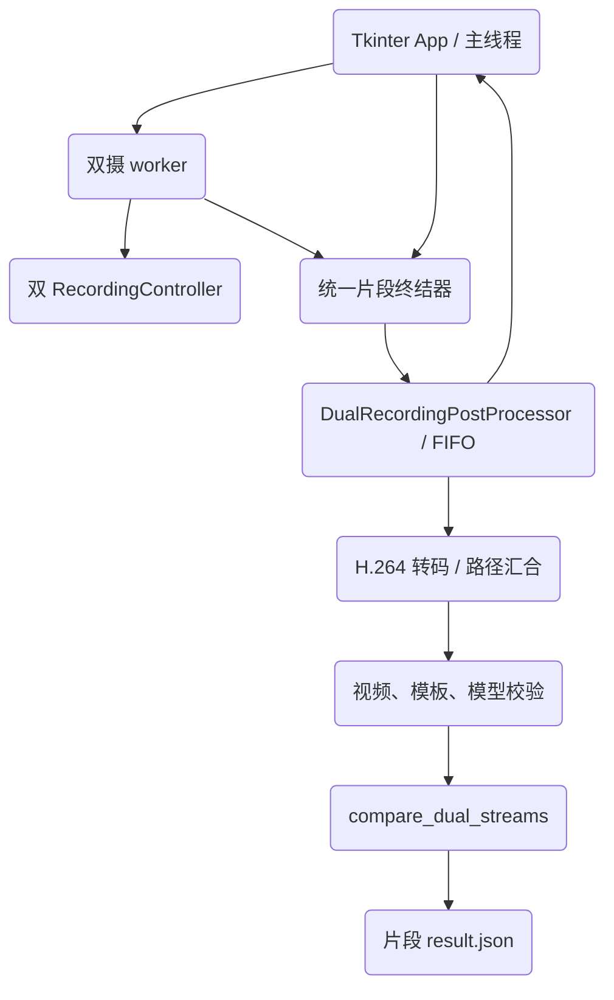

# 架构设计 (Architecture Specification)

> **功能名称：** Tkinter 双摄录制后自动比对
> **版本：** v1.0
> **状态：** 审查中
> **关联需求：** `product.md`
> **最后更新：** 2026-07-09

---

## 1. 系统概览

`App` 继续负责 Tk 控件、双摄采集与 `RecordingController` 状态。新增无 Tk 依赖的 `DualRecordingPostProcessor`，以单消费者 FIFO 接收不可变片段任务，顺序执行转码、校验、`compare_dual_streams()` 和结果持久化，并通过回调把状态投递回 Tk 主线程。所有停止路径收敛到一个片段终结器，锁内只完成双 writer 快照与释放，锁外提交，避免阻塞录制和重复调度。

### 架构决策记录 (ADR)

| 决策 | 选择方案 | 被否定方案 | 理由 |
|:---|:---|:---|:---|
| 后处理并发 | 单消费者 FIFO、任务内顺序转码 | 每段/每路独立线程 | 避免连续录制产生 `2N` 个 ffmpeg 并与双摄 MediaPipe 抢 CPU |
| 骨架录像 | 双摄开关默认关闭；开启即跳过评分 | 默认标注录像后重新推理 | 标准样本实测标注后二次推理显著失真 |
| 结果留档 | 每片段 `result.json` 原子替换 | 全局 CSV/仅 UI | 片段天然隔离，无跨任务文件锁，关闭后可追溯 |
| 模板策略 | 固定交付现有 full/v2 正侧模板 | 每段选择/迁移 v3 | 满足现场自动化且不引入标定和算法漂移 |
| UI 结果 | 主窗口独立最新片段状态区 | 自动弹窗/改造 CompareWindow | 连续录制不中断，保留现有手工单视频入口 |

---

## 2. 组件拓扑图



---

## 3. 数据模型

### 3.1 `DualRecordingJob`

| 字段名 | 类型 | 约束 | 描述 |
|:---|:---|:---|:---|
| `segment_id` | `str` | 非空、应用内唯一 | `record_<timestamp>` |
| `segment_dir` | `Path` | 正侧路径共同父目录 | `result.json` 所在目录 |
| `front_source` / `side_source` | `Path` | 非空 | writer 返回的真实 MP4/AVI 路径 |
| `front_frames` / `side_frames` | `int` | `> 0` 且相等 | 双路写入帧数快照 |
| `front_template` / `side_template` | `Path` | 固定仓库路径 | 正侧标准模板 |
| `record_skeleton` | `bool` | 会话级不可变 | true 时完成转码后跳过评分 |
| `created_at` | `str` | ISO-8601 | 片段提交时间 |

### 3.2 `PostprocessUpdate`

| 字段名 | 类型 | 描述 |
|:---|:---|:---|
| `segment_id` | `str` | 关联 UI guard 和 JSON |
| `status` | `str` | queued/transcoding/validating/comparing/completed/failed/skipped/cancelled |
| `front_score` / `side_score` | `float?` | 0..1，非 completed 时为空 |
| `combined_percent` | `int?` | 0..100，直接取核心结果 |
| `error_code` / `message` | `str?` | 稳定错误码和中文展示 |

### 3.3 `result.json` schema v1

```json
{
  "schema_version": 1,
  "status": "completed",
  "segment_id": "record_20260709_233000_000000",
  "created_at": "2026-07-09T23:30:00-07:00",
  "completed_at": "2026-07-09T23:30:18-07:00",
  "record_skeleton": false,
  "front_video_path": ".../front.mp4",
  "side_video_path": ".../side.mp4",
  "front_template_path": ".../standard_front_full.npz",
  "side_template_path": ".../standard_side_full.npz",
  "warnings": [],
  "result": {
    "front_score": 0.82,
    "side_score": 0.87,
    "combined_score": 0.85,
    "combined_percent": 85,
    "front_matches": [],
    "side_matches": [],
    "front_segment": {"start": 0, "end": 120},
    "side_segment": {"start": 0, "end": 120}
  },
  "error": null
}
```

非成功状态仍保留同一顶层结构，`result=null`，`error={"code":"...","message":"..."}`。每次状态更新先写同目录唯一临时文件，再以 `Path.replace()` 原子替换。

---

## 4. API / 接口签名

### 4.1 后处理协调器

```python
class DualRecordingPostProcessor:
    def submit(self, job: DualRecordingJob) -> bool: ...
    def cancel_all(self) -> None: ...
    def close(self, timeout: float) -> None: ...
```

- `submit()` 对重复 `segment_id` 返回 false，否则立即入队并返回 true。
- 回调在协调器线程触发，`App` 必须经 `root.after()` 更新 UI。
- 一个任务失败不得终止消费者；关闭后拒绝新任务。

### 4.2 可取消转码

```python
def transcode_to_h264(src: Path | None, *, stop_evt: Event | None = None) -> Path | None: ...
```

- MP4 或不存在路径维持既有返回语义。
- AVI 成功返回 MP4；失败清理临时文件并返回原 AVI；取消终止子进程并抛 `InterruptedError`。

### 4.3 双流比对

保持现有公开签名；调用固定为：

```python
compare_dual_streams(
    front_template,
    side_template,
    front_video,
    side_video,
    pose_variant=None,
    workers=1,
    w_front=0.4,
    w_side=0.6,
    baseline=2.0,
    enable_rules=False,
    enable_error_analysis=False,
    stop_evt=job_stop_evt,
)
```

`stop_evt` 被设置时特征提取必须抛 `InterruptedError`，不得以部分帧继续评分。

---

## 5. 依赖白名单

| 依赖名 | 版本 | 用途 | 是否新增 |
|:---|:---|:---|:---|
| Python 标准库 `queue/threading/json/subprocess` | 当前运行时 | FIFO、取消、原子 JSON、ffmpeg 管理 | 否 |
| NumPy | requirements.txt 现有版本 | 模板有限值和 shape 校验 | 否 |
| OpenCV | requirements.txt 现有版本 | 录像可读性校验 | 否 |
| MediaPipe | requirements.txt 现有版本 | 既有双流特征提取 | 否 |

不新增第三方依赖。

---

## 6. 错误处理策略

| 错误场景 | 处理方式 | 用户感知 |
|:---|:---|:---|
| 骨架录像开启 | 完成转码，写 `skipped/annotated_recording` | 提示“带骨架录像未自动比对” |
| 某路无路径/零帧/帧数不一致/writer 错误 | 不调用比对，写 failed | 显示具体正/侧错误 |
| AVI 转码失败但源可读 | 使用 AVI 继续，warnings 记录 | 分数正常，状态注明回退 |
| 视频不可读 | 写 `failed/video_unreadable` | 保留录像，不阻塞后续任务 |
| 模板或 full 模型缺失/不兼容 | 写稳定错误码，不调用比对 | 指引检查固定模板或模型管理 |
| 比对异常 | 释放资源，写 failed | 独立结果区显示，不弹阻塞框 |
| 应用关闭 | 取消活动和排队任务 | 写 cancelled，禁止晚 UI 更新 |

---

## 7. 安全策略

- **输入验证：** 所有任务路径转为 `Path`，校验存在、非空、视频可读；模板校验 keys、shape、finite、layout 和 pose variant。
- **身份认证 / 权限：** 不适用，本地桌面流程不新增外部接口。
- **敏感数据处理：** 视频和评分仅写用户选择的本地目录，不上传网络。
- **审计日志：** `result.json` 记录状态、错误、时间和输入路径；不新增全局日志数据库。

---

## 8. 性能考量

| 指标 | 目标值 | 测量方式 |
|:---|:---|:---|
| UI/录制锁阻塞 | 提交不执行转码/比对，锁内仅快照与 release | 阻塞 fake compare 并立即开始第二段测试 |
| 后处理并发 | 全应用最多 1 | 并发计数测试 |
| 比对 worker | 固定 1 | 注入 fake/参数断言 |
| 退出等待 | 有界且可取消 ffmpeg | 关窗取消测试和真实 ffmpeg smoke |

---

## 9. 审批记录

| 日期 | 审批人 | 决定 | 备注 |
|:---|:---|:---|:---|
| 2026-07-09 | 待审批 | 待批准 | 批准后冻结 artifact/task hashes |
