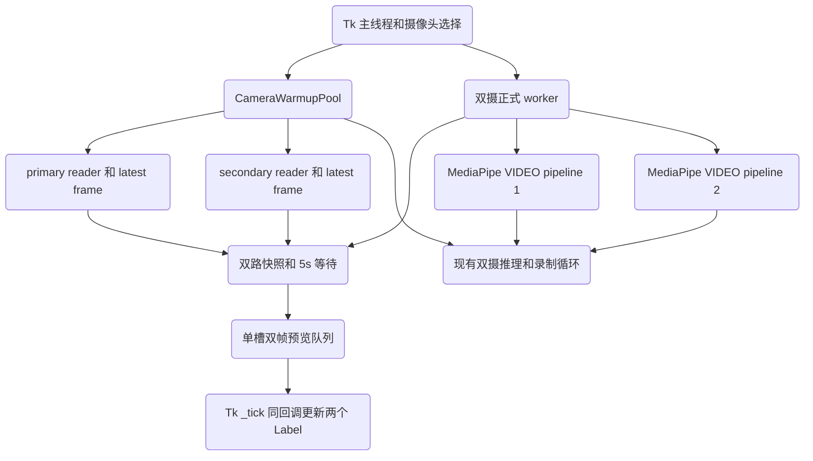

# 架构设计 (Architecture Specification)

> **功能名称：** Tkinter 双摄快速首屏性能优化
> **版本：** v1.0
> **状态：** 已批准（待工具冻结）
> **关联需求：** `docs/specs/20260710-101342-tkinter-dual-fast-first-frame/product.md`
> **最后更新：** 2026-07-10

---

## 1. 系统概览

新增与 Tk 无关的 `CameraWarmupPool`，按 `primary` / `secondary` 角色分别持有后台 capture reader，只保存每路最新有效帧。双摄启动先从 pool 获取同步快照并通过单槽双帧队列原子渲染；骨架开启时，pool 继续产出裸帧，正式 Tk worker 在自身线程创建两条 MediaPipe VIDEO pipeline，随后停止预热读取并接管 capture。现有正式双摄推理、录制和后处理循环在接管后保持原语义。

### 架构决策记录 (ADR)

| 决策 | 选择方案 | 被否定方案 | 理由 |
|:---|:---|:---|:---|
| 双摄预热 | 角色级持续 latest-frame reader | 仅预开 handle；仅缓存首帧 | 只打开不能消除首次 read；单帧缓存会过期 |
| 首屏交付 | 单槽原子双帧 queue | 两个独立 preview queue | 独立队列可能在相邻 Tk tick 中出现，违反同步首屏 |
| pipeline 线程边界 | 正式 worker 内串行构造并使用 | 后台构造后跨线程交付 | 避免 MediaPipe/GPU 上下文线程归属风险 |
| 过渡策略 | 加载期实时裸帧，ready 后整体切换 | 黑屏等待；单路先切换 | 直接解决用户感知等待并保持双路一致 |
| 依赖升级 | 隔离 A/B 门控 | 直接升级到 0.10.35 | 发布说明不能替代本项目端到端证据 |

---

## 2. 组件拓扑图



---

## 3. 数据模型

### 3.1 `WarmFrame`

| 字段名 | 类型 | 约束 | 描述 |
|:---|:---|:---|:---|
| `frame` | `np.ndarray` | 非空 BGR | role 最新有效帧 |
| `captured_at` | `float` | monotonic | 采集时间 |
| `sequence` | `int` | 单调递增 | role 内帧身份 |
| `generation` | `int` | role 级 | 防止旧选择/旧会话复活 |

### 3.2 `_WarmupSlot`

| 字段名 | 类型 | 约束 | 描述 |
|:---|:---|:---|:---|
| `role` | `str` | primary/secondary | 设备角色 |
| `index` | `int` | >=0 | 摄像头 index |
| `cap` | capture/None | 单所有者 | 已打开设备 |
| `latest` | `WarmFrame`/None | latest-only | 最新帧 |
| `error` | `BaseException`/None | 首错保留 | 打开/读取失败 |
| `stop_event` | `threading.Event` | role 私有 | 取消读取 |
| `thread` | `threading.Thread` | daemon | 打开并持续读取 |
| `claimed` | `bool` | 锁保护 | 是否已转移给正式 worker |

### 3.3 `DualPreviewPacket`

单槽队列元素包含 `session_generation`、两张已转 RGB/缩放的帧、两路 action 文本和阶段 `raw|annotated`。Tk `_tick` 只接受当前 generation，并在同一回调中更新两个 Label。

---

## 4. API / 接口签名

### 4.1 `CameraWarmupPool`

```python
class CameraWarmupPool:
    def warm(self, role: str, index: int) -> None: ...
    def cancel(self, role: str) -> None: ...
    def wait_pair(
        self,
        primary_index: int,
        secondary_index: int,
        *,
        timeout: float,
        stop_event: threading.Event,
    ) -> tuple: ...
    def snapshot_pair(
        self,
        primary_index: int,
        secondary_index: int,
        *,
        after: tuple | None = None,
    ) -> tuple | None: ...
    def claim_pair(
        self,
        primary_index: int,
        secondary_index: int,
        *,
        timeout: float,
    ) -> tuple: ...
    def close(self) -> None: ...
```

- `warm()` 对相同 role/index 幂等；不同 index 递增 generation 并取消旧 slot。
- `wait_pair()` 缺少 slot 时同时启动两路，复用进行中 slot；任一路 error/timeout/stop 均失败。
- `snapshot_pair()` 只有两路 generation/index 匹配且均存在有效帧时返回；`after` 用于等待任一路序列推进。
- `claim_pair()` 先停止两路 reader，再原子转移两个 capture；任一路不能转移时释放另一条，禁止半成功。

### 4.2 App 内部边界

```python
def _post_dual_frame_pair(
    self,
    frame: np.ndarray,
    actions: str,
    frame2: np.ndarray,
    actions2: str,
    *,
    session_generation: int,
    stage: str,
) -> None: ...
```

`_worker_loop_dual_camera` 改为只接收 `UiState`，自行通过 warmup pool 等待、预览和 claim 两路设备。`_start` 生成会话 generation 和 `start_click`；`_tick` 在消费首个当前 generation pair 时记录实际 render 时间。

---

## 5. 依赖白名单

| 依赖名 | 版本 | 用途 | 是否新增 |
|:---|:---|:---|:---|
| Python stdlib `threading` / `queue` / `time` | 当前运行时 | 预热、同步、计时 | 否 |
| OpenCV | `4.13.0.90` | 摄像头 capture | 否 |
| MediaPipe | `0.10.31` 基线；`0.10.35` 条件候选 | 姿态/手部推理 | 条件变更，不新增依赖 |

---

## 6. 错误处理策略

| 错误场景 | 处理方式 | 用户感知 |
|:---|:---|:---|
| 单路打开或首次读取失败 | 记录 role/index 错误，取消并释放 pair | 状态栏显示对应摄像头初始化失败；不显示单路 |
| 双路 5 秒超时 | 递增会话 generation，停止预热/预览泵并完成会话 | 显示双摄启动超时，可重新开始 |
| pipeline 1 成功、pipeline 2 失败 | 关闭 pipeline 1，停止裸帧泵，释放 pair | 显示初始化失败；录制始终禁用 |
| 启动期停止/关窗 | stop_event 使 wait/pump 退出；generation 屏蔽晚到帧 | 无晚到预览或控件复活 |
| claim 半失败 | 释放已取得的 capture，整体失败 | 不进入正式循环 |
| 0.10.35/GPU 未达门槛 | 保持 0.10.31/CPU | UI 不新增无效开关 |

---

## 7. 安全策略

- **输入验证：** role 仅允许 `primary|secondary`，index 必须非负且两路不得相同。
- **身份认证：** 不适用。
- **数据访问控制：** 不适用。
- **敏感数据处理：** 预热帧仅存在内存单槽，不写磁盘、不发送网络、不保留历史。
- **审计日志：** 仅记录阶段耗时、role/index 和错误类型，不记录图像内容。

---

## 8. 性能考量

| 指标 | 目标值 | 测量方式 |
|:---|:---|:---|
| 预热后点击到双路实际渲染 P95 | <= 0.5 秒 | 20 次骨架关 + 20 次骨架开实机启动，时间点为 `_start` 到 `_tick` 双 Label 更新 |
| 冷启动并发性 | 接近 `max(t_primary, t_secondary)` | fake capture 延迟注入，不允许接近两路延迟之和 |
| 预热缓存 | 每 role 1 帧 | 单槽状态断言与内存检查 |
| 裸帧发布率 | 最多 20 FPS | 预览泵节流，避免模型加载期占满 Tk 队列 |
| 依赖升级收益 | >=10%，退化 <=5% | 隔离 A/B benchmark |

---

## 9. 审批记录

| 日期 | 审批人 | 决定 | 备注 |
|:---|:---|:---|:---|
| 2026-07-10 | 用户 | 批准 | 授权一路执行并同意全部中间批准；待 CLI 冻结。 |
