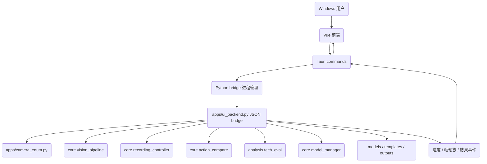

# 技术设计规范 (Design-First Specification)

> **设计名称：** Vue + Tauri + Vite 桌面前端迁移
> **设计粒度：** High Level Design
> **版本：** v1.0
> **状态：** 草稿
> **最后更新：** 2026-06-08

---

## 1. 设计概述

本设计将现有 Tkinter 桌面前端迁移为 Windows-only 的 Vue + Vite + Tauri 桌面应用。迁移目标是完整覆盖当前 `apps/app_ui.py` 的用户可见能力，同时保持 Python 视觉识别、模板匹配、技术评估、模型管理与录制控制逻辑不被重写。由于用户已经锁定前端技术栈、后端边界和发布平台，本任务从技术设计出发，再派生需求与执行任务。

---

## 2. 设计起点与约束

### 2.1 已知设计输入

- 当前 GUI 入口为 `apps/app_ui.py`，包含主窗口、动作分析窗口、设置和模型管理窗口。
- 当前 Python 后端能力包括 `MediaPipePipeline`、`compare_video_to_template`、`create_template_from_video`、`evaluate_video_detail`、`evaluate_video_assets`、`export_debug_video`、`RecordingController`、`enumerate_cameras`、`open_camera` 与 `model_manager`。
- 当前仓库没有 `package.json`、`Cargo.toml`、`vite.config.*` 或 Tauri 脚手架。
- 当前 Windows 打包历史主要来自 PyInstaller `.spec` 文件；新前端需要独立形成 Tauri 打包路径。
- 用户确认：后端不动、完整覆盖现有 Tkinter 功能、只做 Windows。

### 2.2 强约束

- 不重写、不替换、不改变 Python 核心视觉与评分后端。允许新增薄的 Python UI bridge，用来暴露现有函数和 worker 状态；该 bridge 不得改变 `core/`、`analysis/`、`batch/` 的既有行为契约。
- MediaPipe 默认 `pose33_v3` 行为、`infer()`、`annotate()`、golden 回归和 `valid_mask` 契约必须保持不变。
- YOLO-only 仍不得进入正式对外评分报告；前端只展示已由后端授权的状态与提示。
- Tauri 应用仅面向 Windows 本机发布，不承担 macOS 或 Linux 兼容。
- Vue 前端必须完整覆盖当前 Tkinter 可见功能，不以简化 MVP 作为最终验收。
- 前端不得直接实现视觉算法；图像处理、模板生成、模板匹配、技术评估、录制写盘、模型下载仍由 Python 侧执行。
- 实施前必须先获得 `批准规范，启动执行`。

### 2.3 假设

- 本地开发环境可使用仓库 `.venv\Scripts\python.exe` 启动 Python bridge。
- Windows 打包阶段可选择 PyInstaller 生成 Python sidecar，或通过 Tauri 配置调用同目录 Python 后端可执行文件；该选择在实现任务中验证，不能影响 Python 后端行为。
- Vite/Vue/Tauri 具体版本在脚手架任务中由锁文件固定；规范不依赖某个未验证的版本号。
- 当前未提交的 `apps/app_ui.py` 修改代表用户侧工作区状态，规范不会覆盖这些改动。

---

## 3. 目标系统边界

### 3.1 涉及组件

| 组件 / 模块 | 作用 | 是否变更 |
|:---|:---|:---|
| `frontend/` | 新增 Vue + Vite + Tauri 前端工程，承载界面、状态管理、Tauri 命令调用与 Windows 打包配置 | 是 |
| `frontend/src-tauri/` | 新增 Tauri Rust 壳，负责窗口、权限、文件选择、Python bridge 进程管理和事件转发 | 是 |
| `apps/ui_backend.py` | 新增 Python UI bridge，封装现有 Python 能力为本地 JSON 命令和事件流 | 是 |
| `apps/app_ui.py` | 迁移期间保留为旧 Tkinter 入口和功能对照基线 | 否 |
| `core/vision_pipeline.py` | 姿态与手部检测核心 | 否 |
| `core/action_compare.py` | 模板生成、模板匹配和预览导出 | 否 |
| `analysis/tech_eval.py` | 直拳技术评估与调试视频导出 | 否 |
| `core/recording_controller.py` | 录制状态机 | 否 |
| `apps/camera_enum.py` | Windows 摄像头枚举和打开策略 | 否 |
| `core/model_manager.py` | MediaPipe 模型状态与下载 | 否 |
| `tests/` | 新增 bridge、前端契约或打包 smoke 测试，同时保持现有 Python 回归 | 是 |

### 3.2 明确不在范围内

- 不迁移算法到 Rust、TypeScript 或浏览器 WebAssembly。
- 不改变模型文件目录、输出目录、模板文件格式、评分阈值或 YOLO 授权边界。
- 不实现 macOS/Linux 打包。
- 不把 Tkinter 入口立即删除；删除或弃用旧入口需要单独批准。
- 不改变 GitHub issue 路线图中的 YOLO 迁移结论。

---

## 4. 方案设计

### 4.1 总体方案

采用三层结构：

1. Vue + Vite 负责用户界面、交互状态、结果展示、表单校验和前端路由。
2. Tauri Rust 壳负责 Windows 桌面窗口、文件选择、应用生命周期、权限收敛、启动和关闭 Python bridge，以及把 Python 事件转发给 Vue。
3. Python UI bridge 负责调用现有后端函数，维护长任务、实时预览、进度、停止信号和错误序列化。

该方案让新前端拥有现代桌面体验，同时把风险集中在可测试的 bridge 契约上。Python core 保持为事实后端，Tkinter 在迁移期间作为功能基线和回归对照。

### 4.2 拓扑 / 调用链

### 4.3 关键接口与数据流

| 接口 / 数据流 | 输入 | 输出 | 约束 |
|:---|:---|:---|:---|
| `camera.list` | 扫描上限 | 摄像头 index、label、可用状态 | 使用现有 `enumerate_cameras`，保持 Windows 探测超时和资源释放 |
| `session.start` | source、poseVariant、workers、enableHands | sessionId、初始状态 | source 可为摄像头 index 或视频路径；Python 侧创建 worker |
| `session.stop` | sessionId | stopped 状态与可选录制路径 | 必须触发 Python stop event 和资源释放 |
| `session.frame` 事件 | Python annotated frame | JPEG 或 PNG data URL、动作标签、FPS、progress | 不让 Vue 操作 OpenCV 原始对象；高频事件需要限流 |
| `record.toggle` | sessionId | recording、paused 或 idle | 复用 `RecordingController` 三态语义 |
| `record.stop` | sessionId | 本段录制结果路径或空 | 与会话停止分离，覆盖现有“结束录制” |
| `template.create` | baseVideo、poseVariant、workers、startFrame、endFrame | templatePath、meta、progress | 调用 `create_template_from_video`，保留裁切和 worker 规则 |
| `analysis.run` | targetVideo、template、compare 开关、techEval 参数、debug 开关 | score、segment、previewPath、techEval、rawJson | 覆盖模板比对和直拳技术评估组合模式 |
| `model.status` | 无 | 当前模型路径、各模型安装状态和大小 | 使用 `model_manager`，不导入重型视觉库 |
| `model.download` | model key 或 all | 下载进度、完成路径、错误 | 使用官方 URL 和 `.part` 原子写入逻辑 |

### 4.4 数据模型 / 状态变化

| 对象 / 状态 | 变化前 | 变化后 | 备注 |
|:---|:---|:---|:---|
| 输入源 | Tkinter `InputSourceState` 与控件变量 | Vue store 中的 source kind/value，Python bridge 仍使用相同 source 语义 | 保持 camera/video/none 三态互斥 |
| 运行会话 | Tkinter worker thread | Python bridge job + Tauri event stream | Tauri 只管理生命周期，不处理帧算法 |
| 录制状态 | Tkinter 按钮调用 `RecordingController` | Vue 按钮调用 bridge，bridge 内部仍用 `RecordingController` | idle、recording、paused 三态文本保持一致 |
| 动作分析 | Tkinter `CompareWindow` | Vue analysis view 或 modal | 必须覆盖模板生成、模板比对、技术评估、预览导出和 JSON 复制 |
| 模型管理 | Tkinter `SettingsWindow` | Vue settings view 或 modal | 必须覆盖当前模型摘要、单个下载、全部缺失下载、刷新状态 |
| 结果展示 | Tkinter Label/Text/Canvas | Vue components | 分数、指标详情、原始 JSON、状态、进度均可见 |

### 4.5 Low Level Design 细节

本设计粒度为 High Level Design，因此不在本规范中固定函数签名、Rust command 实现细节或 Vue 组件内部状态机。低层实现如需改变 bridge 协议字段、sidecar 打包方式或高频帧传输格式，必须先更新本设计并重新获得批准。

---

## 5. 备选方案与取舍

| 方案 | 结论 | 原因 |
|:---|:---|:---|
| Vue + Tauri + Python bridge | 采用 | 满足用户指定技术栈，保留 Python 后端，支持 Windows 桌面体验和本地文件能力 |
| 仅用 Tauri 直接调用现有 CLI | 放弃 | 实时预览、录制、停止、进度与组合分析需要长任务和事件流，纯 CLI 调用难以完整覆盖 Tkinter |
| 把算法迁到 Rust 或 TypeScript | 放弃 | 违反“后端不动”，会扩大风险并破坏现有 golden 与 YOLO 边界 |
| 继续使用 PyInstaller Tkinter | 放弃 | 不能达成 Vue + Tauri + Vite 迁移目标 |
| Web-only Vite 页面 | 放弃 | 缺少本地摄像头、文件选择、Python sidecar 和 Windows 桌面打包能力 |

---

## 6. 风险与验证策略

### 6.1 主要风险

- Python bridge 与 Tauri 事件流可能出现长任务无法停止、子进程泄漏或资源释放不完整。
- 高频帧预览若无节流，会造成 Vue 渲染卡顿或内存上涨。
- Windows 打包时 Python sidecar、模型目录、输出目录和工作目录可能不一致。
- 文件路径来自前端选择，需要保持 Windows 路径、中文路径和空格路径可用。
- 模型下载属于联网能力，国内网络环境需要遵守仓库代理约定，但前端不应内置镜像。
- 完整覆盖 Tkinter 功能面较大，若没有对照清单，容易遗漏动作分析、录制、模型管理或错误提示。

### 6.2 验证策略

- 结构验证：运行 Spce workflow 校验，确认 `design.md`、`requirements.md`、`tasks.md`、`progress.md`、`spec.yml` 完整。
- Python 回归：继续运行现有 targeted tests、`py_compile` 和 `pose33_v3` golden，证明后端不漂移。
- Bridge 契约：新增 headless 单元测试，用 fake frame、fake model download 和 fake long job 验证命令、事件、停止与错误序列化。
- 前端验证：运行 `npm run build`、Tauri Rust 检查和组件测试，验证 Windows-only 前端工程能构建。
- 浏览器/桌面 smoke：启动 Tauri dev 窗口，检查主窗口、动作分析、设置模型管理、进度、JSON 复制和错误提示。
- 打包 smoke：生成 Windows 包或安装器，验证 sidecar 启动、模型目录、输出目录、中文路径和摄像头枚举。

---

## 7. 派生需求提示

- 需求必须从完整覆盖 Tkinter 功能、Python 后端不动、Windows-only Tauri 发布三个边界派生。
- 需求必须包含失败路径、停止和资源释放、前后端协议、打包路径、回归验证。
- 不得从本设计派生跨平台发布、算法迁移、评分阈值调整、YOLO 正式评分授权或删除 Tkinter 的能力。

---

## 8. 审批记录

| 日期 | 审批人 | 决定 | 备注 |
|:---|:---|:---|:---|
| 2026-06-08 | 用户 | 未审批 | 等待用户回复 `批准规范，启动执行` |
