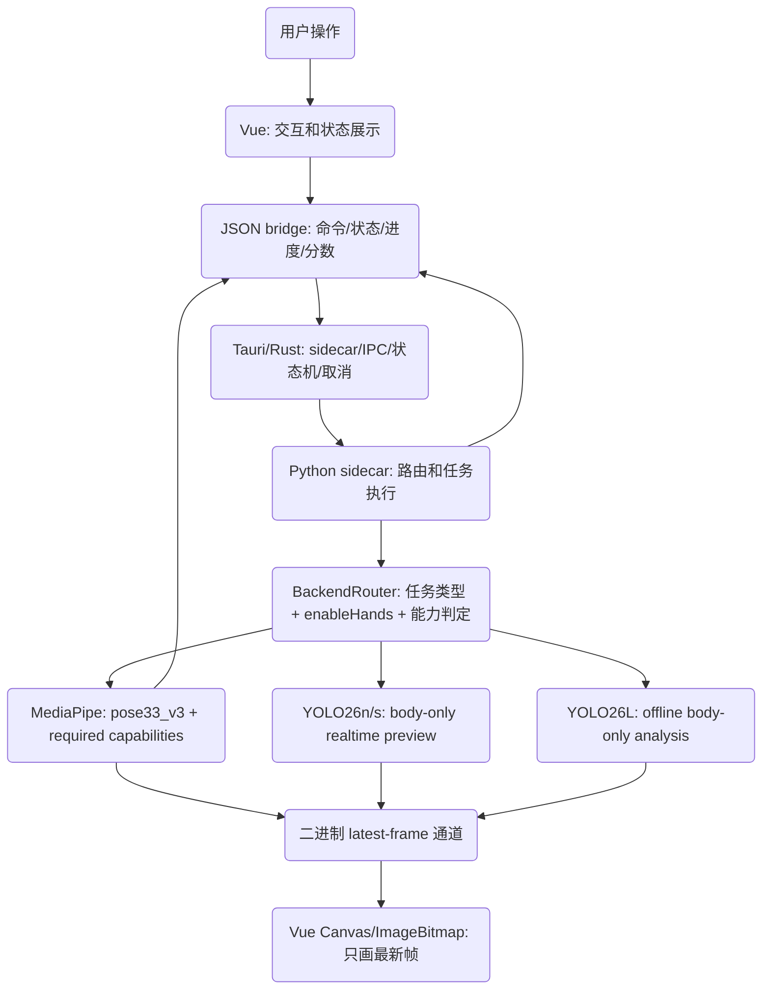

# 技术设计规范 (Design-First Specification)

> **设计名称：** Vue/Tauri 高速帧通道与 MediaPipe/YOLO 后端路由架构
> **设计粒度：** High Level Design
> **版本：** v1.0
> **状态：** 草稿
> **最后更新：** 2026-06-11

---

## 1. 设计概述

本设计把桌面端迁移后的职责边界固化为四层：Vue 负责交互、状态展示和 Canvas 渲染；Tauri/Rust 负责桌面壳、Python sidecar 生命周期、资源路径、IPC、二进制预览帧通道、任务取消、状态机和打包；Python 负责模型清单、下载执行、视觉后端、评分和分析；MediaPipe 后端保留可信完整能力；YOLO 后端只承担 body-only 预览、离线分析、内部标定和快速筛查。

设计起点不是新增一个简单的 YOLO 开关，而是建立可验证的后端能力路由。`enableHands=false` 只表示 YOLO 有资格参与候选，最终仍由任务类型、评分授权和关键点能力决定是否使用 YOLO。

手部开关的冲突优先级采用“开关优先”：`enableHands=false` 是用户关闭 hand landmarker 的硬约束，路由不得静默重新启用手部检测。若此时请求 full tech_eval 或含手指指标的评估，系统必须走 MediaPipe pose-only 生产路径，并把手指相关指标降级为 skip-aware partial，结果中标注 `skippedCapabilities` 和 `reason`。

---

## 2. 设计起点与约束

### 2.1 已知设计输入

- 用户讨论结论：Vue 不承载大帧数据响应式状态；JSON bridge 只传状态、进度、分数；预览帧走二进制 latest-frame 通道；前端只画最新帧并丢弃旧帧。
- 现有桌面栈：`frontend/src/App.vue` 使用 Vue 状态和 `` 渲染 `session.frame.payload.image`；`frontend/src/bridge.ts` 通过 Tauri invoke 调用 `bridge_command`；`frontend/src-tauri/src/lib.rs` 管理 Python bridge 进程和 JSONL 事件；`apps/ui_backend.py` 提供 `bridge.ping`、`session.start`、`session.stop`、`job.stop`、`model.download`、`analysis.run` 等命令。
- 现有性能与契约事实：`apps/ui_backend.py` 的 `_default_frame_encoder` 仍把帧编码成 JPEG base64；`PreviewSessionService` 已有 session/job/stop 基础；`tests/test_ui_backend_sessions.py` 已覆盖 stale-frame 丢弃；`frontend/scripts/frontend-smoke.mjs` 已覆盖前端帧节流、事件归属和停止行为。
- 现有视觉契约：`core/feature_layout.py` 注册 `pose33_v3` 与 `body_core_v1`；`core/yolo_adapter.py` 明确 COCO17 缺失点不得伪造有效点，YOLO `valid_conf_thr=0.6`，`YOLO_CALIBRATION_STATUS="unvalidated"`；`analysis/tech_eval.py` 与 `core/rule_scoring.py` 依赖 `valid_mask` 和结构化缺失能力。
- 现有决策材料：`docs/yolo_default_switch_decision.md` 结论为默认不切 YOLO；`docs/yolo_body_core_calibration.md` 结论为 `body_core_v1` 可作内部参考但不得授权对外评分；`docs/yolo_gpu_readiness_review.md` 说明 CUDA 修复不等于打开 YOLO 默认或评分授权。

### 2.2 强约束

- 不得改变 MediaPipe 旧默认路径行为：`pose33_v3` 模板、`MediaPipePipeline.infer()`、`MediaPipePipeline.annotate()`、正式评分和 full tech_eval 继续以现有 golden 回归为准。
- 需要嘴角、脚跟、脚尖、完整技术评估或正式评分时必须走 MediaPipe；需要手指时必须在 `enableHands=true` 时启用 MediaPipe hand landmarker，在 `enableHands=false` 时不得静默启用 hand landmarker，而是降级为 skip-aware partial；YOLO COCO17 不得伪造缺失点。
- YOLO 输出必须标明 `backend=yolo`、`featureLayout=body_core_v1`、`scoreAuthorized=false`、`capability=body_only`，并保留 `calibration_status=unvalidated`，除非后续有独立批准的标定与授权变更。内部受限显示只能使用单一字段 `displayScope` 表达，枚举值限定为 `limited` 或 `internal`，不得使用 `evalScope`、`internalUseOnly` 或“等价字段”，不得把 `scoreAuthorized` 写成字符串。
- YOLO raw adapter 可以使用 Pose33-like 容器承载 COCO17 映射点和 `valid_mask`，但对外结果必须区分 `rawLayout=pose33_like_coco17` 与最终 `featureLayout=body_core_v1`，避免把 raw 容器误解成完整 Pose33 能力。
- Python artifact 使用 snake_case 字段，前端/JSON payload 使用 camelCase 字段；两者必须有固定映射，不能同时漂移出双字段语义。
- 大图帧不得继续通过 JSON/base64 主桥作为长期方案；JSON bridge 只承载控制命令、状态、进度、分数、错误和小型元数据。
- 二进制预览帧通道必须采用 latest-frame 语义：每个 session 只保留最近可渲染帧，旧帧可丢弃，停止或切换 session 后旧帧不得污染新会话。
- Windows 打包必须继续包含 Python sidecar；`npm run verify:desktop`、`npm run package:windows`、packaged sidecar `bridge.ping` 仍是桌面栈验收核心。
- 当前 `ui_backend_sidecar.spec` 排除了 `torch`、`ultralytics` 和 `core.yolo_adapter`；若安装版承诺支持 YOLO body-only，必须在对应实现任务内同步调整 sidecar 依赖策略和体积/许可验收，否则安装版只能声明 MediaPipe 默认能力。
- 第一阶段仍由 Python 后端承载 MediaPipe 与 YOLO；Rust 只做系统层、IPC、帧通道和任务生命周期，不把视觉算法迁入 Rust。

### 2.3 假设

- 本轮规范生成不直接实现业务代码；实现需在用户回复 `批准规范，启动执行` 后开始。
- YOLO26n/s、YOLO26L、YOLO26X 的具体模型文件命名、下载源和许可落地将在模型清单任务中固化；本规范先锁定用途分层。
- 二进制通道的底层方案已定为“首选 + 回退”：首选 Windows 本地命名管道承载 Python -> Rust 的长度前缀帧包，Rust 维护每 session 单槽 latest-frame store，并通过 Tauri 自定义协议向 Vue 返回二进制 bytes；若命名管道在打包环境不可用，回退到 app data/cache 下的 latest-frame 原子文件 + Rust 自定义协议读取。两种方案都不得把帧字节作为 JSON 数组或 base64 event payload 传回 Vue。
- 内部受限显示只使用 `displayScope=limited|internal`，不改变 `scoreAuthorized=false`。

---

## 3. 目标系统边界

### 3.1 涉及组件

| 组件 / 模块 | 作用 | 是否变更 |
|:---|:---|:---|
| `frontend/src/App.vue` | 交互、状态展示、预览渲染入口 | 是 |
| `frontend/src/bridge.ts` | JSON bridge 客户端和事件监听 | 是 |
| `frontend/src/bridge-state.ts` | session/job/model 事件归属、节流和状态派生 | 是 |
| `frontend/src-tauri/src/lib.rs` | Tauri 命令、Python sidecar 管理、事件转发、未来二进制帧通道 | 是 |
| `apps/ui_backend.py` | Python JSON bridge、任务管理、预览 session、分析和模型下载命令 | 是 |
| `core/backend_router.py` | 唯一后端路由决策点，供 UI bridge 和 batch CLI 共同调用 | 新增 |
| `core/vision_pipeline.py` | MediaPipe pose + hand landmarker 生产能力 | 保持兼容 |
| `core/yolo_adapter.py` | YOLO COCO17 到 Pose33-like/body_core 的唯一入口 | 是 |
| `core/feature_layout.py` | `pose33_v3` 与 `body_core_v1` 布局注册 | 保持兼容并可能补元数据 |
| `batch/backend_options.py` | batch CLI 参数适配和 metadata 序列化 | 收编为 `core/backend_router.py` 调用层 |
| `analysis/tech_eval.py` | full tech_eval 与结构化状态 | 保持 MediaPipe full 默认 |
| `core/rule_scoring.py` | 规则评分、缺失能力 skip-aware 结构化输出 | 保持 MediaPipe full 默认 |
| `scripts/verify-desktop-stack.ps1` | 桌面验证栈 | 是 |
| `scripts/build-tauri-sidecar.ps1` | Python sidecar 打包 | 是 |
| `tests/` | Python、Vue/Tauri、打包、YOLO/MediaPipe 契约回归 | 是 |

### 3.2 明确不在范围内

- 不在本规范中把 YOLO 直接替代 MediaPipe full tech_eval。
- 不在本规范中把 COCO17 缺失的手指、嘴角、脚跟、脚尖推导成有效点。
- 不在第一阶段把 MediaPipe 或 YOLO 推理迁入 Rust 原生实现。
- 不在第一阶段引入 YOLO26X 作为默认方案；它仅作为 RTX 5070 后的极限测试项。
- 不在未获得新许可或授权前把 Ultralytics/YOLO 默认用于闭源商业分发。
- 不在前端 reactive state 中保存每帧图片、base64 帧历史或帧队列。
- 不改造 Tkinter 旧入口 `apps/app_ui.py`；本轮只覆盖 Vue/Tauri 桌面端和共享后端契约。

---

## 4. 方案设计

### 4.1 总体方案

系统保留 Python 作为视觉推理和评分后端，Tauri/Rust 上移为系统层控制面。控制面继续通过 JSON bridge 发送命令、状态、进度、评分和错误；预览帧从 JSON 主桥拆出，使用二进制通道传输 JPEG/WebP/RGBA buffer 或 frame handle。Vue 只维护小型状态和当前 frame handle，并通过 Canvas 或 bitmap 渲染最新帧。

后端路由新增明确决策层，唯一落点为 `core/backend_router.py`。路由输入包括 `enableHands`、任务类型、实时性、质量档、评分授权、关键点能力、许可状态、模型可用性和多人策略；路由输出包括 `backend`、`modelProfile`、`rawLayout`、`featureLayout`、`capability`、`scoreAuthorized`、`calibrationStatus`、`displayScope`、`evalCompleteness`、`skippedCapabilities`、`fallbackReason`、`multiPersonDetected`、`reviewRequired` 与 `reason`。`apps/ui_backend.py` 与 `batch/backend_options.py` 只能调用该决策点，不得各自复制路由规则；batch 侧不得反向 import `apps`。

### 4.2 拓扑 / 调用链

### 4.3 后端路由规则

| 输入条件 | 后端 | 模型档 | 布局 / 能力 | 评分授权 |
|:---|:---|:---|:---|:---|
| `enableHands=true` | MediaPipe full | pose full/heavy + hand landmarker | `pose33_v3` + hands | full |
| `enableHands=false` 且任务为实时预览，YOLO26n/s 可用 | YOLO body-only | YOLO26n/s | `body_core_v1`, `body_only` | false |
| `enableHands=false` 且任务为实时预览，YOLO26n/s 不可用或安装版不支持 | MediaPipe pose-only preview | pose full/heavy，不启用 hands | `pose33_v3` | preview only，记录 `fallbackReason` |
| `enableHands=false` 且任务为离线高质量 body-only 分析，YOLO26L 可用 | YOLO body-only | YOLO26L | `body_core_v1`, `body_only` | false |
| `enableHands=false` 且任务为离线高质量 body-only 分析，YOLO26L 不可用或安装版不支持 | MediaPipe body-only fallback | pose full/heavy，不启用 hands | `pose33_v3` 或派生 body-only | internal，记录 `fallbackReason` |
| `enableHands=false` 且任务为正式评分或完整技术评估 | MediaPipe pose-only 生产路径 | pose full/heavy，不启用 hands | `pose33_v3`，手指指标 skip-aware partial | 可对可用 MediaPipe 指标授权；`evalCompleteness=partial` |
| 需要手指且 `enableHands=true` | MediaPipe full | pose full/heavy + hand landmarker | `pose33_v3` + hands | full |
| 需要手指且 `enableHands=false` | MediaPipe pose-only partial | pose full/heavy，不启用 hands | 手指能力缺失，`skippedCapabilities=fingers` | partial |
| 需要嘴角、脚跟或脚尖 | MediaPipe production | pose full/heavy | `pose33_v3` + required landmarks | full 或 partial，取决于可用点 |
| YOLO26X 极限测试 | YOLO body-only | YOLO26X | `body_core_v1`, `body_only` | false |

### 4.4 关键接口与数据流

| 接口 / 数据流 | 输入 | 输出 | 约束 |
|:---|:---|:---|:---|
| `backend.route` 内部决策 | `taskType`, `enableHands`, `qualityProfile`, `requiresCapabilities`, `scoreMode`, `modelAvailability`, `multiPersonPolicy` | `backend`, `modelProfile`, `rawLayout`, `featureLayout`, `capabilities`, `requiresCapabilities`, `calibrationStatus`, `scoreAuthorized`, `displayScope`, `evalCompleteness`, `skippedCapabilities`, `fallbackReason`, `multiPersonDetected`, `reviewRequired`, `reason` | 唯一实现位于 `core/backend_router.py`；不允许只用 `enableHands` 决策；`scoreAuthorized` 必须是布尔值 |
| JSON command bridge | 控制命令和小型 payload | response/event envelope | 不承载大帧 payload |
| Binary frame channel | session id, frame id, encoded frame bytes, dimensions, timestamp | latest frame handle 或 frame bytes | 每 session 单槽 latest-frame，旧帧可丢弃 |
| Vue preview renderer | latest frame handle/bytes, display metadata | Canvas 当前画面 | 图片不进入 reactive 大对象或历史数组 |
| MediaPipe scoring path | 视频/摄像头帧、模板、评分配置 | 正式评分、full tech_eval、debug artifact | 保持 `pose33_v3` golden 不漂移 |
| YOLO body-only path | 视频/摄像头帧、模型档、valid_conf_thr | body-only skeleton、内部分析元数据 | 标 `scoreAuthorized=false` 与 `displayScope=limited|internal`，不进 full tech_eval |
| Model/config management | Python 模型清单、下载命令、安装状态；Rust 资源路径和打包配置 | MediaPipe/YOLO 模型可用性状态 | 下载、取消、打包资源、代理/离线失败和许可状态可追踪 |

#### 二进制帧通道首选与回退

- **首选方案：** Tauri/Rust 创建 per-session Windows 本地命名管道，Python sidecar 在 JSONL stdout 之外向命名管道写入长度前缀帧包；Rust 读取后只保留该 session 最新帧，Vue 通过 Tauri 自定义协议按 `sessionId/frameId` 读取二进制 bytes 并 `createImageBitmap`/Canvas 渲染。
- **回退方案：** 若命名管道在 dev 或 packaged 环境不可用，Python 将每 session 最新 encoded frame 原子写入 app data/cache 中的单槽文件，JSON event 只发送 frame handle；Rust 自定义协议按 handle 读取 bytes 给 Vue。停止、切换 session 或窗口卸载必须清理 handle 和缓存文件。
- **共同约束：** 两段链路都禁止把帧 bytes 放进 JSON 数组或 base64 Tauri event；latest-frame store 需要记录 `droppedFrameCount`、`renderedFrameCount`、`lastFrameAgeMs` 和 payload size，用于性能 smoke。

### 4.5 数据模型 / 状态变化

| 对象 / 状态 | 变化前 | 变化后 | 备注 |
|:---|:---|:---|:---|
| preview frame | `session.frame.payload.image` base64 字符串 | 二进制 frame bytes 或 frame handle | JSON event 只保留 frame id、尺寸、动作、时间戳 |
| Vue preview state | `previewImage` reactive 字符串 | canvas ref + latest frame metadata | 禁止保存大帧历史 |
| route result | 隐含在 UI 选项或调用路径 | 显式结构化 `BackendRouteDecision` | 所有分析/预览/评分统一读取 |
| YOLO output meta | 已有 `calibration_status` 与部分 meta | 增加统一 `backend/featureLayout/scoreAuthorized/capability/displayScope` 显示契约 | `scoreAuthorized` 为布尔值；camelCase 用于前端，snake_case 用于 Python artifact |
| YOLO raw layout | Pose33-like 容器承载 COCO17 映射点 | `rawLayout=pose33_like_coco17` 与 `featureLayout=body_core_v1` 分开标识 | raw 容器不代表完整 Pose33 能力 |
| enableHands/手指指标冲突 | 可能被理解为路由自动启用 hands | `enableHands=false` 时禁止自动启用 hand landmarker，手指指标 skip-aware partial | 结果必须带 `skippedCapabilities`、`evalCompleteness=partial` 和原因 |
| YOLO realtime 多人 | 未定义 | 只渲染 primary target，输出 `multiPersonDetected/personCount/reviewRequired/targetPolicy` | 不做正式评分；目标选择优先稳定跟踪，否则最大 bbox |
| task lifecycle | Python job manager + Tauri pending map | Rust/Python 双侧一致状态机 | stop/unmount/timeout 不得产生晚到污染 |
| model profiles | MediaPipe 模型为主，YOLO11n 既有实验 | MediaPipe, YOLO26n/s, YOLO26L, YOLO26X 分档 | YOLO26X 不进默认 |

### 4.6 局部 Low Level 约束

- **模块 / 类职责：** `BackendRouter` 必须新增在 `core/backend_router.py`，统一产出路由决策；`apps/ui_backend.py`、`batch/backend_options.py` 和后续 CLI/批处理入口只能调用它；Tauri 不承载算法判断；Vue 只消费决策结果和展示提示。
- **函数签名与契约：** 路由函数应接受任务类型、手部开关、质量档、评分模式、所需能力集合、模型可用性和多人策略，返回包含 `rawLayout`、`featureLayout`、`capabilities`、`calibrationStatus`、布尔 `scoreAuthorized`、`displayScope`、`evalCompleteness`、`skippedCapabilities`、`fallbackReason`、`multiPersonDetected`、`reviewRequired` 和 `reason` 的可序列化决策对象；默认路由允许带原因回退 MediaPipe，显式不可满足时返回明确错误而非静默降级。
- **状态转换：** session 状态至少覆盖 `idle -> starting -> running -> stopping -> stopped/completed/failed`；model download 与 analysis job 使用同一 stop 语义；晚到事件必须按 `sessionId/jobId` 被过滤。
- **详细数据结构：** JSON envelope 保持 `type/requestId/jobId/sessionId/payload/error/timestamp`；frame 通道元数据使用 `frameId/sessionId/jobId/sourceFrameIndex/width/height/fps/timestamp/actions/actionsZh`。

---

## 5. 备选方案与取舍

| 方案 | 结论 | 原因 |
|:---|:---|:---|
| 继续 JSON/base64 主桥传帧 | 放弃 | 已知 stdout/IPC 和 Vue reactive 压力大，无法支撑长期实时预览 |
| 只用 `enableHands=false` 切 YOLO | 放弃 | 手部开关只说明 YOLO 是否可候选，正式评分、full tech_eval 和缺失关键点仍必须走 MediaPipe |
| `enableHands=false` 时为手指指标静默启用 hand landmarker | 放弃 | 用户关闭手部检测应被尊重；冲突场景降级为 skip-aware partial 并显式标注 |
| YOLO26L 替代 MediaPipe full tech_eval | 放弃 | YOLO26L 仍是 COCO17，不能补齐手指、嘴角、脚跟、脚尖 |
| Rust 原生推理先行 | 放弃 | 第一阶段收益不明且会扩大风险；先由 Rust 做系统层和高速通道 |
| Python 同时承载 MediaPipe 与 YOLO，Rust 做系统层 | 采用 | 与当前代码边界一致，能先解决帧通道、路由和打包问题 |
| `core/backend_router.py` 作为唯一决策点 | 采用 | 避免 `apps/ui_backend.py` 与 batch CLI 分叉出两套路由 |
| 命名管道 + Tauri 自定义协议传帧，cache latest-frame file 作为回退 | 采用 | 覆盖 Python -> Rust 与 Rust -> Vue 两段，不污染 JSON bridge |
| 中期迁移 YOLO 离线到 ONNXRuntime/TensorRT | 采用为后续阶段 | 仅在 Python 路由和契约稳定后推进 |

---

## 6. 风险与验证策略

### 6.1 主要风险

- YOLO 误被实现成正式评分或 full tech_eval 默认后端，导致缺失点被误解为有效能力。
- `enableHands=false` 与手指指标请求冲突时被实现成静默启用 hands，违背用户开关语义。
- YOLO raw Pose33-like 容器被误写成完整 `pose33_v3`，导致 capability 与 feature layout 混淆。
- Python snake_case 与前端 camelCase 字段映射未固化，导致 UI、CSV、JSONL、NPZ 出现同义不同名字段。
- 二进制帧通道和 JSON bridge 双通道并存时，session/job 归属错误导致旧帧、旧状态或停止后的事件污染新会话。
- Vue 渲染迁移不彻底，仍把大帧字符串放进 reactive state。
- YOLO 实时预览多人场景目标选择不稳定，导致骨架跳人或被误读为可评分结果。
- 打包后 sidecar、模型路径、资源目录和二进制帧通道路径在开发/安装环境不一致。
- 安装版 sidecar 若继续排除 YOLO 依赖，会导致开发版可用但安装版不可用的能力分裂。
- 模型策略引入 YOLO26n/s/L/X 后，下载、代理、离线安装、许可、配置和错误提示不完整。
- 离线 YOLO26L body-only 分析的 `displayScope=limited` 被误读成正式评分授权。

### 6.2 验证策略

- 结构校验：运行 Spce validator，确保 `design.md`、`requirements.md`、`tasks.md`、`progress.md`、`spec.yml` 一致。
- 契约回归：运行 `pytest tests/test_pose33_v3_golden.py tests/test_valid_mask_migration.py tests/test_yolo_backend_contract.py tests/test_yolo_landmark_mapping.py tests/test_rule_availability.py tests/test_tech_eval_contract.py -q`。
- 前端行为：运行 `npm --prefix frontend run test`，新增用例证明帧不进入 reactive 图片字符串、旧帧丢弃、晚到事件忽略。
- 桌面栈：运行 `npm run verify:desktop`，确保 Vue build、frontend smoke、Tauri cargo check、Python py_compile 和桌面回归通过。
- 打包链路：运行 `npm run package:windows` 和 `pytest tests/test_windows_packaging_smoke.py -q`，验证 sidecar、资源和 packaged bridge。
- 性能与内存：新增二进制帧通道 smoke，记录 frame drop、rendered frame、IPC payload size、前端内存增长和停止后事件清理。验收时必须提供迁移前/后同源基线；`session.frame` JSON metadata p95 payload 应小于 8KB 且不得包含图片 bytes/base64；30fps 源的渲染帧率不得低于迁移前基线 10% 以上；3 分钟预览的前端内存增长不得超过基线 20% 或 50MB 中较大值。阈值如需调整，必须在任务证据中记录样本、环境和原因。

---

## 7. 派生需求提示

- 派生需求必须覆盖四层职责、后端路由、模型分档、双通道 IPC、latest-frame 渲染、评分授权、YOLO 能力标识、raw/feature layout 区分、阶段演进和打包验证。
- 派生需求不能把 YOLO 写成 MediaPipe full tech_eval 替代方案，不能放宽 `scoreAuthorized=false` 和 `calibration_status=unvalidated`，不能把 `enableHands=false` 写成必然 YOLO。

---

## 8. 审批记录

| 日期 | 审批人 | 决定 | 备注 |
|:---|:---|:---|:---|
| 2026-06-11 | 用户 | 待审查 | 回复 `批准规范，启动执行` 后才可开始实现 |
