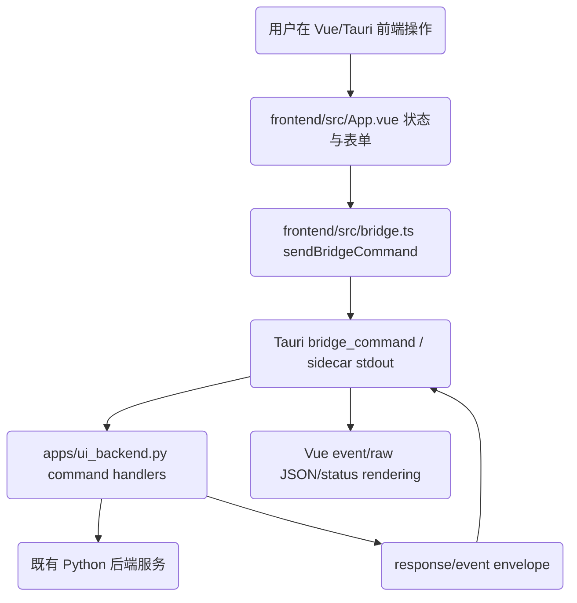

# 修复设计 (Bugfix Design)

> **问题名称：** Vue/Tauri 迁移最终验收缺口修复
> **关联规范：** `docs/specs/bugfix.md`
> **版本：** v1.0
> **状态：** 已批准
> **最后更新：** 2026-06-09

---

## 1. 根因分析

### 1.1 初始假设

- 迁移实现已经通过构建、bridge 后端测试和 Windows 打包 smoke，但最终验收发现这些证据主要覆盖后端和静态构建，未充分证明 Vue/Tauri 用户可见功能完整迁移。

### 1.2 确认后的根因

- **前端覆盖不足：** `frontend/src/App.vue` 仍是主窗口摘要式实现，缺少 Tkinter 设置窗口、动作分析窗口、直拳技术评估和目录选择等完整用户流程。
- **协议契约漂移：** Python bridge、Tauri manifest 和 TS/Rust envelope 类型分散维护，`jobId/sessionId`、raw JSON、停止语义和错误 `requestId` 未被同一契约测试锁住。
- **事件状态隔离不足：** Vue 全局处理 bridge event，未按当前 `sessionId/jobId` 过滤；高频 `session.frame` 未节流。
- **验证证据偏窄：** `npm run verify:desktop` 构建 Vue 并运行 Python/Tkinter 回归，但没有 Vue 交互测试、Tauri 协议边界测试、dev-mode 启动证据和安装后主窗口证据。
- **文档状态不同步：** `tasks.md`、`progress.md`、`design.md`、`requirements.md` 的头部状态和 `spec.yml` 批准状态不一致。
- **第一波验收补充根因：** manifest 未声明 optional 字段语义，TS 类型未接受 `null` envelope；Windows Shell32 picker 缺少 COM/OLE 初始化；模型下载未校验已知长度的截断 EOF；Vue unmount 未停止 active model download；复验证据使用 moving HEAD 范围；重新验收时 docs sync commit `3aa2578` 又未进入 active 证据链；第三轮第一波 B-016 发现 unmount 取消下载缺少行为级 payload/options 回归；第四轮第一波 B-003 发现当前 session `job.failed` 未作为实时会话终态处理；第五轮第一波 B-003 发现早到 `job.failed` 会被后到 `session.start` response 覆盖，且证据日志仍有非具体 commit/不可复现命令；第六轮第一波发现 B-013/B-018 详细任务证据仍有 stale wording，且 request-side `jobId/sessionId` nullable 语义未进入 Python/Rust manifest 与 parity 测试；第七轮第一波发现组合 `analysis.run` stop 后仍继续 tech eval，且最新验证数字未同步到 README/AGENTS/change/specs。

### 1.3 触发条件

- 用户从 Tkinter 切换到新 Vue/Tauri 前端并使用模型设置、录制目录、动作分析、技术评估或错误调试功能。
- bridge 返回错误、停止事件、旧 session 事件或非当前 job 事件。
- 维护者依赖 `tasks.md`、`progress.md` 或 `verify:desktop` 判断迁移是否完成。

---

## 2. 代码路径与影响面

### 2.1 涉及组件

| 组件 / 文件 | 角色 | 是否修改 |
|:---|:---|:---|
| `frontend/src/App.vue` | Vue 主界面和当前缺失功能入口 | 是 |
| `frontend/src/bridge.ts` | 前端 bridge 类型、mock 和命令封装 | 是 |
| `frontend/src-tauri/src/lib.rs` | Tauri sidecar 调用、事件转发、协议 manifest | 可能 |
| `apps/ui_backend.py` | Python bridge 命令、envelope、job/session 生命周期 | 是 |
| `scripts/verify-desktop-stack.ps1` | 统一桌面验证入口 | 是 |
| `tests/` | bridge、Vue/前端交互、打包 smoke 和回归测试 | 是 |
| `docs/specs/`、`README.md`、`AGENTS.md`、`change.md` | 状态、验证和操作文档 | 是 |
| `core/vision_pipeline.py`、`core/action_compare.py`、`analysis/tech_eval.py` | 后端核心算法和评分逻辑 | 否，除非只做导入兼容且需重新审批 |

### 2.2 路径追踪图

### 2.3 明确不修改的区域

- 不改 MediaPipe 默认视觉 pipeline、模板匹配算法、技术评估评分算法。
- 不改 YOLO 迁移阶段结论，不将 YOLO-only 作为正式 tech_eval 候选。
- 不删除 Tkinter UI 和 CLI 入口。
- 不新增任意 shell 执行面或跨平台打包承诺。

---

## 3. 修复策略

### 3.1 最小安全修复方案

- 先补失败证明和契约测试，锁定 final acceptance 发现的真实缺口。
- 在 Python bridge 中修复错误 `requestId` 保留、job stop 活动态判断、manifest 字段和 raw JSON envelope 契约。
- 在 Vue 前端补齐当前缺失的 Tkinter 功能入口：录制目录选择、动作分析、直拳技术评估、设置/模型管理。
- 在 Vue 事件层补当前 session/job 过滤、帧预览节流和未知总帧进度显示。
- 将前端交互测试或 Playwright/Vitest smoke 纳入 `verify:desktop`，补 dev-mode/packaged 启动证据。
- 同步 `docs/specs/` 状态、README/AGENTS/change.md 和最终验证记录。
- 对第一波最终验收新增问题追加最小修复：在 Python/Rust manifest 中显式记录 optional fields；TS bridge 类型允许 `null`；Rust Shell32 picker 使用 `OleInitialize` / `OleUninitialize`；`download_model()` 校验 `Content-Length` 完整性；Vue unmount 取消 active 模型下载；文档证据改为具体 commit/range。
- 对 B-008 复查新增的文档追踪缺口追加 docs-only 修复：active progress/task 记录 docs sync commit `3aa2578`，并用不会自匹配的完整模式检查命令替代不完整 grep 写法。
- 对第三轮第一波 B-016 发现的测试缺口追加最小修复：抽出前端 job 停止 helper，让 `App.vue` 卸载取消路径复用该 helper，并在 frontend behavior smoke 中用 stub 直接断言 `job.stop` 的 command、payload 和 options。
- 对第四轮第一波 B-003 发现的实时会话终态缺口追加最小修复：让当前 session job 的 `job.failed` 复用终态状态助手，清理 `isRunning` 并显示失败状态；前端 smoke 同时断言当前 failed event 被接受、外来 failed event 被拒绝。
- 对第五轮第一波发现追加最小修复：在 `session.start` response 返回后只在 pending `sessionId/jobId` 仍匹配时置为运行，早到 failed event 清理 pending job 后不被复活；active docs 中 B-019/B-020 改为具体 commit，B-018 PowerShell 命令改为单引号 `-Command`，B-013 完成态证据改为 resume/pre-acceptance。
- 对第六轮第一波发现追加最小修复：同步 B-013/B-018 详细任务证据文字；Python/Rust manifest 的 `nullable.request` 显式列出 `jobId/sessionId`，并用 Python contract 与 Rust source smoke 锁定 request nullable parity。
- 对第七轮第一波发现追加最小修复：`analysis.run` 在 compare 后和 tech eval/debug export 前检查 `ctx.stopped()`，停止后直接返回 stopped payload；新增组合 compare+tech eval stop 回归；README/AGENTS/change/specs 更新到当前 `verify:desktop` 结果。

### 3.2 被否决的备选方案

| 方案 | 放弃原因 |
|:---|:---|
| 仅更新文档，把缺口说明为已知限制 | 用户明确要求完整覆盖 Tkinter，且 final acceptance 不允许把缺口伪装为完成 |
| 在 Rust/TS 中重写后端算法 | 违反“后端不动”和 NFR-005 |
| 只补后端 bridge 测试，不补 Vue UI | 不能满足用户可见功能迁移和 AC-005/AC-006/AC-008 |
| 只运行 `npm run build` 作为前端验证 | 不能证明交互、事件、错误和路径语义 |

---

## 4. 测试与验证策略

### 4.1 复现证明

- 增加或更新测试，证明错误 `requestId`、已完成 job stop、Vue 缺失入口、事件污染、模型下载入口和 raw JSON envelope 在修复前会失败。
- 对无法在 headless 环境稳定复现的 Tauri GUI 启动，记录可执行 Windows smoke 命令和截图/日志证据。

### 4.2 修复证明

- `pytest` 覆盖 Python bridge contract、jobs、sessions、models、analysis、recording、packaging smoke。
- 前端测试覆盖主窗口开始/停止/进度、动作分析、技术评估、模型设置和 raw JSON。
- `cargo check` 覆盖 Tauri Rust。
- `npm run verify:desktop` 汇总前端构建/测试、Tauri 检查、Python py_compile 和关键回归。

### 4.3 回归防护

- 保留并运行 `tests/test_pose33_v3_golden.py`、`tests/test_valid_mask_migration.py`，证明 MediaPipe 默认路径和 valid_mask 不漂移。
- 保留 Windows packaging smoke 和 sidecar ping。
- 保留 Tkinter 旧入口 py_compile 和控件/录制回归测试。

### 4.4 额外验证

- `npm run package:windows` 成功生成 NSIS installer。
- Tauri dev-mode 或等价 dev smoke 能启动主窗口/sidecar。
- 缺模型状态下前端不崩溃，展示下载入口。
- 中文/空格路径下目录选择、模型目录和输出目录保持可用。

### 4.5 非自动化验证风险与约束

- **适用条件：** Windows GUI 主窗口、目录选择对话框和安装后启动可能无法完全 headless 自动化。
- **替代验证：** Playwright/Vite 页面测试、Tauri sidecar command smoke、packaged sidecar ping、GUI 启动日志和必要截图。
- **风险控制：** 每个非自动化证据必须写入任务完成日志和 `change.md`，不得替代可自动化的协议/状态测试。

---

## 5. 风险与发布计划

| 风险 | 缓解措施 | 监控方式 |
|:---|:---|:---|
| 前端状态变复杂导致事件串扰 | 增加 `sessionId/jobId` 过滤和 stale event 测试 | Vue 测试、bridge event 测试 |
| 文件/目录选择扩大 Tauri 权限 | 使用固定 Tauri dialog API 或受限命令，不开放 shell | Tauri capability/command 审查 |
| 模型下载取消误删正式文件 | 复用 `model_manager` 和 `.part` 清理测试 | `tests/test_ui_backend_models.py` |
| 技术评估误触 YOLO 边界 | 仅调用既有 `analysis.tech_eval` MediaPipe 路径 | golden/valid_mask/tech_eval contract |
| 打包后 sidecar 路径漂移 | packaging smoke 和 sidecar ping | `tests/test_windows_packaging_smoke.py` |

### 发布 / 回滚说明

- **发布方式：** 本地 Windows 修复提交，重新生成 NSIS installer。
- **回滚条件：** `verify:desktop`、golden/valid_mask、packaging smoke 或 final acceptance 任一失败。
- **回滚步骤：** 回退 bugfix commit；保留当前 Tkinter 入口作为临时使用路径。

---

## 6. 审批记录

| 日期 | 审批人 | 决定 | 备注 |
|:---|:---|:---|:---|
| 2026-06-09 | 用户 | 批准 | `批准规范，启动执行` |
