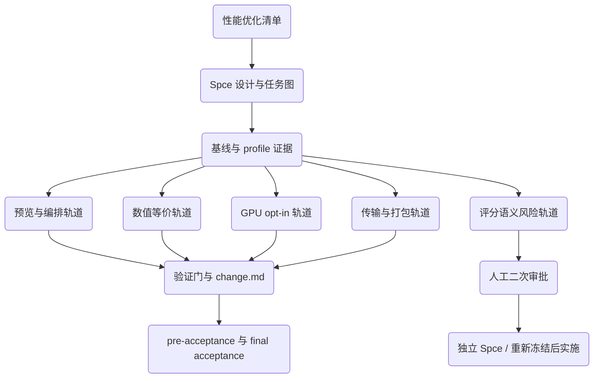

# 技术设计规范 (Design-First Specification)

> **设计名称：** 性能优化清单落地设计
> **设计粒度：** High Level Design
> **版本：** v1.0
> **状态：** 审查中
> **最后更新：** 2026-06-14

---

## 1. 设计概述

本设计把 `docs/performance_optimization_inventory.md` 中的性能优化清单转化为可审批、可恢复、可验收的 Spce 工作流。设计目标不是一次性实现所有优化，而是先建立分批执行边界：纯预览和编排类优化先行，数值等价优化独立验证，涉及评分语义或金标漂移的改动单独审批。

本轮必须从设计出发，因为清单横跨 Python 推理、离线算法、批处理、Vue/Tauri 传输、Rust sidecar 与 Windows 打包。任何直接编码都可能把预览性能、正式评分、YOLO 授权和打包启动约束混在一起，增加回归风险。

---

## 2. 设计起点与约束

### 2.1 已知设计输入

- `docs/performance_optimization_inventory.md`：性能优化清单，覆盖 A 推理侧、B 离线 CPU 热循环、C 批处理与视频 I/O、D 预览传输与打包启动。
- `AGENTS.md`：仓库边界，要求 MediaPipe 仍是正式评分和 full tech_eval 默认链路，YOLO 仅在受控 body-only 预览或内部分析中使用。
- `core/backend_router.py`：桌面、batch、离线分析共享的后端路由唯一决策点。
- `core/vision_pipeline.py`：MediaPipe Tasks pipeline，已经存在 `PipelineConfig.delegate` 和 `enable_hands` 配置位。
- `core/parallel_pose_engine.py`：已有多 worker IMAGE-mode 推理引擎，可作为实时预览多核化的设计输入。
- `analysis/offline_matching_profile.py` 与 `analysis/bench_annotate_fps.py`：现有性能证据入口，可作为执行前后对比工具。
- `tests/test_pose33_v3_golden.py`、`tests/test_valid_mask_migration.py`、`tests/test_tech_eval_contract.py`、`tests/test_yolo_backend_contract.py`：评分、layout、YOLO 授权边界与 tech_eval 合同验证入口。

### 2.2 强约束

- 不得改变 MediaPipe 旧默认路径行为：`pose33_v3` 模板、`infer()`、`annotate()`、旧模板兼容必须以金标不漂移为准。
- 正式评分、规则评分、full tech_eval、CLI 默认路径、Tkinter 默认路径保持 MediaPipe CPU VIDEO-mode 默认链路。
- 视觉算法和编解码算法不迁入 Rust 或 TypeScript；Rust/Tauri 只承担桌面壳、进程、文件、打包资源和原生 IPC。
- YOLO body-only 路由保持 `score_authorized=False` / `scoreAuthorized=false`，并维持 `display_scope=limited|internal` / `displayScope=limited|internal`。
- 安装版 sidecar 不默认打包 YOLO runtime；缺运行时或模型时必须返回结构化不可用或受控 fallback。
- 审批前不写业务代码；审批后必须通过 `spec_progress.py` 或 MCP 记录任务开始、完成、阻塞、跳过和证据。
- 清单中的黄色风险项不得和纯展示、打包、编排类优化混合提交；涉及评分语义或金标变更时必须回到人工审批。
- `T-008` 单次抽帧复用属于评分语义高风险项。首次 `批准规范，启动执行` 只授权产出风险评估和二次审批包，不授权修改 `core/action_compare.py`、`core/rule_scoring.py`、`batch/batch_dual_compare.py` 或 `core/body_core_compare.py` 的单次抽帧实现。真正实施必须先取得独立批准短语 `批准 T-008 高风险评分变更，启动执行`，随后运行 `sync-check --write` 或生成独立 Spce 规范并重新冻结基线。

### 2.3 假设

- 用户已接受本轮只生成 Spce 文档，后续实施需回复 `批准规范，启动执行`。
- 本设计使用 strict 模式，不启用 Quick Plan。
- 清单中的优先级总览是任务排序输入；真实实施顺序仍以依赖、风险和验证证据为准。
- 若执行中发现清单行号与当前代码漂移，以当前仓库代码为准更新规范并重新审批。

---

## 3. 目标系统边界

### 3.1 涉及组件

| 组件 / 模块 | 作用 | 是否变更 |
|:---|:---|:---|
| `apps/ui_backend.py` | Vue/Tauri JSON bridge、预览会话、模型状态、JPEG 预览编码 | 是，限预览、bridge 与受控参数 |
| `core/parallel_pose_engine.py` | 多 worker IMAGE-mode 推理引擎 | 是，作为实时预览多核化复用点 |
| `core/vision_pipeline.py` | MediaPipe pipeline、delegate、pose/hand landmarker 创建 | 是，仅 opt-in GPU 和默认不变保护 |
| `core/backend_router.py` | 后端路由唯一决策点 | 是，限路由元数据和能力边界保护 |
| `core/pose_features.py` | DTW 与姿态归一化 | 是，限数值等价向量化或单独审批的评分变更 |
| `core/action_compare.py` | 单 / 双模板视频对比、误差分析、规则联动 | 是，限缓存和重复推理削减 |
| `core/rule_scoring.py` | 规则评分与结构化状态 | 是，限规则表缓存和经金标验证的向量化 |
| `batch/batch_dual_compare.py` | 批量双模板比较 | 是，限跨视频并行与抽帧复用 |
| `batch/batch_export_skeleton.py` | 批量骨架导出 | 是，限跨视频并行 |
| `apps/main.py` | CLI 实时和离线 runner | 是，限编码线程、writer 回退复用或验证入口 |
| `core/video_writer.py` | 视频输出 codec 回退 | 是，作为多线程 writer 的回退链来源 |
| `frontend/src/App.vue` | 预览 canvas 与前端帧绘制 | 是，限绘制性能和会话隔离保护 |
| `frontend/src/bridge.ts` | raw frame IPC 读取 | 是，限免拷贝视图和帧身份校验 |
| `frontend/src-tauri/src/lib.rs` | sidecar 管理、latest-frame 单槽 store、raw IPC | 是，限 onedir、预拉起和 `Arc<Vec<u8>>` 传输优化 |
| `scripts/build-tauri-sidecar.ps1` | sidecar 构建脚本 | 是，限 onefile 到 onedir 打包链 |
| `frontend/src-tauri/tauri.conf.json` | Tauri resources 和 bundle 配置 | 是，限 sidecar resources 路径 |
| `ui_backend_sidecar.spec` | PyInstaller sidecar 规格 | 是，限 onedir COLLECT 和资源布局 |
| `tests/` | 回归、契约、smoke 与打包测试 | 是，按任务补充或更新 |
| `docs/` 与 `change.md` | 设计、验收证据与变更日志 | 是，记录每批优化依据和验证 |

### 3.2 明确不在范围内

- 不把 YOLO 设为正式评分、full tech_eval、CLI 默认或 Tkinter 默认后端。
- 不新增 `apps/main.py --backend yolo` 实时入口。
- 不新增 Tkinter YOLO 后端选择。
- 不实现 `yolo_body_mp_pose_supplement` 或 Hybrid 半成品 runtime。
- 不把 MediaPipe/YOLO 推理、评分、DTW、规则评分迁入 Rust 或 TypeScript。
- 不在本轮重生 `tests/fixtures/pose33_v3/golden.json`；若未来确需评分变更，必须单独审批。
- 不把 `models/`、`outputs/`、`frontend/dist/`、`frontend/src-tauri/target/` 或 sidecar 生成产物提交入库。

---

## 4. 方案设计

### 4.1 总体方案

性能优化按风险和证据链分为五条执行轨道：

1. 预览与编排轨道：先做不触碰正式评分的实时预览多核、预览默认 pose-only、预览 lite、JPEG/FPS/尺寸常量调档、batch 跨视频并行。
2. 数值等价轨道：对 DTW 局部代价矩阵、姿态归一化、规则表缓存、误差聚合进行向量化或缓存，要求金标不漂移。
3. GPU opt-in 轨道：只贯通显式 delegate 参数与 CPU fallback，默认仍为 CPU，正式评分和 full tech_eval 不走 GPU。
4. 高风险评分轨道：单次抽帧、段 warm-up、DTW 带宽、代表周期算法这类可能改变时序态或对齐语义的项必须单独审批。本规范内 `T-008` 只产出风险评估、验证设计和二次审批包，不实施单次抽帧复用。
5. 传输与打包轨道：前端 canvas、raw frame 免拷贝、Rust latest-frame 引用计数、PyInstaller onedir 与 sidecar 预拉起只改变展示和启动行为。

每条轨道都必须先记录执行前基线，再用任务自身验证命令和跨轨道回归门证明没有越界。

### 4.2 拓扑 / 调用链

### 4.3 关键接口与数据流

| 接口 / 数据流 | 输入 | 输出 | 约束 |
|:---|:---|:---|:---|
| bridge 预览请求 | source、workers、poseVariant、enableHands、qualityProfile | session、latest-frame、preview metrics | `doCompare=true` 优先于 high_quality；late response 不得复活终态 |
| `ParallelPoseEngine` 预览 | camera frame、worker 数、drop_when_full | ordered 或 latest-wins 推理结果 | 仅用于预览，IMAGE-mode 抖动需要 UI 标注或保持默认 workers=1 |
| MediaPipe delegate | explicit delegate 参数 | CPU 或 GPU BaseOptions | 默认 CPU；GPU 失败必须结构化回退 CPU |
| DTW / normalize 向量化 | pose33/body_core 序列与 valid_mask | 分数、区间、误差统计 | 数值等价，`pose33_v3` 金标不漂移 |
| 单次抽帧缓存审批包 | 原始视频、模板、valid_mask、现有 profile 证据、golden 结果 | 风险评估、验证矩阵、二次审批建议 | 首轮 approval 不授权实现；VIDEO-mode 时序态风险必须用真实模型验证后再独立审批 |
| raw frame IPC | frameToken、sessionId、frameId、frameHandle | JPEG bytes 或空帧 | 会话隔离、frameId 单调不回退、latest-wins 背压不改为队列 |
| sidecar resources | onedir sidecar 文件夹 | Tauri bundle 资源 | Windows 打包 smoke 必须覆盖路径解析和资源存在性 |

### 4.4 数据模型 / 状态变化

| 对象 / 状态 | 变化前 | 变化后 | 备注 |
|:---|:---|:---|:---|
| 预览默认能力 | 默认 `enable_hands=True`、`pose_variant=full` | 预览可切换为 pose-only 和 lite，正式评分默认不变 | UI 需显式表达能力范围 |
| 推理 worker | bridge 捕获 `workers` 但预览单管线串行 | camera preview 可在 `workers>1` 时走多 worker | 默认 workers=1 保守不变 |
| delegate | 生产 factory 无显式 GPU 入口 | 显式 opt-in GPU，失败回退 CPU | 不进入正式评分默认链路 |
| DTW / normalize | Python 循环为主 | 局部代价矩阵和归一化向量化 | 必须保持输出容差 |
| 批处理 | dual compare 与 skeleton export 串行 | 跨视频线程池，每线程独立管线 | MediaPipe pipeline 不共享 |
| sidecar | PyInstaller onefile 冷启动自解压 | onedir resources + 路径解析 | 需更新打包脚本和 smoke |
| latest-frame | 单槽 bytes clone | 可改为引用计数，语义不变 | 不引入帧队列 |

### 4.5 Low Level Design 细节

本设计选择 High Level Design。函数签名、缓存键、线程队列、状态机和 PyInstaller resources 的详细字段在对应任务开始前按 approved spec 边界细化到实现，不在本轮预先锁死。若任务执行需要新增 public contract 或改变现有 request/response 字段，必须先更新本设计并重新审批。

---

## 5. 备选方案与取舍

| 方案 | 结论 | 原因 |
|:---|:---|:---|
| 按清单一次性实现全部优化 | 不采纳 | 风险跨度过大，无法区分预览性能收益、数值等价和评分语义变更 |
| 先做纯预览、编排和打包优化 | 采纳 | 收益高，越过正式评分路径的概率低，验证周期短 |
| 直接把算法搬进 Rust | 不采纳 | 违反仓库约束，且无法消除推理与 JPEG/IPC 三角的主要成本 |
| 默认启用 GPU delegate | 不采纳 | 可能引入平台差异和金标漂移；只允许 opt-in |
| 默认加 Sakoe-Chiba DTW 带宽 | 不采纳 | 改变对齐语义，必须作为评分变更另行评审 |
| 先通过 profile 证明热点再做低优先优化 | 采纳 | 避免投入到收益不明确的前端、I/O 或算法细节 |

---

## 6. 风险与验证策略

### 6.1 主要风险

- `pose33_v3` 金标漂移：任何影响 DTW、规则评分、抽帧、VIDEO-mode 时序态的改动都可能触发。
- 预览多 worker 抖动：IMAGE-mode 无 VIDEO-mode 时序平滑，可能使骨架显示抖动增加。
- GPU delegate 平台差异：Windows GPU delegate 可能不可用或结果与 CPU 有差异。
- 并发资源隔离：批处理跨视频并行必须保证每线程独立 pipeline，避免 MediaPipe 非线程安全问题。
- latest-frame 语义破坏：传输优化不得把单槽 latest-wins 背压改成队列。
- 打包路径漂移：onedir sidecar 会改变 Tauri resources 与 Rust 路径解析。

### 6.2 验证策略

- 每批任务先记录执行前 profile 或 smoke 基线，再记录执行后命令和证据。
- `T-001` 必须产出真实 profile 采证：至少包含 `analysis/offline_matching_profile.py --fixture-smoke` 的 JSON/CSV、`analysis/bench_annotate_fps.py --env-only` 环境快照，以及 high_quality backend routing 合同测试结果。若 `tests/test_backend_routing_contract.py::test_offline_high_quality_yolo26l_available_routes_internal_body_only` 仍因 `core/backend_router.py` 的 `_mediapipe_body_core(..., model_profile=...)` 参数不匹配失败，则性能优化实施必须阻塞，先走 Bugfix 或重新审批。
- 评分相关任务至少运行 `tests/test_pose33_v3_golden.py`、`tests/test_valid_mask_migration.py`、`tests/test_tech_eval_contract.py` 中相关子集。
- YOLO 或 backend routing 相关任务运行 `tests/test_yolo_backend_contract.py`、`tests/test_yolo_landmark_mapping.py`、`tests/test_backend_routing_contract.py` 中相关子集。
- Vue/Tauri bridge 相关任务运行 `npm --prefix frontend run test`、相关 `tests/test_ui_backend_*.py`，必要时运行 `npm run verify:desktop`。
- 打包相关任务运行 `npm run package:windows` 与 `.\.venv\Scripts\python.exe -m pytest tests/test_windows_packaging_smoke.py -q`。
- 每个任务完成后运行 `git diff --check` 并更新 `change.md`。

---

## 7. 派生需求提示

- 需求必须从本设计的分轨执行、默认路径保护、证据门和审批边界派生。
- 不能从本设计派生“默认 YOLO 正式评分”“默认 GPU 评分”“重生金标”“Rust 承接视觉算法”等能力。
- 任何实施时新增的用户可见开关、bridge 字段、打包资源布局或评分语义变更，都必须回写规范并等待重新审批。
- `T-008` 的派生需求只能覆盖二次审批包和验证设计；不能从首次规范批准中派生单次抽帧业务实现。

---

## 8. 审批记录

| 日期 | 审批人 | 决定 | 备注 |
|:---|:---|:---|:---|
| 2026-06-14 | Codex | 待审批 | 已生成规范草案；实施需用户回复 `批准规范，启动执行` |
