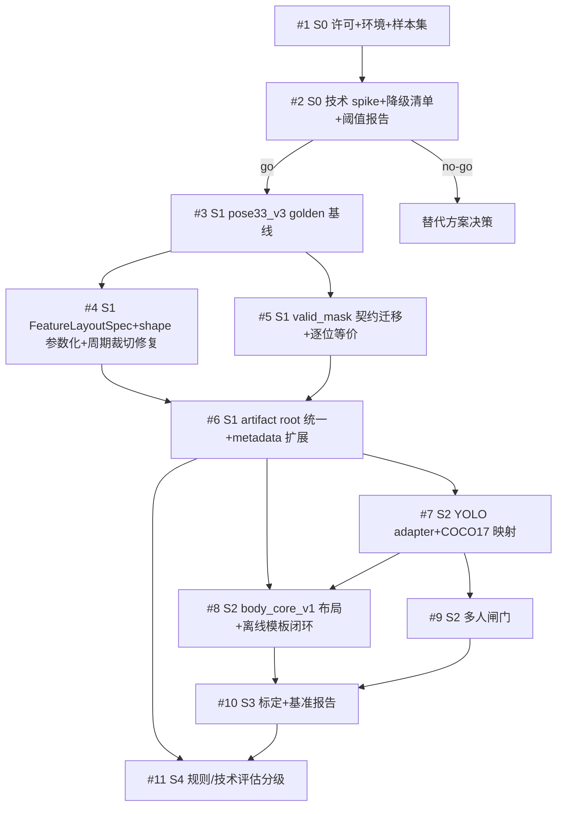

# YOLO 迁移：任务细化（Issue 清单）

来源：`docs/yolo_migration_plan_optimized.md`（三审定稿版）
日期：2026-05-30
用途：每个条目可直接作为一个仓库 Issue 提交。粒度=中间粒度，共 11 个实施 Issue（S0–S4）+ 6 个 M4 决策与扩展 Issue（#23–#28）。

## 仓库追踪索引（已落地）

本清单已在仓库（`YGuo-2/vision`）建为正式 Issue 与 Milestone：

- **总追踪 / 作战地图**：Issue #12 `[Tracking] YOLO 迁移总追踪`（已收尾，全部子任务关闭）。
- **实施 / 决策 Issue**：#1–#11、#23–#28 均已关闭；#23–#28 为 S5/S6 追加拆票。
- **Milestone**（进度条 + 阶段筛选）：

  | Milestone | 包含 Issue |
  |---|---|
  | M0 决策门 | #1 #2 |
  | M1 MediaPipe 加固 | #3 #4 #5 #6 |
  | M2 YOLO 离线闭环 | #7 #8 #9 |
  | M3 标定与分级 | #10 #11 |
  | M4 决策与扩展 | #23 #24 #25 #26 #27 #28 |

## 约定

- 所有命令以仓库根为工作目录，Python 解释器为 `.\.venv\Scripts\python.exe`。
- 每个 Issue 完成后，按 `AGENTS.md` 规范把修改总结写入当前 `change.md`（历史记录见 `change（start~2026.5）.md`）。
- **测试框架前置（重要）**：当前 `requirements.txt` 只有 `mediapipe/opencv-python/numpy/pillow`，**没有 pytest**；现有 `tests/test_standard_video.py`、`tests/test_force_sequence.py` 是 `if __name__ == "__main__"` 脚本风格。本清单的新增测试需要结构化断言，因此 **#3 必须先把测试框架确定下来**，二选一并在 #3 内落地：
  - 方案 A（推荐）：新增 `requirements-dev.txt` 写入 `pytest`，新测试用 `pytest` 风格，验收命令 `.\.venv\Scripts\python.exe -m pytest tests\xxx.py`。
  - 方案 B：不引入第三方依赖，新测试用标准库 `unittest`，验收命令 `.\.venv\Scripts\python.exe -m unittest tests.xxx`。
  - 一旦在 #3 选定，后续所有 Issue 的验收命令统一沿用该风格（本文档示例默认按方案 A 写 pytest，若选 B 请整体替换为 unittest 命令）。
- 测试统一放 `tests/`，命名 `test_*.py`。
- 标签建议：`yolo-migration` + 阶段标签（`S0`..`S4`）+ 类型标签（`spike`/`refactor`/`test`/`feature`/`infra`）。
- **强约束（贯穿所有 Issue）**：MediaPipe 旧默认路径（`pose33_v3` 模板、`infer()`/`annotate()`）行为不得改变；任何改动以 `tests/test_pose33_v3_golden.py` 不漂移为准。

## 依赖关系总览

关键顺序：**#3 golden 基线必须最先落地**，它是 #4/#5 重构“行为不变”的唯一安全网。#4 与 #5 都依赖 #3，彼此可并行。

---

## Issue #1 — S0a：许可结论、实验环境固定与基线样本集

**阶段**：S0　**标签**：`yolo-migration` `S0` `spike`　**依赖**：无　**阻塞**：#2

### 任务明细
在写任何技术 spike 之前，先把“能不能用、在什么环境用、用哪些样本测”三件确定下来。Ultralytics 为 AGPL-3.0 / Enterprise 双许可，闭源或商业部署必须先有书面许可结论；环境与样本集不固定，后续所有 FPS / 精度数字都不可复现。

### 任务规范
- 不改动主代码，本 Issue 只产出文档与样本清单。
- 许可结论必须明确落到“可用 / 不可用 / 需采购 / 转替代方案”四选一。
- 样本集需覆盖正面、侧面、长视频、遮挡或多人边界。

### 任务清单
- [ ] 调研并记录 Ultralytics 许可路径（AGPL-3.0 是否可接受 / 是否需 Enterprise / 是否转 RTMPose 等替代）。
- [ ] 固定实验环境并写入报告：Python、torch、ultralytics 版本、模型文件、CPU/GPU 型号、CUDA 版本。
- [ ] 选 3–5 段样本，建立 `docs/yolo_eval_samples.json`（含路径、视角、时长、场景标签、是否多人）。
- [ ] 在 `docs/yolo_baseline_report.md` 建立报告骨架（头部预留许可结论与环境表）。

### 验收标准
- [ ] `docs/yolo_eval_samples.json` 存在且包含至少 3 段样本，覆盖正面/侧面/长视频/边界场景。
- [ ] `docs/yolo_baseline_report.md` 头部含许可结论（四选一）+ 完整环境表。
- [ ] 若许可结论为“不可用且无采购意愿”，本 Issue 直接触发“替代方案决策”，#2 不启动。
- [ ] `change.md` 已记录。

---

## Issue #2 — S0b：技术 spike、核心指标降级清单与预注册阈值（go/no-go）

**阶段**：S0　**标签**：`yolo-migration` `S0` `spike`　**依赖**：#1　**阻塞**：#3（go 时）

### 任务明细
用临时脚本（不接主代码）跑通 YOLO 与 MediaPipe 在同一批样本上的对照，产出 go/no-go 结论。本 Issue 的核心不是“跑起来”，而是**先填死数字阈值再对照数据**，杜绝事后主观争论。同时必须静态列出 YOLO-only(COCO17) 下结构性失效的核心指标。

### 任务规范
- spike 脚本独立存放（如 `analysis/spike_yolo_baseline.py`），**不得 import 进主链路、不得改主代码**。
- 先确定迁移首要动机：
  - 动机=实时 FPS → **必须测 `apps/main.py --source 0` 的 `annotate()` 全链路 FPS（含 Hands 开/关两档）**，不能只测裸推理 keypoint FPS。
  - 动机=离线吞吐 → 维持离线先行，实时入口留到 S5/S6。
- 所有 go/no-go 阈值必须在跑数据**之前**填入报告头部。

### 任务清单
- [ ] 写 spike 脚本：导出 YOLO keypoints、track_id、FPS、失败帧率；同样本导出 MediaPipe 基线。
- [ ] **若迁移动机为实时 FPS：单独跑 `apps/main.py --source 0`（或离线等价）的 `annotate()` 全链路，记录 Hands 开 / 关两档端到端 FPS**，与裸推理 keypoint FPS 分两栏列出，不可混为一谈。
- [ ] 在报告头部填入预注册阈值（数字，非占位）：实时端到端 FPS 提升比例下限、失败/漏检帧率上限、关键点抖动上限、模板分数相关性下限、初始化耗时上限。
- [ ] 对照 `analysis/tech_eval.py` 列出 YOLO-only 失效/退化指标清单：
  - 重心-支撑面（`eval_cog_side` → `_foot_edges_x` → HEEL/FOOT_INDEX）；
  - 重心-分段质心（`eval_cog_com` → `_compute_body_com_single` 的 foot_l/foot_r 段依赖 ANKLE/HEEL/FOOT_INDEX，缺脚跟脚尖后足部段缺失、CoM 偏移）；
  - 发力顺序（`eval_force_sequence` → `_push_off_ok`/`_calc_heel_lift`/`_foot_angle_deg`/`_rotation_fail_front`）；
  - 后手贴近 / 护手（`_rule_back_arm_close`/`_rule_guard_hand` → MOUTH）；
  - 脚尖平行（`_rule_feet_parallel` → HEEL/FOOT_INDEX）。
- [ ] 给出每条指标的业务可接受性结论（对照降级影响）。
- [ ] 汇总 go/no-go：每条结论引用具体数字。

### 验收标准
- [ ] `docs/yolo_baseline_report.md` 含：样本、命令、版本、硬件、FPS、失败帧率、主要差异。
- [ ] 报告头部预注册阈值齐全，且每条 go/no-go 结论引用数字而非“明显劣于/可接受”等措辞。
- [ ] 核心指标降级清单完整，含业务可接受性判断。
- [ ] 若动机为实时 FPS：报告含 `annotate()` 全链路（Hands 开/关）端到端 FPS。
- [ ] 输出明确 go / no-go；no-go 时进入“替代方案决策”，不进 S1。
- [ ] `change.md` 已记录。

---

## Issue #3 — S1：pose33_v3 golden 回归基线（安全网，先行）

**阶段**：S1　**标签**：`yolo-migration` `S1` `test`　**依赖**：#2(go)　**阻塞**：#4 #5

### 任务明细
S1 后续会改 `_extract_pose_features()`、`mirror_pose_features()`、`_select_representative_cycle()`、误差统计等热路径。`py_compile` 对“行为不变”零保证。本 Issue 先把现状冻结成 golden fixture，作为后续重构的唯一硬保证——**必须在 #4/#5 动代码之前合并**。

### 任务规范
- fixture 用保存好的 landmark/feature 序列或一段短 fixture 视频，纳入版本控制（注意体积，必要时用裁剪短样本）。
- golden 值在“当前未改动代码”上生成，提交时锁定。
- 数值断言用极小容差 `np.allclose`；状态/分类断言用精确相等。

### 任务清单
- [ ] 准备 fixture（短样本视频或序列 `.npz`），放 `tests/fixtures/`。
- [ ] 生成并保存 golden：单模板 `compare_video_to_template` 分数；双模板 `compare_video_to_dual_templates` 的 `combined_percent` 及各视角分数；`tech_eval` 各指标 `status` + 关键 `detail`。
- [ ] 写 `tests/test_pose33_v3_golden.py`，对上述三类输出做回归断言。
- [ ] 文档化“如何在有意变更行为时重新生成 golden”的流程。

### 验收标准
- [ ] `.\.venv\Scripts\python.exe -m pytest tests\test_pose33_v3_golden.py` 在未改动代码上全绿。
- [ ] 测试覆盖单模板分数、双模板 `combined_percent`+各视角分、tech_eval 指标状态三类。
- [ ] fixture 与 golden 已入库，README 或测试 docstring 说明重生成步骤。
- [ ] `change.md` 已记录。

---

## Issue #4 — S1：FeatureLayoutSpec 注册表 + layout shape 参数化 + 周期裁切修复

**阶段**：S1　**标签**：`yolo-migration` `S1` `refactor`　**依赖**：#3　**阻塞**：#6

### 任务明细
把 `(22,2)` 硬编码从热路径里拆出来，做成显式 layout 注册。本 Issue **只做参数化，默认仍走 22 点路径**，不引入 `body_core_v1`（下移 #8）。同时修复 `_select_representative_cycle()` 的静默退化 bug：当前 `if features.shape[1:] != (22, 2): return features`（`core/action_compare.py` 约 337-343 行）会让非 22 点布局静默跳过周期裁切，DTW query 退化成整段模板，不报错最难查。

### 任务规范
- `FeatureLayoutSpec` 本期**只注册生产用的 `pose33_v3`**。
- 周期裁切函数泛化：`_select_representative_cycle` 改为**只依赖 `features.shape[1:]` 是否为合法 `(J,2)` 布局**（`J>=` 某下限即可裁切），不再写死 `(22,2)`；这样它无需知道 `body_core_v1` 是否已注册，也能被任意 `(T,J,2)` 输入驱动。
- 非 22 点的测试用 **test-only dummy layout / 直接构造 `(T,12,2)` ndarray**，不依赖生产注册表存在 `body_core_v1`（后者在 #8 才注册）。
- 改动后 `tests/test_pose33_v3_golden.py` 必须保持全绿——这是“默认行为不变”的硬门槛。

### 任务清单
- [ ] 新增 `FeatureLayoutSpec`（`name`/`source_indices`/`shape`/`mirror_pairs`/`joint_names`/`default_baseline`），注册 `pose33_v3`。
- [ ] 不引入 S4 才消费的 `required_landmarks` 字段（避免提前建模）。
- [ ] `_extract_pose_features()` 缺帧补零按 layout shape 生成，去掉字面量 `(22,2)`。
- [ ] `mirror_pose_features()` 按 layout `mirror_pairs` 工作，去掉写死的 22 点配对。
- [ ] 双模板关节误差统计从 layout `joint_names` 取名。
- [ ] 泛化 `_select_representative_cycle()` 守卫：按 `features.shape[1:]` 判定，使任意 `(T,J,2)` 输入都能正常裁切。
- [ ] 不同 layout 比对时抛清晰错误，不允许静默比对。

### 验收标准
- [ ] `tests/test_pose33_v3_golden.py` 全绿（行为不变）。
- [ ] `tests/test_layout_shape_param.py`：断言上述函数在 `pose33_v3` 下行为不变；**热路径（缺帧补零、mirror、误差统计、周期裁切）不得硬编码 `22`/`(22,2)` 作为 shape 魔法值——`FeatureLayoutSpec.pose33_v3` 的注册定义、测试期望值、注释中出现 `22` 属合法，不计入**。
- [ ] `tests/test_representative_cycle_layout.py`：用 test-only 构造的 `(T,12,2)` 输入，验证 `_select_representative_cycle()` 不再静默整段返回、能正常按周期裁切。
- [ ] `py_compile` 全部目标文件通过。
- [ ] `change.md` 已记录。

---

## Issue #5 — S1：valid_mask 契约迁移 + 逐位等价回归

**阶段**：S1　**标签**：`yolo-migration` `S1` `refactor`　**依赖**：#3　**阻塞**：#6

### 任务明细
把“此点是否可用”的判据从散落的 `lm[idx,3] >= thr` 统一迁移到 `valid_mask`。当前 `analysis/tech_eval.py:104` 的 `_valid()` 与 `core/rule_scoring.py:93` 的 `_valid_frame()` 是该风格，且被 `eval_cog_*`/`eval_force_sequence`/全部 `_rule_*` 反复调用，调用面是几十处——这是 S1 真正的大头，单列为专项。

### 任务规范
- 序列提取层产出 `valid_mask[T,33]`；MediaPipe 路径由现有 `visibility >= 0.5` 规则灌入，记 `validity_policy=visibility_thr`、`valid_conf_thr=0.5`。
- 下游一律读 `valid_mask`，不再各自比 `lm[idx,3]`。
- MediaPipe 侧 `0.5` 视为已标定；本期不引入 YOLO（YOLO 阈值标定在 #10）。
- **API 传播边界（必须遵守，否则旧调用会炸）**：所有接收关键点的公开/半公开函数**新增可选参数 `valid_mask: np.ndarray | None = None`**，语义为“`None` 时内部按 `landmarks[...,3] >= 0.5` 现场推导”。这样旧调用方（含现有脚本测试、`compare_video_to_dual_templates` 内部对 `extract_pose_raw` 的调用）不传该参数也能正常工作。需覆盖的签名至少包括：
  - `rule_scoring.extract_pose_raw`（产出端：额外返回或在 meta 带 `valid_mask`）
  - `rule_scoring.score_rules`
  - `tech_eval.extract_pose_and_view_scores`（产出端）
  - `tech_eval.evaluate_video_detail` / `evaluate_video_full`（或当前等价的视频级评估入口）
  - 直接被测试/批处理调用的 `eval_cog_side`/`eval_cog_front`/`eval_cog_com`/`eval_force_sequence` 等 `eval_*`
  - 内部判据 `tech_eval._valid` / `rule_scoring._valid_frame` 改为读传入的 mask 切片
- 推导逻辑只允许集中在一处 helper（如 `derive_valid_mask(landmarks, thr=0.5)`），避免阈值再次散落。

### 任务清单
- [ ] 实现集中式 `derive_valid_mask(landmarks, thr)` helper。
- [ ] 在序列/原始提取链路产出并传递 `valid_mask`（`extract_pose_raw`、`extract_pose_and_view_scores`）。
- [ ] 给上述全部公开/半公开函数加 `valid_mask: np.ndarray | None = None` 形参，`None` 时回退到 `derive_valid_mask`。
- [ ] 重写 `tech_eval._valid` / `rule_scoring._valid_frame` 为读 `valid_mask` 切片。
- [ ] 迁移全部调用点（`eval_cog_*`/`eval_force_sequence`/`_rule_*`），并核对 `compare_video_to_dual_templates` 等内部调用方不传 mask 时仍走旧行为。
- [ ] 在 meta/config 落地 `validity_policy`/`valid_conf_thr` 字段。

### 验收标准
- [ ] `tests/test_valid_mask_migration.py`：同 fixture 下三种调用方式产出**逐位一致**——① 旧式不传 `valid_mask`（内部推导）、② 显式传入由 `derive_valid_mask` 生成的 mask、③ 改造前的旧实现 golden；规则扣分、tech_eval 状态、关节误差三者全一致。
- [ ] 不传 `valid_mask` 的旧调用（含现有脚本测试）不报错、行为不变。
- [ ] `tests/test_pose33_v3_golden.py` 仍全绿。
- [ ] 源码中 `tech_eval`/`rule_scoring` 评分路径不再出现散落的 `lm[idx,3] >=` / `_lm_vis(...) >=` 直接阈值比较（阈值只存在于 `derive_valid_mask`）。
- [ ] `change.md` 已记录。

---

## Issue #6 — S1：artifact root 统一 + 模板 metadata 扩展

**阶段**：S1　**标签**：`yolo-migration` `S1` `infra`　**依赖**：#4 #5　**阻塞**：#7 #8

### 任务明细
当前各包各自 `Path(__file__).resolve().parent / "models"`（`core`/`apps`/`batch`/`analysis` 均有），模板也散落。统一到顶层 root，并扩展模板 metadata 以承载后端/布局/有效性信息，为 S2 接 YOLO 铺路。

### 任务规范
- 统一到顶层 `models/`、`templates/`、`outputs/`，同步更新 `.gitignore`。
- metadata 扩展为增量字段，旧模板缺字段时要有兼容默认值，不能读崩。

### 任务清单
- [ ] 统一模型目录解析（集中到一个 helper，替换各处散落写法）。
- [ ] 统一模板输出目录到 `templates/`。
- [ ] **统一 `outputs/` root**：收敛 `apps/app_ui.py`、`batch/*.py` 等各自的输出/预览/CSV/JSONL 落盘路径到顶层 `outputs/`，集中到同一 helper 解析。
- [ ] 模板 metadata 增加 `backend`、`model_name`、`feature_layout`、`normalizer_version`、`confidence_kind`、`validity_policy`、`valid_conf_thr`。
- [ ] 旧模板读取兼容（缺字段走默认）。
- [ ] 更新 `.gitignore`（覆盖 `models/`、`templates/`、`outputs/`）。

### 验收标准
- [ ] `tests/test_artifact_roots.py`：各入口解析到同一模型 / 模板 / `outputs/` root。
- [ ] `tests/test_template_metadata.py`：旧模板仍可加载比对；新模板 metadata 字段齐全。
- [ ] `tests/test_pose33_v3_golden.py` 仍全绿。
- [ ] `py_compile` 全部目标文件通过。
- [ ] `change.md` 已记录。

---

## Issue #7 — S2：YOLO adapter + COCO17→Pose33-like 映射

**阶段**：S2　**标签**：`yolo-migration` `S2` `feature`　**依赖**：#6　**阻塞**：#8 #9

### 任务明细
新增轻量 YOLO adapter，把 COCO17 映射到 Pose33-like 容器，缺失点诚实置无效。这是 YOLO 进入主链路的唯一入口，必须严守“不伪造完整 Pose33”。

### 任务规范
- 懒加载 `from ultralytics import YOLO`，未安装时不影响 MediaPipe 路径 import。
- **`synthetic` 信息的存放位置必须二选一并写死契约（解决与“序列热路径只返回 numpy”冲突）**：
  - 序列层（`extract_landmark_series` 等）**只返回 `landmarks[T,33,4]` + `valid_mask[T,33]`**，缺失点在序列层的唯一可见判据是 `valid_mask=False`；
  - `synthetic=True` 属于**边界容器语义**，只存在于 adapter 的 `FrameResult`/`Landmark` 层；
  - 因此对“缺失点是合成点”的断言**限定在 adapter 边界层测试**；若下游确有按帧区分“合成 vs 真实低置信”的需求，则**新增 `synthetic_mask[T,33]` 作为序列层的显式数组**，而不是把 `synthetic` 塞进 `(T,33,4)`。本期默认走前者（边界层断言），是否引入 `synthetic_mask` 视 #11 需求再定。
- 缺失点（嘴角 9/10、手指 17-22、脚跟脚尖 29-32、眼细分 1/3/4/6）在序列层必须 `valid_mask=False`；在 adapter 边界层必须 `synthetic=True`、`visibility=0.0`。
- YOLO confidence 写入第 4 通道但标 `confidence_kind=yolo_conf`，**不可**与 MediaPipe visibility 共用阈值。
- YOLO 侧 `valid_conf_thr` 本期为**待标定占位值**，仅供预览/调试与 S3 标定，不得产出对外评分。

### 任务清单
- [ ] 新增 adapter 模块（懒加载 ultralytics），定义 `FrameResult`/`Landmark` 边界容器。
- [ ] 实现 COCO17 解析与 BlazePose 索引映射（按文档映射表）。
- [ ] adapter 边界层：缺失点标 `synthetic=True`/`visibility=0.0`。
- [ ] 序列层摊平为 `(T,33,4)` + `valid_mask[T,33]`，缺失点 `valid_mask=False`；明确不携带逐点 `synthetic` 标量。
- [ ] 写入 `confidence_kind`/`validity_policy`/`valid_conf_thr`（占位）到 meta。
- [ ] 单视频/单 segment 内 tracker 不跨任务复用；段边界 track_id 重置语义写入注释与 meta。

### 验收标准
- [ ] `tests/test_yolo_landmark_mapping.py`：**边界层**断言缺失点 `synthetic=True`；**序列层**断言对应点 `valid_mask=False`、33 长度正确、COCO 对应点 confidence 正确传递。
- [ ] `tests/test_yolo_backend_contract.py`：无人帧 / 空结果 / track_id 段边界重置行为正确。
- [ ] 序列层输出仅为 numpy 数组（`landmarks`/`valid_mask`[/可选 `synthetic_mask`]），不逐帧返回冻结对象列表。
- [ ] 未安装 ultralytics 时，MediaPipe 路径与既有测试不受影响。
- [ ] `change.md` 已记录。

---

## Issue #8 — S2：body_core_v1 布局引入 + 离线模板闭环

**阶段**：S2　**标签**：`yolo-migration` `S2` `feature`　**依赖**：#6 #7　**阻塞**：#10

### 任务明细
引入 `body_core_v1`(12,2) 共享布局（从 S1 下移到此，因为此时才真正有消费者），新增其 normalizer，让 YOLO 与 MediaPipe 都能生成该布局模板，并打通一条离线模板闭环。

### 任务规范
- `body_core_v1` 作为**显式 opt-in**，不动 MediaPipe 默认 `pose33_v3`。
- `body_core_v1` baseline 本期先用占位值，正式标定在 #10。
- YOLO 只允许 `body_core_v1`；先只接一条离线闭环（`make_template`/`match_template`/`batch_dual_compare` 三选一）。
- **本期 YOLO 产出的分数仅用于调试与 S3 标定，不是对外评分**：YOLO `valid_conf_thr` 与 `body_core_v1` baseline 此时均未标定，输出 metadata 必须标 `calibration_status=unvalidated`，且不得进入用户报告 / 正式评分结果。

### 任务清单
- [ ] 在 `FeatureLayoutSpec` 注册 `body_core_v1`（12 点索引、mirror_pairs、joint_names）。
- [ ] 新增 `body_core_v1` normalizer（YOLO/MediaPipe 共享）。
- [ ] 让 MediaPipe 也能生成 `body_core_v1` 模板（供 S3 三方对比）。
- [ ] 打通一条 YOLO `body_core_v1` 离线模板闭环（生成→匹配）。
- [ ] 闭环输出 metadata 写 `calibration_status=unvalidated`，分数仅供调试/标定。
- [ ] 不同 layout 比对报清晰错误。

### 验收标准
- [ ] `tests/test_body_core_layout.py`：`body_core_v1` 的 shape / mirror pairs / joint names / layout mismatch 行为正确。
- [ ] 能生成 YOLO `body_core_v1` 模板并匹配同一视频，产出分数，且该分数 metadata 标 `calibration_status=unvalidated`、未进入对外报告。
- [ ] MediaPipe 旧 `pose33_v3` 模板仍能正常比对（golden 全绿）。
- [ ] 不实现 UI 后端选择 / Hybrid / 默认切换（范围守住）。
- [ ] `change.md` 已记录。

---

## Issue #9 — S2：多人场景闸门

**阶段**：S2　**标签**：`yolo-migration` `S2` `feature`　**依赖**：#7　**阻塞**：#10

### 任务明细
`batch_tech_eval`/`batch_dual_compare` 跑的是学员视频，教练、镜面反射、路人入镜常见。YOLO“最大框/最高分取单人”可能稳定选错实例——这是**正确性风险**，不是鲁棒性优化。MVP 必须能识别并拒绝/降级，不允许静默选最大框。

### 任务规范
- 单人（`num_persons<=1`）才走“最大框/最高分取单人”。
- 多人（`num_persons>1`）必须标记并阻断对外出分。
- 完整多人鲁棒策略（中心最近、tie-break、track 延续）本期不做。

### 任务清单
- [ ] adapter 输出每帧/整段检出人数。
- [ ] `num_persons>1` 时 meta 写 `multi_person_detected=True` + 人数。
- [ ] tech_eval / batch 链路对该视频拒绝出分或降级“需人工复核”。
- [ ] 段边界 track_id 重置语义在 meta/注释写明。

### 验收标准
- [ ] `tests/test_yolo_backend_contract.py` 增补：多人帧触发 `multi_person_detected` 并被拒绝/降级，不静默选最大框。
- [ ] batch 输出中多人视频明确标“需人工复核/拒绝”，不混入正常评分结果。
- [ ] 单人样本不受影响。
- [ ] `change.md` 已记录。

---

## Issue #10 — S3：标定与基准报告

**阶段**：S3　**标签**：`yolo-migration` `S3` `spike`　**依赖**：#8 #9　**阻塞**：#11（评分阈值部分）

### 任务明细
确定 `body_core_v1` 是否可用于评分、baseline 取值，以及标定 YOLO 侧 `valid_conf_thr`（把 #7 的占位值替换为标定值，此后 YOLO 才允许对外出分）。结论必须对照预注册数字，不能是“可用/不建议”这类感觉。

### 任务规范
- 同批样本跑三路：MediaPipe `pose33_v3`、MediaPipe `body_core_v1`、YOLO `body_core_v1`。
- 预注册阈值在跑数据前填入报告头部。

### 任务清单
- [ ] 三路对照，统计模板分数、avg_cost、有效帧率、失败帧率、FPS、初始化耗时。
- [ ] 报告头部预注册数字判据：分数相关性下限、pass/fail 一致率下限、分数 MAE 上限、skip 比例上限、失败帧率上限。
- [ ] 报告头部预注册 pass/fail 判定口径：明确使用业务人工标签、MediaPipe full 阈值，还是模板分数阈值；阈值、标签来源和样本范围必须在跑数据前写死。
- [ ] 重标定 `body_core_v1` baseline，写入 layout spec/config（替换全局 `2.0`）。
- [ ] 标定 YOLO `valid_conf_thr` 并写入 config，替换 #7 占位值。
- [ ] 输出差异样例（误判高/低、skip 比例高的片段）。

### 验收标准
- [ ] `docs/yolo_body_core_calibration.md` 头部含全部预注册数字，结论逐条引用数字。
- [ ] 报告明确记录 pass/fail 判定口径、阈值/标签来源和样本范围，不允许事后改口径解释结果。
- [ ] `body_core_v1` baseline 已落配置，不再写死 `2.0`。
- [ ] YOLO `valid_conf_thr` 已标定入库，占位值移除。
- [ ] 明确结论四选一（仅预览 / 可模板匹配 / 可 skip-aware partial eval / 不建议），附数字依据。
- [ ] `change.md` 已记录。

---

## Issue #11 — S4：规则与技术评估分级（结构化状态）

**阶段**：S4　**标签**：`yolo-migration` `S4` `feature`　**依赖**：#6 #10　**阻塞**：无（MVP 收尾）

### 前置条件（按 #10 结论分流，必读）
本 Issue 的范围**取决于 #10 标定结论**：
- [ ] 若 #10 = “可用于 skip-aware partial eval” → **完整执行**本 Issue（含 YOLO-only 指标分级）。
- [x] 若 #10 = “仅用于预览” 或 “可用于模板匹配（但不评分）” → **只做 MediaPipe 侧的结构化状态改造**（`state`/`skip_reason`/`required_landmarks`/`missing_landmarks`），**不实现 YOLO partial tech_eval 指标启用**；该结构化改造本身对 MediaPipe 也有价值，仍值得做。
- [ ] 若 #10 = “不建议使用” → 本 Issue 退化为**仅 MediaPipe 结构化状态改造（可选）**，并直接转入 S5/S6 决策，不再投入 YOLO 评估工作。

> **采用分支（已确认）**：#10 结论为「**仅用于预览**」（见 `docs/yolo_body_core_calibration.md` 第八节：跨视频 J1 corr=0.280、J4 一致率=0.50 未达标）。故本 Issue **只做 MediaPipe 侧结构化状态改造**，**不启用 YOLO partial tech_eval 指标**。`score_rules` 新增的 `supported_capabilities` 形参为后续 YOLO 路径预留，本期主链路不传（即 MediaPipe full，全部能力支持，行为与旧版逐位一致）。

### 任务明细
让评估链路能诚实输出“能评估什么、不能评估什么”。`rule_scoring.py` 已有 `RuleScore`/`RuleViolation`，但三态靠中文 `detail` 字符串拼（`（未评估）`/`（合格）`），下游无法用稳定字段判断。改法是补字段，不推倒重来。

### 任务规范
- 在 `RuleViolation` 加 `state`/`skip_reason`，`detail` 中文保留供 UI，下游判断只读结构化字段。
- 每个 tech_eval 指标声明 `required_landmarks` 与运行时 `missing_landmarks`。
- 缺点指标（mouth/index/pinky/heel/foot_index 相关）在 YOLO-only 下默认 `无法判定/skipped`，不能当合格或不合格。
- **YOLO 指标启用部分受上面「前置条件」约束**：仅当 #10 结论允许 partial eval 时才启用 COCO17 足够的 YOLO 指标。

### 任务清单
- [x] `Rule` 增加 `required_landmarks`、`required_capabilities`（由 `required_indices` 派生）。
- [x] `RuleViolation` 增加 `state ∈ {evaluated, skipped}`、`skip_reason ∈ {missing_landmarks, low_confidence, insufficient_valid_frames}`。
- [x] `score_rules` 三态改为写结构化字段，不再靠拼字符串区分（`detail` 中文保留供 UI）。
- [x] `tech_eval` 每指标声明 `required_landmarks` 并在结果带 `missing_landmarks`/`backend`。
- [ ] （仅当 #10 允许 partial eval）YOLO-only 只启用 COCO17 足够的指标（肘角/膝角/站距/鼻尖-手腕高度等），阈值重标定；缺点指标默认 skipped。 → **不适用**（#10 = 仅预览，不启用 YOLO partial eval）。

### 验收标准
- [x] `tests/test_rule_availability.py`：覆盖 skipped 及其 `skip_reason`（含 low_confidence / insufficient_valid_frames / missing_landmarks）。
- [x] `tests/test_tech_eval_contract.py`：每指标含 `status`/`reason`/`required_landmarks`/`missing_landmarks`/`backend`。
- [ ] （仅当 #10 允许 partial eval）YOLO-only CSV/JSONL 未评估原因清晰，不把不可评估当合格/不合格。 → **不适用**（不启用 YOLO partial eval）；MediaPipe 侧 CSV/JSONL 已补缺失关键点列。
- [x] MediaPipe 旧 tech_eval 回归不退化（golden 全绿）。
- [x] Issue 顶部已勾选所采用的 #10 分流分支，范围与之一致（仅预览 → 仅 MediaPipe 结构化改造）。
- [x] `change.md` 已记录。

---

## M4 决策与扩展（已拆票并收尾）

### S5 — 扩展入口与可选 Hybrid
已拆为 #23–#27 并全部关闭：

- #23 GPU 复测决策门：no-go，当前环境不启动实时 / UI 默认扩展。
- #24 batch backend/layout 参数：保留离线调试 / 标定入口，`score_authorized=False`。
- #25 CLI 实时预览：按 #23 no-go 关闭 / 不实现。
- #26 UI 后端选择：按 #23 / #25 no-go 关闭 / 不实现。
- #27 Hybrid：默认不实现 `yolo_body_mp_pose_supplement`。

### S6 — 默认切换决策
已拆为 #28 并关闭。当前 S6 决策见 `docs/yolo_default_switch_decision.md`：
**全部不切默认，仅保留离线 / 实验入口**。

---

## 里程碑建议

- **M0 决策门**：#1 #2（go 才继续）
- **M1 MediaPipe 加固**：#3 #4 #5 #6（旧路径不变 + valid_mask 迁移完成）
- **M2 YOLO 离线闭环**：#7 #8 #9
- **M3 标定与分级**：#10 #11
- **M4 决策/扩展**：#23 #24 #25 #26 #27 #28（已完成）
