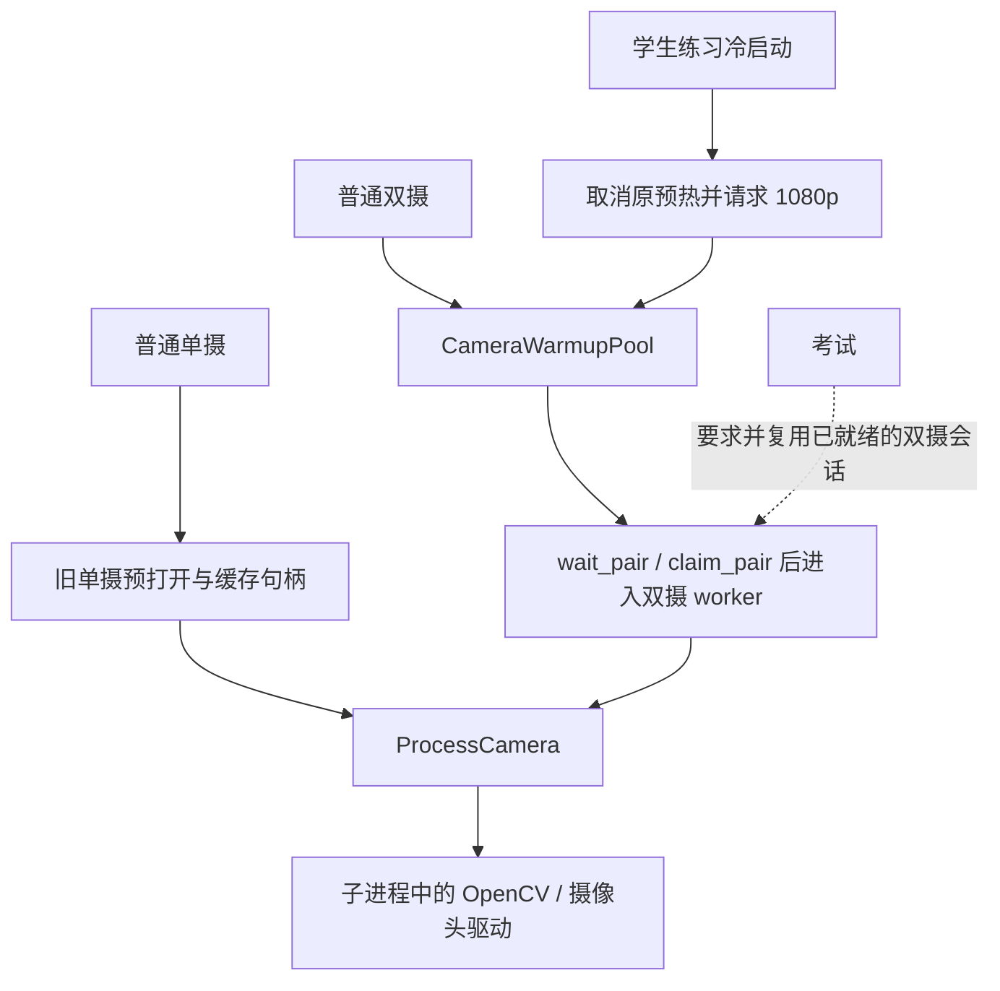

# 摄像头架构设计交接说明（供 Claude 独立设计）

整理日期：2026-09-30 UTC；本机时区 America/Los_Angeles，对应 2026-09-29。

## 1. 本次要你做什么

请基于真实代码，独立设计 Tk 桌面摄像头模块的重构方案。用户连续遇到启动失败、模式切换失败，已经不接受只针对一个入口追加补丁。需要解释问题边界，明确设备所有权、状态转换与并发规则，并给出可实施的迁移方案和验收方法。

本文件是事实与需求交接，不是已批准的架构方案。前序讨论提出过“统一摄像头会话管理”的方向，但没有确定类名、接口、线程模型或具体实现。请独立判断哪些应合并、哪些应保留；不要把前序建议当成必须照搬的设计。

本轮目标是架构设计文档，先不要修改业务代码、自动提交推送或启动长时间硬件采集。设计应足够具体，让后续实现者知道改哪些文件、删哪些旧路径、如何迁移和如何验证，而不只是画一个总框图。

## 2. 工程与版本状态——开始前必须分清

| 对象 | 本次核对结果 | 对设计与实施的影响 |
| --- | --- | --- |
| 主工作目录 | `D:/CodeProject/vision`，HEAD 为 `958dd2f`，提交说明为“fix(camera): 修复双摄格式异常及启动失败后无法重试” | HEAD 不包含后续所有本地修改 |
| 实际使用入口 | `apps/app_ui.py` 的 Tk 桌面；打包入口为 `apps/desktop_launcher.py` | 本轮以此为核心，不把 Vue/Tauri 迁移混进来 |
| 当前工作区 | 有未提交修改和未跟踪文件，摄像头修复与其他结果页工作并存 | 禁止用 reset/checkout/clean 覆盖原有工作；先按文件和 diff 区分范围 |
| 摄像头修复隔离目录 | `C:/Users/21240/.codex/worktrees/camera-mode-recovery/vision` | 基于 `958dd2f`，只应用本次摄像头补丁及测试、记录；适合检查修复边界，不等同于完整最新产品源码 |
| 上次交付 EXE | `dist/camera-fix-20260928/vision_ui.exe` | 包内分析规则是 `sanda-feedback-mediapipe-2026-09-20-v4` |
| 本次交付 EXE | `dist/camera-mode-fix-20260929/vision_ui.exe` | 基于上次 EXE，仅替换摄像头预热模块与自检模块，保留 v4 |

**当前源码与已交付 EXE 存在实质差异，不能把当前 Git HEAD 直接当成最终产品的完整构建基线。**

- 当前 `core/action_feedback.py` 的规则版本仍为 v2；当前 `core/feedback_geometry.py` 默认 Lite、12fps 抽样。已交付 EXE 的自检报告则验证了 v4、Full、双视角逐帧分析。
- 主工作区首次运行真实 Tk 模式切换检查时，遇到已有结果页代码的导入错误：`core/feedback_report.py` 要求 `core.action_feedback.format_fusion`，当前源码没有该符号。这不是本次摄像头补丁造成的，相关本地工作已保留。
- 本次最终 EXE 保留了上次包中另外 895 个 Python 模块、1224 个其他归档条目的原始字节，仅替换 `apps.camera_warmup` 和 `apps.desktop_smoke`，实际运行自检通过。
- 这是本次交付采取的兼容处理，不应作为未来默认发布流程。后续实施需要明确完整源码基线与可复现构建方式，防止摄像头重构顺便回退分析精度或丢失其他功能。尚未证明当前仓库包含了已交付 v4 的完整对应源码。
- 本次摄像头补丁未提交、未推送。干净补丁保存在 `outputs/camera-mode-repair-20260929.patch`。

## 3. 用户遇到的故障与已经证实的原因

### 用户现场描述

1. 之前点击“开始”会退回未开始状态，之后反复开始均失败，重启 App 才恢复。
2. 双摄曾出现 OpenCV `cv::Mat::Mat` 的 `step >= minstep` 断言。
3. 修复后，普通预览可以运行；切入学生练习后提示“预热失败”，报错描述包含摄像头 0 的 Shutdown。返回普通模式，逐个测试摄像头和双摄同时测试都正常。

没有取得甲方这次故障的完整日志。以下结论来自代码与确定性复现，不能据此声称已经排除了所有 USB 带宽、设备驱动、分辨率协商或机器性能因素。

### 最近一次已证实的竞态

修复前的调用关系：

```text
学生练习 _student_start()
  → 为改用 1080p，调用 _release_camera_warmups()
  → CameraWarmupPool.cancel() 仅发出取消请求，后台继续关闭
  → 立即调用 _start()
  → 双摄 worker 调用 wait_pair()
  → 旧设备尚在 retired 集合，池直接抛出：
       camera 0 is still shutting down
```

关键错误是把“取消调用已经返回”当成了“设备资源已经释放完成”。普通双摄启动通常复用现有预热，不强制经过这段关闭后立即重开的窗口，所以普通模式正常不能排除该竞态。错误字符串来自应用预热池的保护逻辑，不是摄像头驱动直接返回的设备健康结论。

新增可控释放屏障测试，在修复前对“直接重启”“先预热再重启”两条路径均复现了相同错误。前次测试覆盖过独立启动、回收和重试，也检查过 release/start 调用顺序，但没有验证这段真实异步交接。

### 已实施的修复与边界

- `958dd2f` 已加入 `ProcessCamera`：原生 open/read/release 留在独立 spawn 子进程中，超时可有界回收进程；格式在首帧前协商，验证有效连续 BGR 帧，处理短暂空帧和异常。
- 当前未提交补丁把等待旧设备释放移入 `CameraWarmupPool._open_capture()`，由后台 reader 等待；`warm()` 和 `wait_pair()` 都复用这条路径。
- 新等待受现有启动超时及取消机制约束；取消后的旧请求不得在资源释放后迟到打开摄像头。
- 此补丁修复了已复现的竞态，**没有完成整个摄像头生命周期的统一重构**。单摄预打开与双摄预热池仍然并存。

## 4. 当前调用结构与阅读入口



图示只描述 Tk 路径。`camera_enum.py`、CLI、Vue/Tauri/bridge 各自还有调用边界，不能把 Tk 使用的进程封装理解为整个仓库已经统一。

下列行号为本次核对时的主工作区位置，后续以符号搜索为准：

| 文件与入口 | 当前职责／需要追踪的问题 |
| --- | --- |
| `apps/camera_capture.py`：`ProcessCamera`、`_capture_worker`、`_open_native` | 进程隔离、共享帧缓冲、首帧与读帧超时、格式和后端尝试、进程回收；`open_camera` 是 ProcessCamera 的别名 |
| `apps/camera_enum.py`：`CameraEntry`、枚举函数、`open_camera` | 摄像头选择与编号；注意它自身的原生打开函数与 Tk 导入的进程版不是同一个函数 |
| `apps/camera_warmup.py`：`warm`、`cancel`、`wait_pair`、`claim_pair` | 双角色预热、latest-only 帧、代次、retired 资源、两路句柄交接与失败回收 |
| `apps/camera_warmup.py:729`：`_open_capture` | 当前修复所在：在后台等待同编号旧 owner 退出后才调用工厂 |
| `apps/app_ui.py:169`：`_ExclusiveCameraCapture` | 双摄路径把设备编号锁持有到 capture.release() 成功后 |
| `apps/app_ui.py:4033`：`_release_camera_warmups`、`_sync_camera_warmup` | 根据下拉框选择单摄预开或双摄池，并负责取消另一条路径 |
| `apps/app_ui.py:4115`：`_open_camera_serialized`、`_open_camera_exclusive` | 打开锁与 capture 生命周期锁的边界不同，需要确认各调用方资源所有权 |
| `apps/app_ui.py:4169`：`_kick_preopen`、`_preopen_camera`、`_take_preopen_cap`、`_release_preopen_cap` | 单摄旧预热、缓存句柄、pending index、generation 与失效处理 |
| `apps/app_ui.py:4466`：`_start`、`_stop`、`_worker_loop` | UI 会话启动停止、单／双摄及并行处理分流 |
| `apps/app_ui.py:4952`：`_worker_loop_dual_camera` | 等待两路有效帧、模型加载期间裸帧预览、停止 raw pump、接管句柄、预览和录像 |
| `apps/app_ui.py:5912`：`_post_done` | 结束时恢复按钮、处理会话代次，并决定是否自动重新预热 |
| `apps/app_ui.py:2448/2525/2673`：学生练习进入、退出、启动 | 模式标志、1080p 冷启动、录制策略和站位检测；不是独立视觉算法 |
| `apps/app_ui.py:3176`、`apps/exam_panel.py` | 考试当前要求双摄会话已启动且就绪，并检查骨架/模型等条件；不要误画成考试独立打开摄像头 |
| `core/recording_controller.py`、`apps/recording_postprocess.py` | 会话与录像片段边界、双路写入、收尾与后处理，重构时需要保持调用契约 |
| `apps/desktop_smoke.py:54`：`_check_camera_mode_switch` | 新增真实 Tk 回调、实际 spawn 子进程的模式切换检查，仅物理设备由模拟驱动替代 |

当前普通请求尺寸为 1280×720，学生练习为 1920×1080；尺寸选择发生在 `_open_camera_exclusive()`，它读取可变的 `_student_practice_active`，没有直接接收独立的采集配置快照。配置与模式切换的时序耦合需要设计时明确处理。驱动实际返回尺寸仍需单独验证和展示，不能把请求尺寸当成设备必然支持的尺寸。

## 5. 请重点回答的架构问题

这些是待设计的问题，不是要求再实现一层同名包装：

1. **谁唯一拥有物理设备？** 单摄预开、双摄 reader、运行 worker、缓存句柄与采集进程之间，哪些拥有资源、哪些仅持引用？所有权是否需要转移？若保留 `claim_pair()`，交接成功与失败分别由谁清理？
2. **模式和资源管理如何分离？** 普通、学生、考试各自应只传哪些需求？哪些模式变化可以复用设备，哪些必须重新协商？配置如何在一次启动期间保持一致？
3. **状态转换的完成条件是什么？** 请明确“请求停止”“读帧停止”“底层设备释放”“可以重新开始”的区别，以及从哪个事件判断成功；错误不能只通过重置按钮隐藏。状态名和实现方式由你决定。
4. **怎样处理竞争请求？** 开始后立即停止、停止后立即开始、刷新设备、交换两路、切换模式、关闭窗口、后台晚到响应，分别由谁排序或取消？已有多套 generation/stop flag 哪些应保留、合并或删除？
5. **失败与恢复策略是什么？** 一路失败是否使双摄事务整体失败？设备不可释放时怎样隔离？后续重试怎样恢复？不能通过重复占用设备、遗弃线程／进程或要求重启整个 App 来掩盖失败。
6. **哪些工作留在 UI 线程，哪些放到后台？** 包括打开、等待首帧、模型加载、录像收尾和进程退出；Tk 线程不能承担驱动阻塞等待。需要解释取消与关窗期间的回调行为。
7. **现有预热和进程隔离是否都值得保留？** 请结合首帧延迟、办公本资源限制、Windows 驱动阻塞，以及 PyInstaller spawn 约束论证。允许删除没有必要的缓存和交接步骤，不要求层级越多越好。
8. **如何得到可复现的交付基线？** 需要区分当前源码、未提交工作、隔离修复、已交付 v4 包，说明实施依赖与风险；不要通过覆盖现有文件来“统一版本”。

## 6. 必须保持的行为与项目约束

- 本轮主要解决 Tk 摄像头生命周期；不顺带迁移到 Vue/Tauri、不改 UI 产品流程，不把算法换型混进来。若认为必须扩大范围，请具体说明依赖。
- 同一物理设备不得被旧会话和新会话同时打开。选择、后端回退和正／侧身份必须一致；同名 USB 双摄不能靠猜测另一后端的编号映射。
- 模型/驱动是否打开成功与有效帧是否就绪要区分。仅 `isOpened()` 为真不能作为会话可用或可录制的充分条件。
- 取消、模式退出和关窗后的迟到帧、回调和任务不能复活旧会话，也不能让旧任务释放新会话的资源。
- 录制必须遵循原片段边界，保持正／侧绑定和文件收尾，不得为恢复预览误删已有录像或自动开启新录制。
- 学生练习继续复用 MediaPipe Lite 站位检测、PresenceGate 与播报；沿用保存的考试 ROI，站稳约 0.8 秒开始、连续离开 2 秒结束，取消后旧占用样本不触发后续录制。
- MediaPipe 正式评分及 `pose33_v3` 契约不改变；不能顺便把 YOLO 接入正式评分，也不能为了相机修复回退已交付 v4 的分析精度。
- 不强迫实际不支持 1080p 的设备伪装成功。支持哪些格式、能否降级及如何提示，应明确列为产品行为与设备能力问题。
- 保留真实用户偏好与录制目录。测试遵守 `tests/conftest.py` 对 `_prefs_path` 的隔离，不能读写真实 `user_prefs.json` 来通过测试。
- 优先复用已有依赖和进程能力；新增依赖或大规模重写必须有具体收益。完整规则以当前 `AGENTS.md` 为准。

## 7. 设计必须覆盖的验收场景

| 场景 | 必须观察到的结果 |
| --- | --- |
| 单摄与双摄分别冷启动 | 有效帧到达后才进入就绪；选择与实际设备对应 |
| 普通预览→停止→学生练习→退出→普通预览，连续重复 | 不因旧资源尚在退出而立即失败；按已约定格式策略完成切换 |
| 已有预热句柄／预热尚在打开时进入学生练习 | 旧配置不会混入新会话，同编号设备不重复打开 |
| 开始后立刻停止、停止过程中再次开始 | 顺序明确、UI 可响应；取消后无迟到打开和迟到录制 |
| 双摄仅一路打开失败、首帧失败或运行中断流 | 两路所有权与录制状态收敛；原因可见，后续重试有明确结果 |
| open/read/release 阻塞，旧资源慢释放 | 等待有界；未释放时保持设备隔离；释放完成后能够恢复 |
| 单摄↔双摄、交换正／侧、重新枚举 | 设备身份不串路；旧回调、旧句柄不会覆盖新选择 |
| 模型加载期间停止、预热期间关闭窗口 | 不留占用设备的采集进程，不产生窗口销毁后的有效 UI 更新 |
| 学生／考试的开始、结束与录制交接 | 摄像头就绪与业务可录制条件分清，保持原有站位和片段语义 |
| 冻结 EXE 与甲方目标双摄 | 源码检查、真实 EXE 检查、现场硬件检查分别给出证据，不能互相代替 |

请定义最少但能诊断上述场景的日志字段，例如会话标识、设备身份、请求/实际格式、状态变化、失败阶段和取消原因。具体字段由设计决定，不要求建设独立监控平台。

## 8. 已有验证证据及其边界

- 主工作区摄像头、预热、生命周期、双摄、学生练习定向回归：199 passed。该数字不包含后来新增的完整 Tk 模式切换检查；主工作区的该检查受到第 2 节所述导入错误阻塞。
- 隔离修复目录定向回归：220 passed、1 skipped。跳过项为可选 sidecar 运行检查，不是把摄像头切换失败跳过。
- 冻结 EXE 自检：`ok=true`、`frozen=true`，包含两轮真实 Tk/进程的 720p↔1080p 切换，以及 v4 双视角逐帧分析。
- 摄像头异常模拟使用实际 spawn 子进程；有的 native open/read/release 行为被模拟为卡死或慢返回。它能证明资源交接与恢复逻辑，不证明甲方 USB 双摄的驱动兼容性。
- 本次排查时，本机只枚举到一台 FHD Camera，尚未完成甲方目标双摄的硬件验收。

关键测试：

- `tests/test_camera_warmup.py::test_restart_waits_for_cancelled_capture_release`：直接／预热重试 × 释放完成／取消／超时，六种组合。
- `tests/test_camera_warmup.py::test_blocked_open_is_quarantined_and_retry_does_not_duplicate_open`：阻塞旧 open 时禁止重复占用。
- `tests/test_camera_capture.py::test_tk_preview_student_switch_with_process_cameras`：真实 Tk 主循环及进程模式切换。
- 其他行为契约见 `tests/test_app_ui_lifecycle.py`、`tests/test_app_ui_dual_camera.py`、`tests/test_student_presence.py`。

本次隔离目录执行过的命令（设计阶段不要求再次运行全部检查）：

```powershell
& D:/DevTools/venvs/vision/Scripts/python.exe -m pytest tests/test_camera_warmup.py tests/test_camera_capture.py tests/test_app_ui_lifecycle.py tests/test_app_ui_dual_camera.py tests/test_student_presence.py tests/test_app_controls.py tests/test_windows_packaging_smoke.py -q
```

可直接检查的产物，均以 `D:/CodeProject/vision` 为根：

- `outputs/camera-mode-offline-check-20260929.json` 及同名 `.log`：本次最终 EXE 自检。
- `outputs/camera-mode-v4-repackage-20260929.json`：模块替换范围及 v4 保持核验。
- `outputs/rebuild_camera_mode_v4_fix.py`：本次兼容重打包操作的脚本，不应扩展为长期默认发布方案。
- `outputs/camera-mode-repair-20260929.patch`：隔离目录的摄像头修复补丁。
- `change.md`：前次及本次排查、修复与验证记录。
- 甲方故障日志位置：`%LOCALAPPDATA%/VisionSanda/desktop.log`；本次尚未取得甲方故障日志全文。

## 9. 期望 Claude 交付的设计内容

1. **现状判断**：哪些复杂性来自真实设备约束，哪些属于重复管理或责任混乱；每项有代码依据，区分确定事实和待验证假设。
2. **推荐方案**：模块边界、设备所有权、状态转换、线程／进程职责和最小调用接口；解释取消、重试、双摄部分失败、模式切换的时序。
3. **删除与迁移清单**：明确哪些旧函数／状态／锁／回调要删除、替代或暂时保留，以及按什么步骤迁移；避免只在旧逻辑上再套一层。
4. **验收与诊断方案**：将第 7 节场景映射到最贴近风险的测试；列出必须实机验证的事项和可观察完成条件。
5. **版本与实施依赖**：说明源码/EXE 差异、未提交工作隔离、后续构建和交付所需的基线，以及仍需用户决定的实质产品取舍。

优先给一个有依据、可以落地的推荐方案；确有明显取舍时再给精简对照。无需罗列大量设计模式，也无需在架构设计阶段重写算法、结果页或整个应用。
